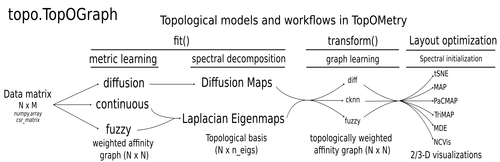

## TopOMetry - Topologically Optimized geoMetry

Documentation available at [Read The Docs](https://topometry.readthedocs.io/en/latest/).

### A global framework for dimensionality reduction: learning topologic metrics, orthogonal bases and graph layouts

TopOMetry is a high-level python library to explore data topology.
It allows learning topological metrics, dimensionality reduced basis and graphs from data, as well
to visualize them with different layout optimization algorithms. The main objective is to achieve approximations of
the [Laplace-Beltrami Operator](https://en.wikipedia.org/wiki/Laplace%E2%80%93Beltrami_operator), a natural way to describe
data geometry and its high-dimensional topology.

TopOMetry is designed to handle large-scale data matrices containing
extreme topological diversity, such as those
generated from [single-cell omics](https://en.wikipedia.org/wiki/Single_cell_sequencing), and can be used to perform topology-preserving
visualizations.

TopOMetry main class is the ``TopOGraph`` object. In a ``TopOGraph``, topological metrics are recovered with diffusion
harmonics, fuzzy simplicial sets or Continuous-k-Nearest-Neighbors, and used to obtain topological basis (multiscale Diffusion Maps and/or
fuzzy or continuous versions of Laplacian Eigenmaps). On top of these basis, new graphs can be learned using k-nearest-neighbors
graphs or with new topological metrics. The learned metrics, basis and graphs are stored as different attributes of the
``TopOGraph`` object.

Finally, different graph layout optimization algorithms built-in TopOMetry can be used for visualization: 
* MAP (Manifold Approximation and Projection) - a lighter 
[UMAP](https://umap-learn.readthedocs.io/en/latest/index.html) with looser assumptions
* [MDE](https://github.com/cvxgrp/pymde) (Minimum Distortion Embedding) - the ultimate swiss-army knife for graph layout optimization
* [tSNE](https://github.com/DmitryUlyanov/Multicore-TSNE) (t-Stochasthic Neighborhood Embedding) - a classic of visualization, with parallelization
* [TriMAP](https://github.com/eamid/trimap) - dimensionality reduction using triplets
* [NCVis](https://github.com/stat-ml/ncvis) (Noise Contrastive Visualization) - for blazing fast performance
* [PaCMAP](http://jmlr.org/papers/v22/20-1061.html) (Pairwise-controlled 
Manifold Approximation and Projection) - for balanced visualizations

The following image summarizes the TopOMetry workflow:

### Contributing

Contributions are very welcome! If you're interested in adding a new feature, just let me know in the Issues section.

### License

[MIT License](https://github.com/davisidarta/topometry/blob/master/LICENSE)

