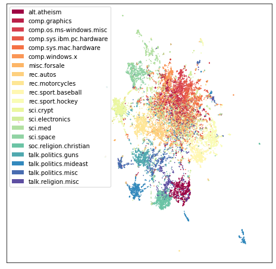

# Using TopOMetry for document embedding

This tutorial reproduces an UMAP example on the [20 newsgroups dataset](http://qwone.com/~jason/20Newsgroups/) for document embedding, and compares its results to those of TopOMetry models. The 20 newsgroups dataset is a collection of forum posts, labelled by topic. The task here is to represent this high-dimensional information in a comprehensive visualization in which news within the same topic end up close together, and different topics get separated from each other. By the end of this tutorial, we'll see TopOMetry recoveries a lot of substructure that was missed by using UMAP alone. This happens because TopOMetry's models extract latent information before learning a new topological graph which is may be embedded with UMAP.

Load required libraries:


```python
import numpy as np
import pandas as pd

# For comparison
import umap
import topo as tp

# Used to get the data
from sklearn.datasets import fetch_20newsgroups
from sklearn.feature_extraction.text import CountVectorizer

# Some plotting libraries
import matplotlib.pyplot as plt
%matplotlib inline
```

Download data:


```python
dataset = fetch_20newsgroups(subset='all',
                             shuffle=True, random_state=42)
```


```python
print(f'{len(dataset.data)} documents')
print(f'{len(dataset.target_names)} categories')
```

    18846 documents
    20 categories


This data contains 18846 documents spanning 20 categories. These categories are:


```python
dataset.target_names
```


    ['alt.atheism',
     'comp.graphics',
     'comp.os.ms-windows.misc',
     'comp.sys.ibm.pc.hardware',
     'comp.sys.mac.hardware',
     'comp.windows.x',
     'misc.forsale',
     'rec.autos',
     'rec.motorcycles',
     'rec.sport.baseball',
     'rec.sport.hockey',
     'sci.crypt',
     'sci.electronics',
     'sci.med',
     'sci.space',
     'soc.religion.christian',
     'talk.politics.guns',
     'talk.politics.mideast',
     'talk.politics.misc',
     'talk.religion.misc']


 We can print some of our news to get an idea of what we're dealing with.


```python
for idx, document in enumerate(dataset.data[:3]):
    category = dataset.target_names[dataset.target[idx]]

    print(f'Category: {category}')
    print('---------------------------')
    # Print the first 500 characters of the post
    print(document[:500])
    print('---------------------------')
```

    Category: rec.sport.hockey
    ---------------------------
    From: Mamatha Devineni Ratnam <mr47+@andrew.cmu.edu>
    Subject: Pens fans reactions
    Organization: Post Office, Carnegie Mellon, Pittsburgh, PA
    Lines: 12
    NNTP-Posting-Host: po4.andrew.cmu.edu
    
    
    
    I am sure some bashers of Pens fans are pretty confused about the lack
    of any kind of posts about the recent Pens massacre of the Devils. Actually,
    I am  bit puzzled too and a bit relieved. However, I am going to put an end
    to non-PIttsburghers' relief with a bit of praise for the Pens. Man, they
    are killin
    ---------------------------
    Category: comp.sys.ibm.pc.hardware
    ---------------------------
    From: mblawson@midway.ecn.uoknor.edu (Matthew B Lawson)
    Subject: Which high-performance VLB video card?
    Summary: Seek recommendations for VLB video card
    Nntp-Posting-Host: midway.ecn.uoknor.edu
    Organization: Engineering Computer Network, University of Oklahoma, Norman, OK, USA
    Keywords: orchid, stealth, vlb
    Lines: 21
    
      My brother is in the market for a high-performance video card that supports
    VESA local bus with 1-2MB RAM.  Does anyone have suggestions/ideas on:
    
      - Diamond Stealth Pro Local 
    ---------------------------
    Category: talk.politics.mideast
    ---------------------------
    From: hilmi-er@dsv.su.se (Hilmi Eren)
    Subject: Re: ARMENIA SAYS IT COULD SHOOT DOWN TURKISH PLANES (Henrik)
    Lines: 95
    Nntp-Posting-Host: viktoria.dsv.su.se
    Reply-To: hilmi-er@dsv.su.se (Hilmi Eren)
    Organization: Dept. of Computer and Systems Sciences, Stockholm University
    
    
    
    
    |>The student of "regional killings" alias Davidian (not the Davidian religios sect) writes:
    
    
    |>Greater Armenia would stretch from Karabakh, to the Black Sea, to the
    |>Mediterranean, so if you use the term "Greater Armenia
    ---------------------------


```python
category_labels = [dataset.target_names[x] for x in dataset.target]
hover_df = pd.DataFrame(category_labels, columns=['category'])
```

#### Representing texts as a matrix

Here, we'll use the [bag of words](https://en.wikipedia.org/wiki/Bag-of-words_model) approach. For this, we'll count how many times each word appeared in each document, and create a matrix of word frequency per document. This will allow us to quantitatively represent these texts. Such task is done using scikit-learn CountVectorizer. 


```python
vectorizer = CountVectorizer(min_df=5, stop_words='english')
word_doc_matrix = vectorizer.fit_transform(dataset.data)
```

 Next, we feed this matrix to UMAP.


```python
umap_embedding = umap.UMAP(n_components=2, metric='hellinger').fit(word_doc_matrix)
```

And define a plotting function to handle the categories names and colors for us:


```python
def plot_20k_newsgroups(embedding, figsize=(8,8)):
    from matplotlib.patches import Patch
    unique_labels = np.unique(hover_df['category'])
    num_labels = unique_labels.shape[0]
    color_key = plt.get_cmap("Spectral")(np.linspace(0, 1, num_labels))
    legend_elements = [
        Patch(facecolor=color_key[i], label=unique_labels[i])
        for i, k in enumerate(unique_labels)
    ]
    f, ax = plt.subplots(figsize=(8,8))
    ax.scatter(embedding[:, 0], embedding[:, 1], c=dataset.target, cmap='Spectral', s=0.5)
    ax.legend(handles=legend_elements)
    ax.set_xticks(())
    ax.set_yticks(())
```

And finally visualize the UMAP embedding:


```python
plot_20k_newsgroups(umap_embedding.embedding_, figsize=(8,8))
```


    

    


 UMAP performs really well! It sucessfully separates main categories and topics (i.e. eletronics, religion, politics and sports). However, it does not add much new insight on top of the previously known categories: note how the 'main blob' representing eletronic and computational topics becomes overcrowded by poorly-defined structure.

## Using TopOMetry

Just like in the digits tutorial, we'll create a TopOGraph object to start our analysis. Parameters can be set at this time but also easily changed later.


```python
import topo as tp

# Start up the TopOGraph
tg = tp.TopOGraph(n_jobs=-1)

# easily change parameters after initialisatio
tg.verbosity=1     

# feed the bag-of-words matrix to the TopOGraph
tg.fit(word_doc_matrix)     
tg.transform() # learns a topological graph

# Project for visualization
topo_MAP = tg.project(projection_method='MAP') 
```

    Computing neighborhood graph...
     Base kNN graph computed in 3.671462 (sec)
     Fitted the bw_adaptive kernel in 0.226102 (sec)
     Fitted eigenbasis with Diffusion Maps from the bw_adaptive kernel in 51.936376 (sec)
        Building topological graph from eigenbasis...
            Computing neighborhood graph...
     Computed in 1.342951 (sec)
     Fitted the bw_adaptive graph kernel in 0.237367 (sec)
     Computed MAP in 48.171167 (sec)


```python
plot_20k_newsgroups(topo_MAP, figsize=(12,12))
```


    

    


As we can see, with TopOMetry it is possible to uncover a rather more elaborate visualization of the data geometry. In this case, a central root of texts containing mostly common words and distributed across many different topics - as we walk away from this homogenous mass in the geometry of this dataset, neighborhood paths become more specific and restrited to single-topics. Plausably, the edges of these spikes should contain the texts with most heterogeneity across the dataset, rendering them good examples for specific language of a specific field. Similarly, words enriched at the central blob could be striped off the dataset for a downstream, more refined analysis containing heterogeneity-driving words.

We do not claim any particular model performs better or worse beforehand - instead, seeing how different algorithms deal with the heterogenous structure of data allows us to elaborate better insights from data. For details, check the evaluation tutorial.
