# Evaluating dimensionality reduction results

As one realizes how much methods and strategies exist for dimensionality reduction, it can be challenging to decide which to use. TopOMetry employs various models, but even so it may be hard to decide for a single one _a priori_. Instead, a better approach would be to compute several alternatives and score them to decide which to trust more.

In this tutorial, we'll see how to evaluate the results of dimensionality reduction methods. In TopOMetry, there are two main ways to do this:
- Quantifying the correlation of graph geodesics in high- and low-dimensional spaces
- Visualizing the distortion to the underlying manifold with the Riemann metric

One can also assess global structure preservation by computing the PCA-loss score defined in the [TriMAP manuscript](). For convenience, it is also included in TopOMetry.

For comparisons, we'll use PCA (Principal Component Analysis) and [UMAP]()(Uniform Manifold Approximation and Projection). 
Once again, we'll use the MNIST digits data for demonstration. Let's start!


```python
# Load some libraries:
import numpy as np
import topo as tp

# Scikit-learn utilities
from sklearn.datasets import load_digits

# Matplotlib for plotting:
from matplotlib import pyplot as plt
%matplotlib inline
```

Load the data:


```python
# Load the digits data and the labels:
X, labels = load_digits(return_X_y=True)
```

## Fit the TopOGraph

Fit a TopOGraph with some projection options:


```python
# Set up a TopOGraph object:
tg = tp.TopOGraph(n_eigs=15, n_jobs=-1, verbosity=1)

tg.run_models(X, kernels=['bw_adaptive'],
                   eigenmap_methods=['DM', 'LE'],
                   projections=['MAP', 'PaCMAP'])
```

    Computing neighborhood graph...
     Base kNN graph computed in 0.047402 (sec)
     Fitted the bw_adaptive kernel in 0.036413 (sec)
    Computing eigenbasis...
     Fitted eigenbasis with Diffusion Maps from the bw_adaptive kernel in 0.156080 (sec)
        Building topological graph from eigenbasis...
            Computing neighborhood graph...
     Computed in 0.130751 (sec)
     Fitted the bw_adaptive graph kernel in 0.037292 (sec)
     Computed MAP in 30.801050 (sec)
     Computed PaCMAP in 100.126088 (sec)
    Computing eigenbasis...
     Fitted eigenbasis with Laplacian Eigenmaps from the bw_adaptive in 1.869208 (sec)
        Building topological graph from eigenbasis...
            Computing neighborhood graph...
     Computed in 0.172561 (sec)
     Fitted the bw_adaptive graph kernel in 0.110285 (sec)
     Computed MAP in 26.472183 (sec)
     Computed PaCMAP in 93.718561 (sec)


    TopOGraph object with 1797 samples and 64 observations and:
     . Base Kernels: 
        bw_adaptive - .BaseKernelDict['bw_adaptive']
     . Eigenbases: 
        DM with bw_adaptive - .EigenbasisDict['DM with bw_adaptive'] 
        LE with bw_adaptive - .EigenbasisDict['LE with bw_adaptive']
     . Graph Kernels: 
        bw_adaptive from DM with bw_adaptive - .GraphKernelDict['bw_adaptive from DM with bw_adaptive'] 
        bw_adaptive from LE with bw_adaptive - .GraphKernelDict['bw_adaptive from LE with bw_adaptive']
     . Projections: 
        MAP of bw_adaptive from DM with bw_adaptive - .ProjectionDict['MAP of bw_adaptive from DM with bw_adaptive'] 
        PaCMAP of DM with bw_adaptive - .ProjectionDict['PaCMAP of DM with bw_adaptive'] 
        MAP of bw_adaptive from LE with bw_adaptive - .ProjectionDict['MAP of bw_adaptive from LE with bw_adaptive'] 
        PaCMAP of LE with bw_adaptive - .ProjectionDict['PaCMAP of LE with bw_adaptive'] 
     Active base kernel  -  .base_kernel 
     Active eigenbasis  -  .eigenbasis 
     Active graph kernel  -  .graph_kernel


You may have noticed the projections' names are quite descriptive. This is to avoid any potential confusion, as several different similarity-learning and matrix decomposition methods may have been used to generate the graphs or eigenbases used for the graph layout optimization. Here, we are using the 'bandwidth adaptive' method, which is related to a measure of local dimensionality.

We'll then project some of the learned projections:


```python
# Fetch the projections from the TopOGraph object:
pacmap_dm_bw_adap = tg.ProjectionDict['PaCMAP of DM with bw_adaptive']
map_bw_adap_dm_bw_adap = tg.ProjectionDict['MAP of bw_adaptive from DM with bw_adaptive']

projections = [(pacmap_dm_bw_adap, 'PaCMAP of DM with bw_adaptive'),
     (map_bw_adap_dm_bw_adap, 'MAP of bw_adaptive from DM with bw_adaptive')]

plot_num = 1
plt.figure(figsize=(4, 12))
for coord, name in projections:
    plt.subplot(4, 1, plot_num)
    plt.scatter(coord[:, 0], coord[:, 1], c=labels, cmap='Spectral', s=0.5)
    plt.gca().set_aspect('equal', 'datalim')
    plt.colorbar(boundaries=np.arange(11)-0.5).set_ticks(np.arange(10))
    plt.title(name + ' of the Digits dataset', fontsize=12)
    plot_num += 1

plt.tight_layout()
```


    
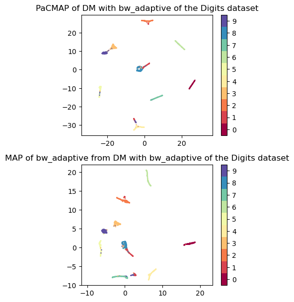
    


## Using the Riemann metric to visualize distortions

Based on a visual assessment, one could claim that embedding #2 (MAP of cknn from DM with the bw_adaptive kernel) preserves the underlying information better because it best separates classes when compared to other embeddings. However, such statements may be particulary hard to claim when one does not know the true classes in their data, or when they are too numerous or cannot be reliably trusted. 

In such cases, it is best to know how much the projections we obtained distort the underlying data. First, let's do this qualitatively by using the [Riemann metric](). In a nuthshell, visualizing the Riemann metric allows one to define how much of the underlying data topology is being preserved by the low-dimensional visualization - in that sense, it augments visualizations by informing in which direction distortions ocurred. For doing this, it needs a graph Laplacian - in this case, we'll use the default normalized graph Laplacian computed by the `Kernel` class within the `TopOGraph`.

We can either use the `topo.eval.RiemannMetric` class for this, or conveniently allow it to be called by the plotting function `topo.plot.plot_riemann_metric` within TopOMetry. 


```python
# Get the graph Laplacian of the cknn graph:
L = tg.base_kernel.L

# Plot the Riemann metric
for coord, name in projections:
    tp.pl.plot_riemann_metric(coord, L, std=0.5, title=name + ' of the Digits dataset',
                             n_plot=500, labels=labels, random_state=tg.random_state,  figsize=(4,4)
                             )
```


    
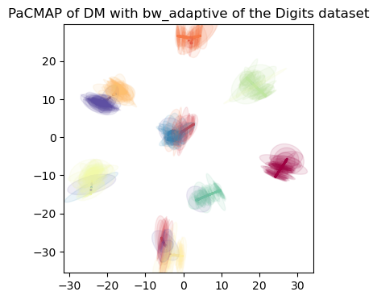
    


    

    


Simply speaking, if the distortion is more or less equal on both the X and Y axis of the 2D visualization, the ellipse encoding the distortion will tend to a circle. The radii increase proportionally to the increase in distortion. If one of the ellipse axis is greater than the other, it means the distortion is greater in that direction - in other words, distances have been 'streched' in that direction and are comparativelly smaller in the high-dimensional space.

We can change the base radius to improve our visualization by changing the parameter `std`. If it is too large or too small, the visualization will not be particularly useful.


```python
tp.pl.plot_riemann_metric(map_bw_adap_dm_bw_adap, L, std=0.1, n_plot=500, labels=labels, random_state=tg.random_state,  figsize=(4,4))
tp.pl.plot_riemann_metric(map_bw_adap_dm_bw_adap, L, std=0.3, n_plot=500, labels=labels, random_state=tg.random_state,  figsize=(4,4))
tp.pl.plot_riemann_metric(map_bw_adap_dm_bw_adap, L, std=0.5, n_plot=500, labels=labels, random_state=tg.random_state,  figsize=(4,4))
```


    

    


    
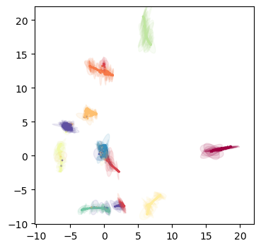
    


    
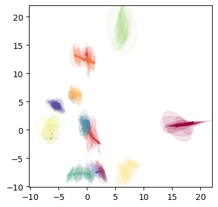
    


## Quantifying preservation of geodesics

A less subjetive and rather quantitative way to assess the distortion induced by dimensionality reduction is to quantify the preservation of graph geodesics. This rationale is used in a couple of other works, such as [DeMAP]() and a recent [benchmark](). The main idea is that if we sucessfully preserved information, than graph geodesics should also more or less be preserved - this is particularly true when talking about local information. To assess this, we can compute the Spearman correlation between the graph geodesics in the high- and low-dimensional spaces.

NOTE: This is computationally quite expensive. I've made it as light and fast as possible, including the only multiprocess shortest-paths implementation I know of, but it can still require a lot of RAM and processing time for large datasets.

### One representation at a time

Let's first do this one representation at a time. For this, we'll use the convenience function `topo.pipes.local_score`. We'll use PCA for comparisons.


```python
from sklearn.decomposition import PCA
pca_op = PCA(n_components=10)
pca_Y = pca_op.fit_transform(X)

dm_with_bw_adaptive_score = tp.pipes.local_score(tg.base_knn_graph, tg.EigenbasisDict['DM with bw_adaptive'].transform(),
                                                metric='euclidean',
                                                n_neighbors=3,
                                                n_jobs=-1)
pca_score = tp.pipes.local_score(tg.base_knn_graph, pca_Y,
                                                metric='euclidean',
                                                n_neighbors=3,
                                                n_jobs=-1)
```

    Computing Spearman R...
    Computing Spearman R...


```python
print('Locality preserving score of our diffusion maps: ' + str(round(dm_with_bw_adaptive_score.correlation, 3)))
print('Locality preserving score of PCA: ' + str(round(pca_score.correlation, 3)))
```

    Locality preserving score of our diffusion maps: 0.585
    Locality preserving score of PCA: 0.482


As we can see, the diffusion eigenbasis preserves more local information than PCA. This was expected as it is a locality-preserving method.

Now let's see how our learned projections compare to using UMAP.


```python
from umap import UMAP

umap_Y = UMAP(n_components=2, min_dist=0.1, metric='cosine').fit_transform(X)
umap_on_pca_Y = UMAP(n_components=2, min_dist=0.1, metric='cosine').fit_transform(pca_Y)

plt.scatter(umap_Y[:, 0], umap_Y[:, 1], c=labels, cmap='Spectral', s=0.5)
plt.gca().set_aspect('equal', 'datalim')
plt.colorbar(boundaries=np.arange(11)-0.5).set_ticks(np.arange(10))
plt.title('UMAP of the Digits dataset', fontsize=12)

plt.scatter(umap_on_pca_Y[:, 0], umap_on_pca_Y[:, 1], c=labels, cmap='Spectral', s=0.5)
plt.gca().set_aspect('equal', 'datalim')
plt.colorbar(boundaries=np.arange(11)-0.5).set_ticks(np.arange(10))
plt.title('UMAP on PCA of the Digits dataset', fontsize=12)
```

    2023-03-23 00:38:13.069693: I tensorflow/core/platform/cpu_feature_guard.cc:193] This TensorFlow binary is optimized with oneAPI Deep Neural Network Library (oneDNN) to use the following CPU instructions in performance-critical operations:  AVX2 FMA
    To enable them in other operations, rebuild TensorFlow with the appropriate compiler flags.
    2023-03-23 00:38:13.179599: W tensorflow/compiler/xla/stream_executor/platform/default/dso_loader.cc:64] Could not load dynamic library 'libcudart.so.11.0'; dlerror: libcudart.so.11.0: cannot open shared object file: No such file or directory
    2023-03-23 00:38:13.179615: I tensorflow/compiler/xla/stream_executor/cuda/cudart_stub.cc:29] Ignore above cudart dlerror if you do not have a GPU set up on your machine.
    2023-03-23 00:38:13.934489: W tensorflow/compiler/xla/stream_executor/platform/default/dso_loader.cc:64] Could not load dynamic library 'libnvinfer.so.7'; dlerror: libnvinfer.so.7: cannot open shared object file: No such file or directory
    2023-03-23 00:38:13.934586: W tensorflow/compiler/xla/stream_executor/platform/default/dso_loader.cc:64] Could not load dynamic library 'libnvinfer_plugin.so.7'; dlerror: libnvinfer_plugin.so.7: cannot open shared object file: No such file or directory
    2023-03-23 00:38:13.934594: W tensorflow/compiler/tf2tensorrt/utils/py_utils.cc:38] TF-TRT Warning: Cannot dlopen some TensorRT libraries. If you would like to use Nvidia GPU with TensorRT, please make sure the missing libraries mentioned above are installed properly.


    Text(0.5, 1.0, 'UMAP of the Digits dataset')


    
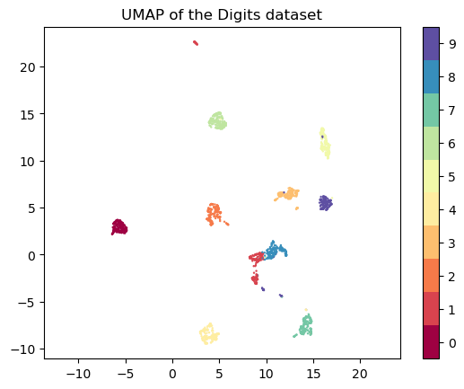
    


```python
map_dm_score = tp.pipes.local_score(tg.base_knn_graph, map_bwadap_dm_bw_adap, metric='cosine', n_neighbors=5)
umap_score = tp.pipes.local_score(tg.base_knn_graph, umap_Y, metric='cosine', n_neighbors=5)
```

    Computing Spearman R...
    Computing Spearman R...


```python
print('Locality preserving score of our diffusion-based MAP: ' + str(round(map_dm_score.correlation, 3)))
print('Locality preserving score of UMAP: ' + str(round(umap_score.correlation, 3)))
```

    Locality preserving score of our diffusion-based MAP: 0.339
    Locality preserving score of UMAP: 0.29


### Evaluating several models at once

When using TopOMetry to compute multiple kernels, eigenbases and layout options, it can be cumbersome to score each model individually. To address this issue, there's a wrapper function that calls the TopOGraph object, fits it according to the specified models and quantitatively evaluates the results. 

In other words: instead of naively selecting a single model or method to 'trust the most' (i.e. use UMAP or t-SNE and nothing else), users can test several models with a single line of code and use a numeric measurement to guide their final choice.

Let's do it:


```python
# Remove verbosity - this outputs a lot of text
tg.verbosity = 0
```


```python
evaluation_dict = tp.pipes.eval_models_layouts(tg, X,
                        kernels=['cknn', 'fuzzy'. 'bw_adaptive'], # kernels to use (there are the three main ones)
                        eigenmap_methods=['DM', 'LE', 'top'], # eigenmap methods to use
                        projections=['MAP', 'PaCMAP', 'Isomap'], # projections to use
                        additional_eigenbases=None, # additional eigenbases to use (e.g. VAEs)
                        additional_projections={'UMAP':umap_Y}, # additional projections to use (e.g. VAEs, UMAP, UMAPm on PCA)
                        n_neighbors=5, n_jobs=-1)
```

Then we can print our results dictionary - that is however quite verbose and not quite intuitive.


```python
evaluation_dict
```


    {'EigenbasisLocal': {'DM with bw_adaptive': 0.5951443270119502,
      'LE with bw_adaptive': 0.6118177454649414,
      'DM with cknn': 0.5558203540137503,
      'LE with cknn': 0.49214358993302443,
      'PCA': 0.5614368393695521},
     'EigenbasisGlobal': {'DM with bw_adaptive': 0.2517132527460154,
      'LE with bw_adaptive': 0.24511675486738643,
      'DM with cknn': 0.2470760111100049,
      'LE with cknn': 0.23857619043615336},
     'ProjectionLocal': {'MAP of bw_adaptive from DM with bw_adaptive': 0.42819866457673483,
      'PaCMAP of DM with bw_adaptive': 0.4500203135374891,
      'MAP of bw_adaptive from LE with bw_adaptive': 0.42392754345547495,
      'PaCMAP of LE with bw_adaptive': 0.45661094832082616,
      'MAP of cknn from DM with cknn': 0.4087540670471655,
      'MAP of bw_adaptive from DM with cknn': 0.42961712945526087,
      'MAP of cknn from LE with cknn': 0.3969302734355321,
      'MAP of bw_adaptive from LE with cknn': 0.37589689864799525,
      'MAP of cknn from DM with bw_adaptive': 0.42002073196215717,
      'MAP of cknn from LE with bw_adaptive': 0.3960567427109374,
      'UMAP': 0.4279140123293785},
     'ProjectionGlobal': {'MAP of bw_adaptive from DM with bw_adaptive': 0.9637686803214798,
      'PaCMAP of DM with bw_adaptive': 0.9931265850342833,
      'MAP of bw_adaptive from LE with bw_adaptive': 0.9616913512476277,
      'PaCMAP of LE with bw_adaptive': 0.9428393991993144,
      'MAP of cknn from DM with cknn': 0.9733012767974238,
      'MAP of bw_adaptive from DM with cknn': 0.9431537022348053,
      'MAP of cknn from LE with cknn': 0.9584939796403151,
      'MAP of bw_adaptive from LE with cknn': 0.9261755154115735,
      'MAP of cknn from DM with bw_adaptive': 0.9552133804923074,
      'MAP of cknn from LE with bw_adaptive': 0.9636822851391127,
      'PCA': 1.0,
      'UMAP': 0.953857353727817}}


Alternatively, we can plot these results as a barchart:


```python
tp.pl.plot_scores(evaluation_dict['EigenbasisLocal'], fontsize=10, figsize=(6,3))
```


    

    


With the help of a convenience function, we can plot all evaluation metrics at once:


```python
tp.pl.plot_all_scores(evaluation_dict, fontsize=10, figsize=(6,3))
```


    
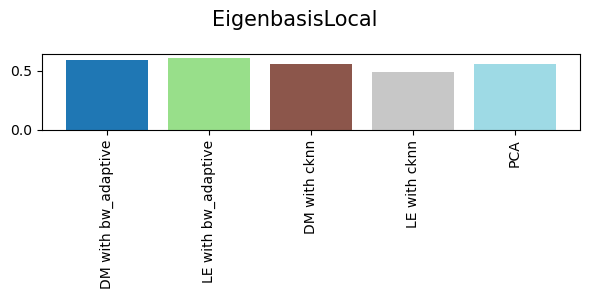
    


    
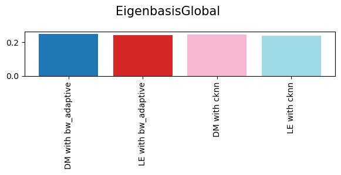
    


    
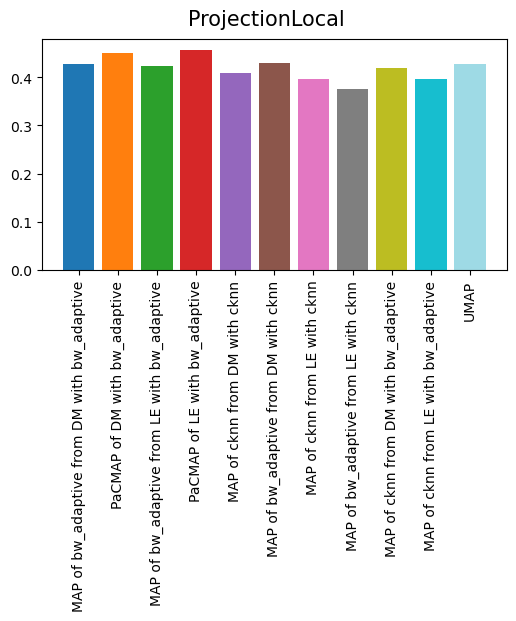
    


    
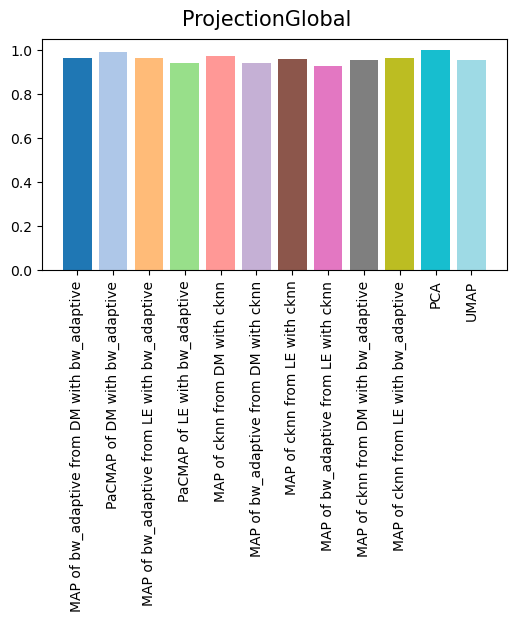
    


Often the quantitative difference between models will be small. To aid visualizing which models are the best, we can use a logarithmic scale in the Y axis:


```python
tp.pl.plot_all_scores(evaluation_dict, fontsize=10, figsize=(6,3), log=True)
```


    
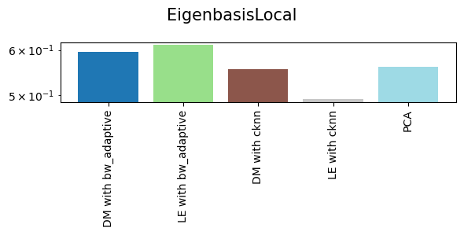
    


    
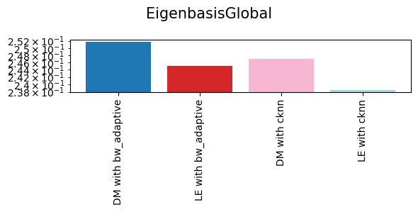
    


    
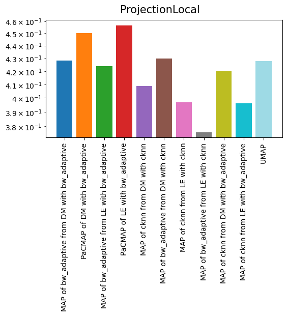
    


    
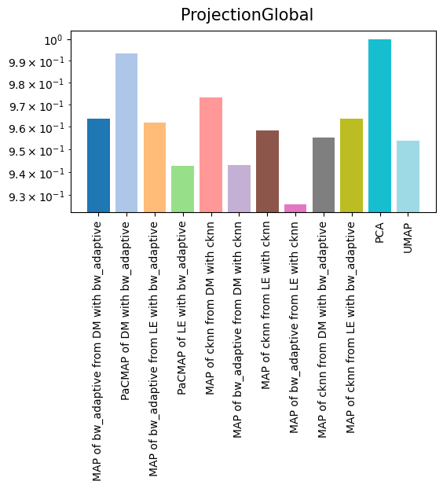
    


That's it for this tutorial! I hope this helped make clear how to evaluate the results of different dimensionality reduction approaches on your data, both quantitatively and qualitatively. Feel free to reach out if you have any questions.
