# TopoMetry — Step-by-Step Analysis

Single-cell RNA-seq measures thousands of transcripts per cell, yielding high-dimensional, noisy data with uneven sampling across cell states. Most pipelines first compress the data and then build a cell–cell graph for clustering, trajectory inference, and visualization. Yet low-dimensional representations and 2-D maps often distort the underlying geometry, and users rarely have tools to quantify or diagnose those distortions before making biological claims.

**TopoMetry** addresses this by learning a **spectral scaffold**—a diffusion/Laplacian eigenbasis that encodes latent geometry across scales—and a **refined graph** that better captures cell–cell relationships. From this scaffold and graph, TopoMetry derives layouts (e.g., TopoMAP, TopoPaCMAP), clustering, denoising/imputation, and diagnostics, together with **operator-native metrics** and **Riemannian distortion maps** that let you audit geometry explicitly.

In this tutorial, we’ll perform a **step-by-step** TopoMetry analysis on the PBMC68k dataset (~68k human peripheral blood mononuclear cells), but you could use the demo pbmc3k dataset from Scanpy to keep the run lightweight for a laptop CPU. You will learn how:


1) **Set up & load data** (PBMC68k) and apply **adequate preprocessing** (HVG selection + Z-score scaling).

2) **Run TopoMetry** to learn the spectral scaffold (fixed-time and multiscale) and the refined graph, with namespaced outputs that do not mutate `adata.X`.

3) **Inspect the eigenspectrum** with `tg.eigenspectrum()` and interpret **eigengaps** for automated scaffold sizing.

4) **Estimate intrinsic dimensionality** (global/local) and assess **spectral selectivity** of scaffold axes to labels.

5) **Visualize** with geometry-aware 2-D layouts (TopoMAP / TopoPaCMAP) and **recompute** layouts.

6) **Diagnose distortions** using **Riemannian metrics** to see where maps contract or expand the manifold.

7) **Quantify geometry preservation** across representations with operator-native metrics and a compact report.

8) **Impute/denoise** expression via diffusion on the learned operator and compare marker patterns.

9) **Illustrate graph-signal filtering** with a minimal simulated “disease state” smoothed on the multiscale graph.

10) **Compute and visualize non-euclidean layouts**: spherical, toroidal, hyperboloid and gaussian-energy embeddings with MAP.


---
## Environment & imports

Besides topometry and standard python libraries (`numpy`, `pandas`, `matplotlib`), we'll use [scanpy](https://scanpy.readthedocs.io/en/stable/index.html) and the `AnnData` data format to manage our single-cell data. 


```python
import numpy as np, pandas as pd, scanpy as sc, topo as tp
import matplotlib.pyplot as plt
np.random.seed(7)
sc.settings.verbosity = 0
sc.set_figure_params(dpi=80, facecolor='white')
print("scanpy:", sc.__version__)
print("topo:", getattr(tp, "__version__", "unknown"))
```

    scanpy: 1.10.3
    topo: 1.0.1


We'll also use a `matplotlib` coloring palette:


```python
# Palette
from matplotlib import pyplot as plt, cm as mpl_cm
from cycler import cycler
palette=cycler(color=mpl_cm.tab20.colors)
```

---
## Load data

We'll use the PBMC3k dataset (available directly via `sc.datasets.pbmc3k_processed()`), which provides 2,638 PBMCs already preprocessed with log-normalization and HVG selection:


```python
# Using sc.datasets.pbmc3k_processed() for testing — no file extraction needed.
```


```python
adata = sc.datasets.pbmc3k_processed()
adata
```


    AnnData object with n_obs × n_vars = 2638 × 1838
        obs: 'n_genes', 'percent_mito', 'n_counts', 'louvain'
        var: 'n_cells'
        uns: 'draw_graph', 'louvain', 'louvain_colors', 'neighbors', 'pca', 'rank_genes_groups'
        obsm: 'X_pca', 'X_tsne', 'X_umap', 'X_draw_graph_fr'
        varm: 'PCs'
        obsp: 'distances', 'connectivities'


This provides a quick inventory of what is present before any preprocessing or modeling steps. In the sections that follow, these fields will be populated with QC metrics, normalized expression, embeddings, and neighborhood graphs, and the same summary printout can be used to confirm that each stage wrote outputs to the expected locations.

---
## Simple quality control

Before proceeding with the analysis, we perform some basic quality control:


```python
# QC annotation skipped — pbmc3k_processed is already filtered and annotated.
```

Plot QC metrics:


```python
# Pre-QC violin plots skipped — dataset already clean.
```

Filter low-quality cells:


```python
# QC filtering skipped — pbmc3k_processed is already filtered.
```

Plot filtered QC results:


```python
# Post-QC violin plots skipped — dataset already clean.
```

---
## Expected normalization

TopoMetry expects ***Z-score–normalized*** (standardized) expression values for a set of highly-variable genes (HVGs). Concretely: after normalization and log-transform, select HVGs, then scale each gene to mean 0 and unit variance (optionally clipping extreme values). 

The automated wrapper `tp.sc.preprocess(adata)` performs exactly these preprocessing steps and prepares adata.X for TopoMetry’s base graph construction.


```python
import scipy.sparse as ssp

# pbmc3k_processed is already log-normalized and HVG-selected.
# Manually recreate the layers structure that tp.sc.preprocess() produces.

# 'counts' layer: log-normalized expression (closest available)
adata.layers['counts'] = adata.X.copy()

# Scale expression for use with PCA and TopOGraph (z-score, max_value=10)
sc.pp.scale(adata, max_value=10)
adata.layers['scaled'] = adata.X.copy()  # adata.X is now scaled

adata
```


    AnnData object with n_obs × n_vars = 2638 × 1838
        obs: 'n_genes', 'percent_mito', 'n_counts', 'louvain'
        var: 'n_cells', 'mean', 'std'
        uns: 'draw_graph', 'louvain', 'louvain_colors', 'neighbors', 'pca', 'rank_genes_groups'
        obsm: 'X_pca', 'X_tsne', 'X_umap', 'X_draw_graph_fr'
        varm: 'PCs'
        layers: 'counts', 'scaled'
        obsp: 'distances', 'connectivities'


The `tp.sc.preprocess(adata)` wrapper is equivalent to the legacy `scanpy` preprocessing:

```
sc.pp.normalize_total(adata, target_sum=1e4)
sc.pp.log1p(adata)
sc.pp.highly_variable_genes(adata, flavor="seurat_v3")
adata = adata[:, adata.var.highly_variable]
sc.pp.scale(adata, max_value=10)
```

and automatically handles `adata.layers` and `adata.raw`. 

---
## Minimal celltype annotation

After preprocessing, let's perform some minimal celltype annotation. We take advantage of the fact that PBMCs are very well studied and use [known marker genes](https://scanpy.readthedocs.io/en/stable/tutorials/basics/clustering.html#manual-cell-type-annotation) to construct a simple classifier to annotate the main cell types:


```python
# pbmc3k_processed already has expert-curated louvain cell type annotations.
# Use them directly as predicted_celltype.
adata.obs['predicted_celltype'] = adata.obs['louvain'].copy()

# Available marker genes in this HVG set for reference
marker_dict = {
    "CD14+ Mono":  ["FCN1"],
    "CD16+ Mono":  ["FCGR3A"],
    "cDC":         ["CST3", "FCER1A"],
    "NK":          ["GNLY", "NKG7", "FCGR3A"],
    "B cells":     ["MS4A1", "CD79A"],
    "T cells":     ["IL32", "GZMK"],
    "CD8+ T":      ["GZMB", "GZMK"],
    "Megakaryocytes": ["PPBP"],
}

# Filter each list to only genes present in the HVG set
marker_dict_valid = {ct: [g for g in genes if g in adata.var_names]
                     for ct, genes in marker_dict.items()
                     if any(g in adata.var_names for g in genes)}

sc.pl.dotplot(adata, marker_dict_valid, groupby="predicted_celltype",
              standard_scale="var", dendrogram=True)
```


    
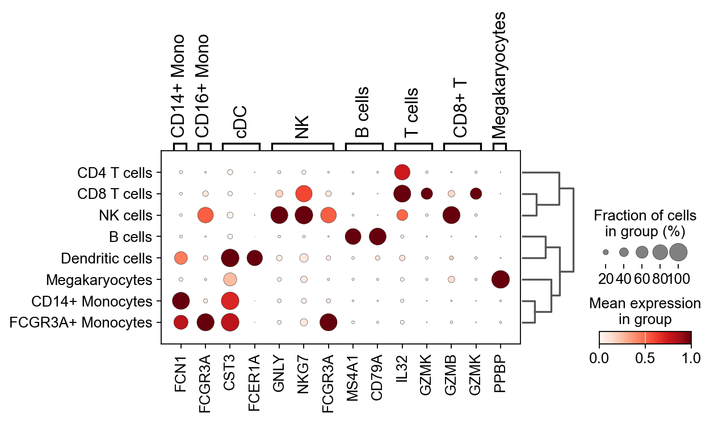
    


---
## Standard analysis (baseline)

Next, we run the *de facto* standard in single-cell analysis:
1. Dimensionality reduction with Principal Component Analysis (PCA);
2. Neighborhood graphs from the top principal components;
3. Clustering and UMAP of the PCA-derived neighborhood graph.

This will give us a baseline to compare TopoMetry to.


```python
# run PCA
sc.pp.pca(adata, layer="scaled", n_comps=300)

# check variance ratio to choose number of PCs
sc.pl.pca_variance_ratio(adata, log=True, n_pcs=100)
```


    
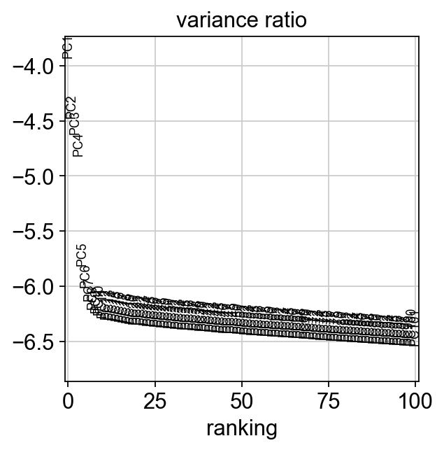
    


The variance ratio plot suggests that 30 PCs are enough to explain our data:


```python
# neighborhood graph
sc.pp.neighbors(adata, n_pcs=30, use_rep='X_pca', metric='cosine', key_added='pca')

# clustering on the PCA-derived neighborhood graph
sc.tl.leiden(adata, resolution=0.5, neighbors_key='pca', key_added='pca_leiden', 
             flavor='igraph', n_iterations=2) # to avoid scanpy warning about default leiden implementation changing in the future

# UMAP of the PCA-derived neighborhood graph
sc.tl.umap(adata, neighbors_key='pca')
adata.obsm['X_PCA_UMAP'] = adata.obsm['X_umap'].copy()
del adata.obsm['X_umap'] #remove duplicate key

# visualize
fig, axes = plt.subplots(1, 2, figsize=(11, 5))
sc.pl.embedding(adata, basis='PCA_UMAP', color='pca_leiden', legend_loc='on data',ax=axes[0], frameon=False, show=False, palette=palette)
sc.pl.embedding(adata, basis='PCA_UMAP', color='predicted_celltype', ax=axes[1], frameon=False, show=False, palette=palette)
fig.subplots_adjust(wspace=0.5); plt.show()
```

    2026-03-10 09:18:42.815457: I tensorflow/core/util/util.cc:169] oneDNN custom operations are on. You may see slightly different numerical results due to floating-point round-off errors from different computation orders. To turn them off, set the environment variable `TF_ENABLE_ONEDNN_OPTS=0`.


    
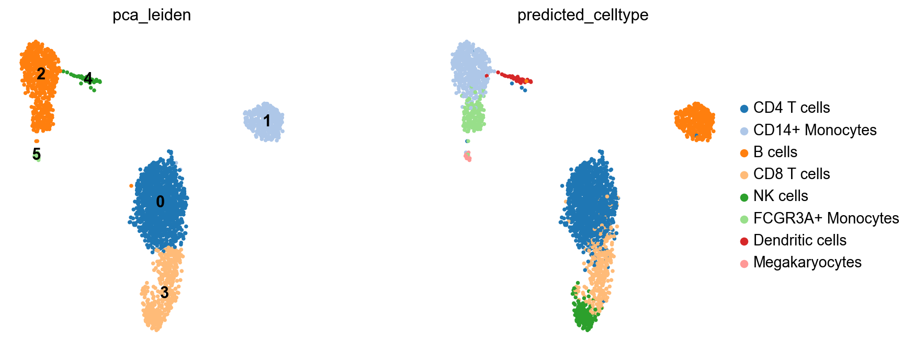
    


We can also visualize how well PCA explains this data:


```python
adata_raw = adata.raw.to_adata().copy()
tp.sc.pca_explained_variance_by_hvg(adata_raw)
```


    
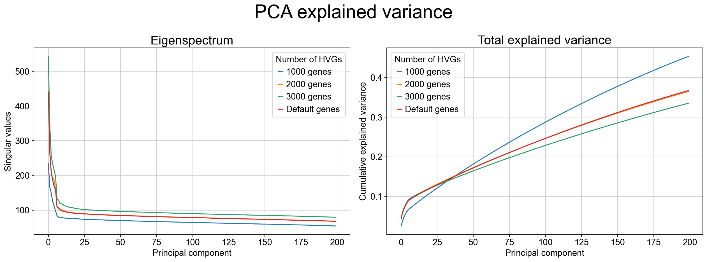
    


As the variance-ratio curve suggests, the first ~30 PCs appear to capture “most of the signal,” but this impression can be misleading. In practice, PCA retains only a modest fraction of the total variance even with many components (often <30% by 50 PCs in this dataset), and extending to more PCs typically yields diminishing returns rather than recovering the missing structure. This pattern is common when biologically relevant variation is distributed across many weakly correlated directions and/or organized along **nonlinear** manifolds, where linear projections cannot efficiently parameterize the geometry.


---
## Fit TopoMetry (high‑level wrapper)

When analyzing single-cell data stored in an `AnnData` object, we use the high-level wrapper `tp.sc.fit_adata()`, which conveniently constructs a `tp.TopOGraph`object and writes the results to `AnnData`. Most knobs that control the underlying `TopOGraph` construction are exposed through `fit_adata()` either as explicit arguments (e.g., `projections`, `do_leiden`) or passed through as keyword arguments to TopOGraph (e.g., kNN sizes, kernel/metric choices, intrinsic dimensionality settings). The defaults are designed for robust geometry recovery across diverse single-cell datasets, but the key parameters below determine speed, granularity, and how “local” vs “global” structure is emphasized.

**Core geometry / graph parameters:**
* `base_knn` and `graph_knn`: set the neighborhood size used to build the initial kNN graph and the refined graph on the learned spectral scaffold; 
* `base_metric` and `graph_metric`: specify the distance metric used at each stage (often cosine in expression space and euclidean in scaffold space); 
* Kernel choices (`base_kernel_version`, `graph_kernel_version`): control adaptive bandwidth behavior and therefore how density variation is handled; 
* `backend`: selects the kNN backend library;
* `n_jobs`: controls parallelism.

**Intrinsic dimensionality parameters:** TopoMetry estimates local intrinsic dimensionality to automatically size the spectral scaffold. 
* `id_method`: selects which estimate is used to set the scaffold size;
* `min_eigs`: sets a floor on how many eigenvectors are computed when learning the spectral scaffold;
* `id_min_components` and `id_max_components`: cap the number of components actually kept for downstream steps to control runtime and memory;
* `id_headroom` define guardrails so the chosen scaffold dimensionality is neither under- nor over-sized.

**Visualization and clustering parameters:** 
* `projections=("MAP","PaCMAP")`: specifies which 2-D layouts should be computed from the learned scaffolds;
* `do_leiden=True`: runs Leiden clustering on the refined operator at the requested `leiden_resolutions`.


```python
tg = tp.sc.fit_adata(
    adata,
    projections=("MAP","PaCMAP"),
    do_leiden=True,
    leiden_resolutions=(0.2, 0.8), # example resolutions for multi-resolution clustering; adjust as needed
    n_jobs=-1, # use all cores - this is the default, but we specify it here for clarity
    verbosity=0,
    random_state=7,
)
adata
```

    /home/davi/topometry/topo/single_cell.py:786: FutureWarning: In the future, the default backend for leiden will be igraph instead of leidenalg.
    
     To achieve the future defaults please pass: flavor="igraph" and n_iterations=2.  directed must also be False to work with igraph's implementation.
      sc.tl.leiden(adata, resolution=res, adjacency=P, key_added=key)


    AnnData object with n_obs × n_vars = 2638 × 1838
        obs: 'n_genes', 'percent_mito', 'n_counts', 'louvain', 'predicted_celltype', 'pca_leiden', 'topo_clusters_res0.2', 'topo_clusters_res0.8', 'topo_clusters', 'topo_clusters_ms_res0.2', 'topo_clusters_ms_res0.8', 'topo_clusters_ms'
        var: 'n_cells', 'mean', 'std'
        uns: 'draw_graph', 'louvain', 'louvain_colors', 'neighbors', 'pca', 'rank_genes_groups', 'dendrogram_predicted_celltype', 'pca_leiden', 'umap', 'pca_leiden_colors', 'predicted_celltype_colors', '_topo_tmp_dm', 'topo_clusters_res0.2', 'topo_clusters_res0.8', '_topo_tmp_ms', 'topo_clusters_ms_res0.2', 'topo_clusters_ms_res0.8'
        obsm: 'X_pca', 'X_tsne', 'X_draw_graph_fr', 'X_PCA_UMAP', 'X_ms_spectral_scaffold', 'X_spectral_scaffold', 'X_msTopoMAP', 'X_TopoMAP', 'X_msTopoPaCMAP', 'X_TopoPaCMAP'
        varm: 'PCs'
        layers: 'counts', 'scaled'
        obsp: 'distances', 'connectivities', 'pca_distances', 'pca_connectivities', 'topometry_connectivities', 'topometry_distances', '_topo_tmp_dm_distances', '_topo_tmp_dm_connectivities', 'topometry_connectivities_ms', 'topometry_distances_ms', '_topo_tmp_ms_distances', '_topo_tmp_ms_connectivities'


The call to `fit_adata` creates the TopOGraph object `tg` (used to orchestrate the analysis) and populates the `AnnData`:

* **Cluster labels (`obs`)**
  Leiden clusters computed on the refined operators are written to `adata.obs`, including single-scale clusters (`topo_clusters`, `topo_clusters_res*`) and multiscale clusters (`topo_clusters_ms`, `topo_clusters_ms_res*`) at each requested resolution.

* **Spectral scaffolds (`obsm`)**
  The learned diffusion-geometry representations are stored in `adata.obsm["X_spectral_scaffold"]` (fixed-time) and `adata.obsm["X_ms_spectral_scaffold"]` (multiscale), serving as geometry-faithful latent spaces for downstream analysis.

* **Two-dimensional layouts (`obsm`)**
  Requested visualization layouts are written to `adata.obsm`, including `X_TopoMAP` and `X_TopoPaCMAP` for the fixed-time scaffold, and `X_msTopoMAP` and `X_msTopoPaCMAP` for the multiscale scaffold.

* **Refined neighborhood graphs (`obsp`)**
  Geometry-aware connectivities and distances learned on the scaffolds are stored in `adata.obsp["topometry_connectivities"]` and `adata.obsp["topometry_distances"]`, with corresponding multiscale variants suffixed by `_ms`.

* **Provenance and intermediate state (`uns` / `obsp`)**
  Namespaced entries in `adata.uns` and temporary graph objects in `adata.obsp` record intermediate diffusion operators, clustering metadata, and parameters used during fitting, enabling reproducibility and inspection without polluting standard Scanpy keys.

Together, these fields constitute a complete TopoMetry result: geometry-aware latent representations, visualization layouts, refined graphs, and clustering outputs, all stored directly on `adata` for immediate reuse in downstream analyses.


---
## Intrinsic Dimensionality (Global & Local)

Intrinsic dimensionality (ID) is the effective number of degrees of freedom required to describe the data locally on its underlying manifold. Unlike the ambient dimension (e.g., thousands of genes), ID reflects the dimensionality of the geometric support that cells occupy after accounting for correlations and constraints imposed by biology and measurement. In single-cell atlases, ID is rarely uniform: proliferative or cycling programs can introduce loop-like structure; branching differentiation increases local complexity near branch points; and terminal states often collapse to lower-dimensional neighborhoods. For this reason, TopoMetry treats ID as both a descriptive diagnostic and a practical control signal for representation learning.

TopoMetry estimates ID at two complementary levels. A global ID summarizes the overall complexity of the dataset and provides a principled baseline for selecting how many spectral components are worth keeping. A local (per-cell) ID map quantifies how complexity varies across the manifold and can highlight biologically meaningful regions where geometry changes, such as branch points, loops, dense terminal attractors, or technical mixing. These estimates are used by default during `TopOGraph.fit()` / `tp.sc.fit_adata()` to size scaffolds conservatively (with guardrails like minimum and maximum components), but it is often useful to recompute or inspect them explicitly when tuning runtime, debugging structure, or preparing downstream models (e.g., choosing latent sizes for parametric models).


```python
tp.sc.intrinsic_dim(adata, 
                    tg=tg, # pass the topograph to avoid redundant graph construction
                    n_jobs=-1, # use all cores - this is the default, but we specify it here for clarity
                    id_methods=["fsa", "mle"], # compute both FSA and MLE estimates
                    id_k_values=None # use multiple k values for robustness (default) - this increases runtime but can provide more reliable estimates
)
tp.sc.plot_id_histograms(adata, dpi=80)
# Results: adata.uns['intrinsic_dim_estimator']; per-cell IDs in adata.obs (id_* keys).
```


    
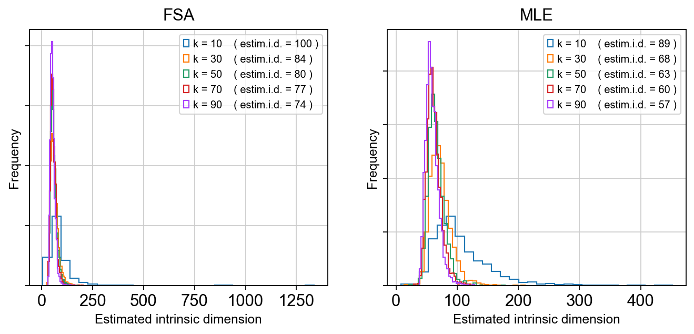
    


As we can see, the estimated global dimensionality is somewhere between 80 and 120. After running, the estimator object and global summaries are stored in `adata.uns['intrinsic_dim_estimator']`, while local ID values are written into `adata.obs` under `id_*` keys (method-dependent). 

In practice, the global estimate provides a sanity check on scaffold dimensionality (too few components risks collapsing trajectories; too many wastes compute and can exaggerate noise), while local ID maps can be overlaid on TopoMAP/TopoPaCMAP layouts to localize where manifold complexity increases. Regions of elevated local ID could coincide with transition zones such as NPC-to-neuroblast progression, branch points separating lineages, or loop-like structure driven by cell-cycle dynamics, and therefore serve as an interpretable geometric guide for component selection and downstream modeling choices.

---
## Eigenspectrum (“scree”) & eigengaps

The spectral scaffold learned by TopoMetry is built from the eigen-decomposition of a diffusion-type operator (a normalized graph Laplacian / diffusion kernel constructed on the kNN graph). Each eigenvalue–eigenvector pair corresponds to a mode of variation of the data manifold: large eigenvalues capture slow, global diffusion modes that reflect dominant biological structure, while smaller eigenvalues capture progressively finer-scale, noisier variations.

Plotting the ordered eigenvalues produces an eigenspectrum (or scree plot). The curve shows how much geometric signal is retained as additional spectral components are included. In practice, this spectrum decays rapidly at first—reflecting a small number of dominant manifold directions—and then flattens as components begin to encode noise or very local structure.

A key diagnostic feature of the eigenspectrum is the eigengap: a sharp drop between consecutive eigenvalues. An eigengap indicates a natural separation between informative dimensions and residual structure, and therefore suggests a principled cutoff for the number of scaffold components to retain. When present, this cutoff often aligns well with global intrinsic dimensionality estimates and provides an intuitive, geometry-driven justification for scaffold sizing.


```python
tg.eigenspectrum()
```


    
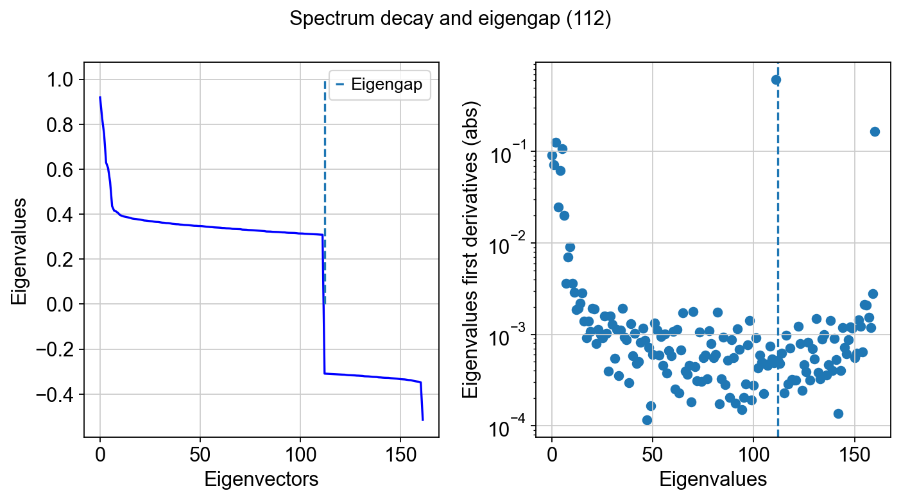
    


Note that the size of the spectral scaffold is usually higher than global intrinsic dimensionality estimates. That is the case because intrinsic dimensionality (ID) is a coarse summary—often a single number—of how many degrees of freedom are needed *locally* or *on average*, whereas a scaffold is an **orthonormal basis** intended to represent the dataset’s geometry **everywhere** and across **multiple scales**. In practice, different regions of the manifold can have different local IDs (branches, loops, mixed trajectories, terminal states), so no single small set of components captures all neighborhoods equally well. Additional scaffold components also act as “coverage”: they provide redundancy so that distinct structures can be represented on different axes, and they help stabilize downstream graphs and layouts when sampling is uneven or when transitions are sharp. Finally, diffusion/Laplacian eigenfunctions are ordered by smoothness, not by “ID relevance,” so it is common to keep more components than a global ID estimate to ensure that both broad structure and finer, region-specific variation are represented without forcing all biology into too few modes.

At the tail of the spectrum, it is common to observe eigenvalues approaching zero and then becoming slightly negative. These negative values are not meaningful geometric signal. They arise from numerical effects in finite-precision eigensolvers (typically operating in 32- or 64-bit floating point), where round-off error dominates once the true eigenvalues fall below machine precision. Many linear algebra backends effectively “flip” the sign of these near-zero modes when numerical noise overwhelms the signal. This behavior is expected and serves as an additional practical indicator that the informative spectrum has been exhausted.

---
## Quick 2‑D visualizations

These layouts are initialized from the spectral scaffold to preserve neighborhoods while keeping global structure reasonable. All results are written to `AnnData`, so we can use scanpy default functions to plot these results. Let's inspect TopoMetry's clustering results and cell type predictions on the TopoMAP and TopoPaCMAP visualizations:


```python
# Four subplots for the two embeddings, clustering results and predicted cell type visualizations
fig, axes = plt.subplots(2, 2, figsize=(10, 10))  

# TopoMAP
sc.pl.embedding(adata, basis="TopoMAP", color="topo_clusters", ax=axes[0, 0], show=False,
                legend_loc=None,frameon=False,  title='TopoMetry clusters', palette=palette) # aesthetics 
sc.pl.embedding(adata, basis="TopoMAP", color="predicted_celltype", ax=axes[0, 1], show=False,
                 title='Predicted Cell Types', frameon=False, palette=palette) # aesthetics 

# TopoPaCMAP
sc.pl.embedding(adata, basis="TopoPaCMAP", color="topo_clusters", title='',  ax=axes[1, 0], show=False,
                 legend_loc=None, frameon=False, palette=palette) # aesthetics
sc.pl.embedding(adata, basis="TopoPaCMAP", color="predicted_celltype", ax=axes[1, 1], show=False, 
                title='', frameon=False, palette=palette) # aesthetics

fig.subplots_adjust(wspace=0.3, hspace=0.3); plt.show()
```


    
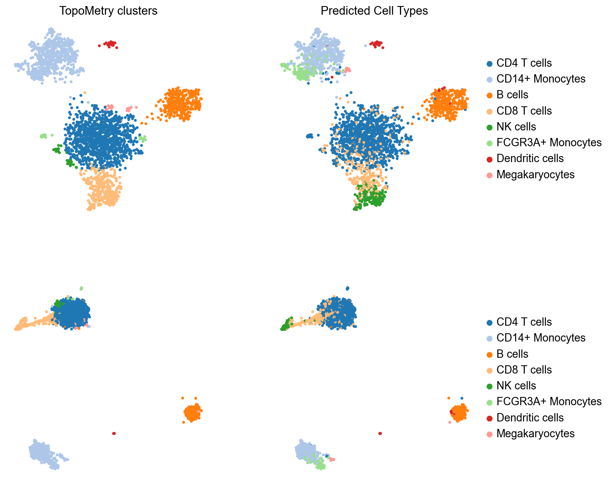
    


TopoMetry also includes utilities to augment scanpy's plots into publication-quality figures with annotation labels:


```python
fig, ax = plt.subplots(1, 1, figsize=(6,6))  

sc.pl.embedding(adata, basis="TopoMAP", color='predicted_celltype', show=False, ax=ax,
                frameon=False, palette=palette, title='') # aesthetics
tp.sc.repel_annotation_labels(adata, groupby='predicted_celltype', basis='TopoMAP', ax=ax)

plt.show()
```

    Looks like you are using a tranform that doesn't support FancyArrowPatch, using ax.annotate instead. The arrows might strike through texts. Increasing shrinkA in arrowprops might help.


    
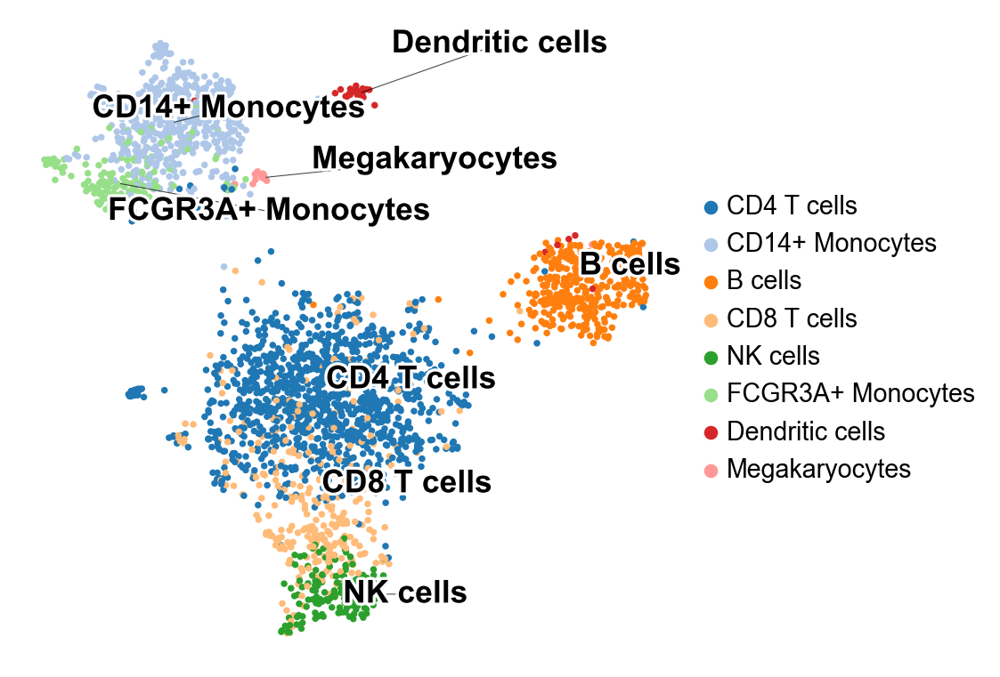
    


TopoMetry finds a surprisingly high number of T cell clusters. numerous T cell populations in this dataset. Interestingly, some of them was classified as "Tfh" (T folicular helper). 

Let's highlight them in a TopoMAP representation to see if "Tfh" (T folicular helper) cells correspond to one of these populations: 


```python
fig, ax = plt.subplots(1, 1, figsize=(6,6))  

ax = sc.pl.embedding(
    adata,
    basis="TopoMAP",
    color="predicted_celltype",
    groups=["Tfh"],
    legend_loc=None,
    title='',
    na_color="#BEBEBE",
    palette='Reds',
    frameon=False,
    size=10,
    ax=ax,
    show=False)

# Find location on the plot where circle should be added
location_cells = adata[adata.obs.predicted_celltype == "Tfh", :].obsm["X_TopoMAP"]
x = location_cells[:, 0].mean() + 0.7
y = location_cells[:, 1].mean() - 0.7
size = 1  # Set circle size
# Plot circle
circle = plt.Circle((x, y), size, color="k", clip_on=False, fill=False)
ax.add_patch(circle)
```

    /tmp/ipykernel_493571/3503324268.py:19: RuntimeWarning: Mean of empty slice.
      x = location_cells[:, 0].mean() + 0.7
    /home/davi/intelpython3/lib/python3.9/site-packages/numpy/core/_methods.py:121: RuntimeWarning: invalid value encountered in divide
      ret = um.true_divide(
    /tmp/ipykernel_493571/3503324268.py:20: RuntimeWarning: Mean of empty slice.
      y = location_cells[:, 1].mean() - 0.7


    <matplotlib.patches.Circle at 0x76b6244f8160>


    ---------------------------------------------------------------------------

    ValueError                                Traceback (most recent call last)

    File ~/intelpython3/lib/python3.9/site-packages/IPython/core/formatters.py:340, in BaseFormatter.__call__(self, obj)
        338     pass
        339 else:
    --> 340     return printer(obj)
        341 # Finally look for special method names
        342 method = get_real_method(obj, self.print_method)


    File ~/intelpython3/lib/python3.9/site-packages/IPython/core/pylabtools.py:169, in retina_figure(fig, base64, **kwargs)
        160 def retina_figure(fig, base64=False, **kwargs):
        161     """format a figure as a pixel-doubled (retina) PNG
        162 
        163     If `base64` is True, return base64-encoded str instead of raw bytes
       (...)
        167         base64 argument
        168     """
    --> 169     pngdata = print_figure(fig, fmt="retina", base64=False, **kwargs)
        170     # Make sure that retina_figure acts just like print_figure and returns
        171     # None when the figure is empty.
        172     if pngdata is None:


    File ~/intelpython3/lib/python3.9/site-packages/IPython/core/pylabtools.py:152, in print_figure(fig, fmt, bbox_inches, base64, **kwargs)
        149     from matplotlib.backend_bases import FigureCanvasBase
        150     FigureCanvasBase(fig)
    --> 152 fig.canvas.print_figure(bytes_io, **kw)
        153 data = bytes_io.getvalue()
        154 if fmt == 'svg':


    File ~/intelpython3/lib/python3.9/site-packages/matplotlib/backend_bases.py:2178, in FigureCanvasBase.print_figure(self, filename, dpi, facecolor, edgecolor, orientation, format, bbox_inches, pad_inches, bbox_extra_artists, backend, **kwargs)
       2176 if bbox_inches:
       2177     if bbox_inches == "tight":
    -> 2178         bbox_inches = self.figure.get_tightbbox(
       2179             renderer, bbox_extra_artists=bbox_extra_artists)
       2180         if (isinstance(layout_engine, ConstrainedLayoutEngine) and
       2181                 pad_inches == "layout"):
       2182             h_pad = layout_engine.get()["h_pad"]


    File ~/intelpython3/lib/python3.9/site-packages/matplotlib/_api/deprecation.py:457, in make_keyword_only.<locals>.wrapper(*args, **kwargs)
        451 if len(args) > name_idx:
        452     warn_deprecated(
        453         since, message="Passing the %(name)s %(obj_type)s "
        454         "positionally is deprecated since Matplotlib %(since)s; the "
        455         "parameter will become keyword-only %(removal)s.",
        456         name=name, obj_type=f"parameter of {func.__name__}()")
    --> 457 return func(*args, **kwargs)


    File ~/intelpython3/lib/python3.9/site-packages/matplotlib/figure.py:1787, in FigureBase.get_tightbbox(self, renderer, bbox_extra_artists)
       1783 if ax.get_visible():
       1784     # some Axes don't take the bbox_extra_artists kwarg so we
       1785     # need this conditional....
       1786     try:
    -> 1787         bbox = ax.get_tightbbox(
       1788             renderer, bbox_extra_artists=bbox_extra_artists)
       1789     except TypeError:
       1790         bbox = ax.get_tightbbox(renderer)


    File ~/intelpython3/lib/python3.9/site-packages/matplotlib/_api/deprecation.py:457, in make_keyword_only.<locals>.wrapper(*args, **kwargs)
        451 if len(args) > name_idx:
        452     warn_deprecated(
        453         since, message="Passing the %(name)s %(obj_type)s "
        454         "positionally is deprecated since Matplotlib %(since)s; the "
        455         "parameter will become keyword-only %(removal)s.",
        456         name=name, obj_type=f"parameter of {func.__name__}()")
    --> 457 return func(*args, **kwargs)


    File ~/intelpython3/lib/python3.9/site-packages/matplotlib/axes/_base.py:4499, in _AxesBase.get_tightbbox(self, renderer, call_axes_locator, bbox_extra_artists, for_layout_only)
       4496     bbox_artists = self.get_default_bbox_extra_artists()
       4498 for a in bbox_artists:
    -> 4499     bbox = a.get_tightbbox(renderer)
       4500     if (bbox is not None
       4501             and 0 < bbox.width < np.inf
       4502             and 0 < bbox.height < np.inf):
       4503         bb.append(bbox)


    File ~/intelpython3/lib/python3.9/site-packages/matplotlib/artist.py:365, in Artist.get_tightbbox(self, renderer)
        349 def get_tightbbox(self, renderer=None):
        350     """
        351     Like `.Artist.get_window_extent`, but includes any clipping.
        352 
       (...)
        363         Returns None if clipping results in no intersection.
        364     """
    --> 365     bbox = self.get_window_extent(renderer)
        366     if self.get_clip_on():
        367         clip_box = self.get_clip_box()


    File ~/intelpython3/lib/python3.9/site-packages/matplotlib/patches.py:645, in Patch.get_window_extent(self, renderer)
        644 def get_window_extent(self, renderer=None):
    --> 645     return self.get_path().get_extents(self.get_transform())


    File ~/intelpython3/lib/python3.9/site-packages/matplotlib/path.py:642, in Path.get_extents(self, transform, **kwargs)
        640         # as can the ends of the curve
        641         xys.append(curve([0, *dzeros, 1]))
    --> 642     xys = np.concatenate(xys)
        643 if len(xys):
        644     return Bbox([xys.min(axis=0), xys.max(axis=0)])


    ValueError: need at least one array to concatenate


    <Figure size 480x480 with 1 Axes>


As we can see, one of the populations identified by TopoMetry could correspond to Tfh-like cells. Let's check the expression of Tfh cells:


```python
sc.pl.embedding(adata, basis='TopoMAP', color=["PDCD1", "ICOS", "GNLY"], cmap='inferno', vmin=0, frameon=False)
```


    
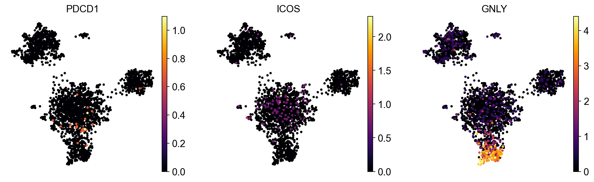
    


As we can see, some cells present specific expression of PDCD1 and ICOS. These markers are associated with activated or exhausted T cells, as well as Tfh-like populations.

---
## Recomputing layouts

Although TopoMetry produces default 2-D layouts as part of the main pipeline, users often wish to recompute or fine-tune graph layouts after inspecting the results. Graph-layout algorithms such as MAP, UMAP, or PaCMAP expose hyperparameters that control trade-offs between local neighbor preservation, global structure, and visual compactness. Adjusting these parameters can improve interpretability for specific datasets or highlight particular biological features, without changing the underlying geometry learned by TopoMetry. Because layouts are downstream visualizations built on the spectral scaffold or refined graphs, they can be safely recomputed multiple times with different settings, allowing exploratory visualization while keeping the core manifold representation fixed.

Layouts can be recomputed using the TopOGraph object `tg` created by `fit_adata()`:


```python
# Remake TopoPaCMAP projection
adata.obsm['X_TopoPaCMAP'] = tg.project(projection_method='PaCMAP', multiscale=False, num_iters=100, n_neighbors=10)

# Plot
sc.pl.embedding(adata, basis='TopoPaCMAP', color="topo_clusters", legend_loc=None, frameon=False, palette=palette)
```


    
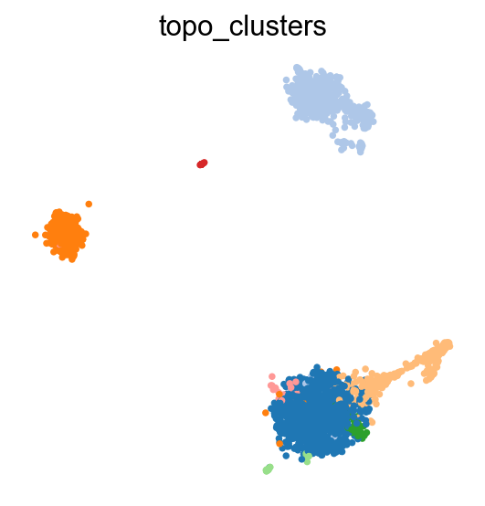
    


---
## Visualizing layout optimization

In addition to inspecting the final embedding, it is often useful to visualize the **layout optimization trajectory**. Watching the map evolve over iterations helps diagnose whether the optimizer has stabilized, whether neighborhoods are still drifting, and whether apparent structure is an artifact of early, under-converged states. This view is also practical for tuning layout hyperparameters (e.g., number of iterations, learning-rate schedule, early exaggeration/repulsion settings, and initialization), and it builds intuition for how TopoMAP/TopoPaCMAP trade off local versus global organization during optimization.

TopoMetry includes a convenience function to visualize the process as an animated GIF, but this is currently limited to TopoMAP embeddings:


```python
tp.sc.visualize_optimization(adata, tg,
                            num_iters=1000,  # number of iterations to visualize - adjust as needed
                            multiscale=False) # visualize the single-scale optimization trajectory)
```


    'TopoMAP_training_1773134615.gif'


---
## Riemannian distortion diagnostics

A 2-D layout is a mapping from the scaffold space to the plane. The **Riemannian metric** on the layout (the “pullback” of ordinary 2-D distances through this mapping) tells us, point by point, how small steps in scaffold space are **stretched**, **squashed**, or **rotated** by the visualization. From this metric we read:

* **area change** (via the metric’s determinant)—negative log-det means **contraction**/crowding; positive log-det means **expansion**/over-separation;  

* **anisotropy** (via the ratio of its principal stretch factors)—large ratios indicate a strong preferred direction (ray-like stretching). By comparing these quantities to their “no-distortion” ideal (area change ≈ 0, anisotropy ≈ 1), we can judge how faithful a 2-D map is to the scaffold’s local geometry and decide whether to adjust parameters (neighbors, scaffold size, layout iterations) or prefer one layout over another.


```python
tp.sc.plot_riemann_diagnostics(adata, tg, proj_key='X_TopoMAP', # specify any projection key in adata.obsm to compute diagnostics for that embedding
                                groupby='topo_clusters',
                                show=True,
                                do_all=False, # default False; if True, computes and plots diagnostics for ALL embeddings in adata.obsm (can be very time-consuming)
                                dpi=80)
```

    Riemannian diagnostics for projection 'X_TopoMAP'


    
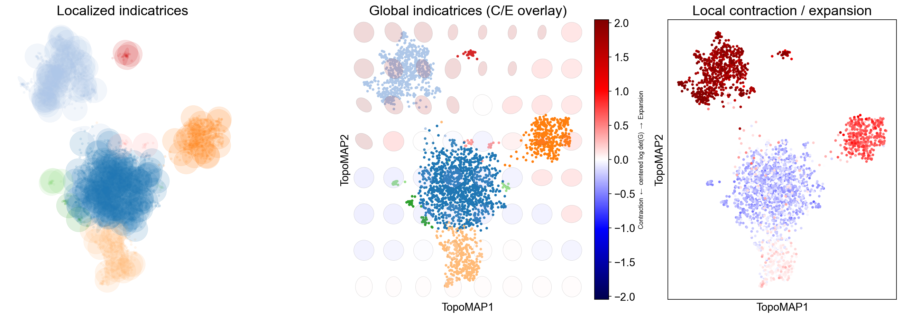
    


These panels quantify how a 2-D map deforms the scaffold’s local geometry:

* **Localized indicatrices** (small ellipses at sampled points) show how distances are stretched/squashed around each cell: long ellipses indicate anisotropy (a preferred direction), round ones indicate locally uniform scaling. 

* A **global indicatrix overlay** places a coarse grid of ellipses over the entire embedding with a background heatmap of the **centered log-determinant** of the pullback metric (blue = contraction, red = expansion), revealing broad fields of deformation that often align with transitions or boundaries. 

* The **per-cell deformation map** colors points by the same contraction/expansion score, making bottlenecks (strong blue), hubs/mixing zones, and overly dilated regions (strong red) easy to spot. 

Use these readouts to verify that neighborhoods of biological interest are not excessively distorted, decide when to adjust neighborhood sizes, and compare embeddings (e.g., TopoMAP vs alternatives) on geometric faithfulness rather than appearance alone.

In this specific case, the Riemannian diagnostics show that regions of the manifold corresponding to monocytes and B cells are expanded in the visualization (i.e., red) when compared to the original geometry, while the region corresponding to T cells is slightly contracted by the visualization.

---
## Calculate deformations

TopoMetry also includes a function to quickly calculate a per-point deformation metric for a given 2-D visualization, which can be used to identify regions of the manifold that are more or less distorted relative to the original high-dimensional space. This can be useful for interpreting visualizations:


```python
# calculate deformation on PCA-based UMAP
tp.sc.calculate_deformation_on_projection(adata, tg, proj_key='PCA_UMAP') # stored in adata.obs['deformation_'+proj_key]

# visualize with scanpy
sc.pl.embedding(adata, basis='PCA_UMAP', color='deformation_PCA_UMAP', cmap='bwr', frameon=False, vmin=-6, vmax=6)
```


    
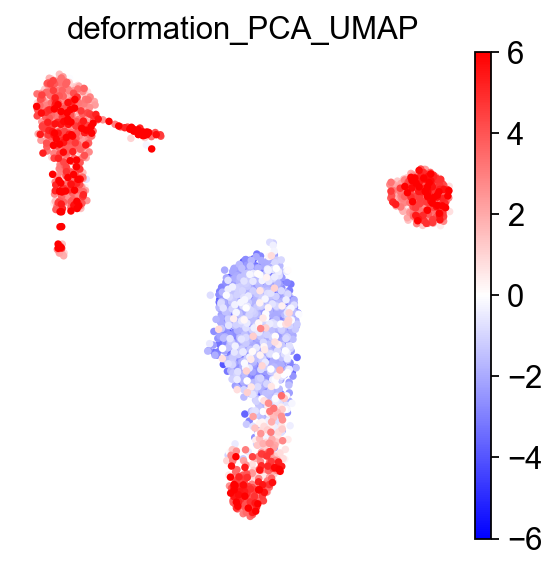
    


---
## Geometry‑preservation metrics 

To quantitatively assess how well a representation preserves the underlying manifold, TopoMetry evaluates **geometry preservation** by directly comparing diffusion operators. Specifically, a reference operator (P_X) is constructed on the original data space (`adata.X`), and each learned representation induces its own operator (P_Y). When (P_Y) closely matches (P_X), both local neighborhoods and global diffusion structure are faithfully preserved, indicating that the representation respects the intrinsic geometry of the data rather than distorting it through projection or embedding artifacts.

TopoMetry summarizes this comparison using complementary operator-native scores:

* **Sparse Neighborhood F1 (PF1)**: measures the overlap of the top-k transition supports for each cell, focusing on whether the same neighbors are retained in the diffusion process while ignoring transition weights.

* **Row-wise Jensen–Shannon similarity (PJS)**: compares the full transition probability distributions row by row, capturing how diffusion mass is redistributed and therefore sensitively reporting local geometric distortions. 

* **Spectral Procrustes (SP)** evaluates consistency at the coordinate level by aligning multiscale diffusion coordinates up to an orthogonal transform and reporting an (R^2)-like goodness of fit. 

Together, these metrics provide a principled, operator-level view of geometry preservation that simultaneously probes neighborhood structure, transition probabilities, and global spectral organization.


```python
tp.sc.evaluate_representations(
    adata,
        tg,
        return_df = False, # if True, returns a dataframe of results; if False, results are stored in adata.uns['topometry_representation_eval']
        print_results = False, # if True, prints a summary of results to the console
        plot_results = True, # controls whether to generate summary plots
        plot_path = None, # if not None, saves summary plots to the specified path
        # operator construction
        n_neighbors = 30, 
        n_jobs = -1,
        # evaluation hyperparams
        times = (1, 2, 4),  # Diffusion times for Spectral Procrustes (SP).
        r = 32, # Leading eigenpairs for spectral metrics.
        k_for_pf1 = None, # Top-k used by PF1; if None, each row uses its native sparsity.
)
```


    
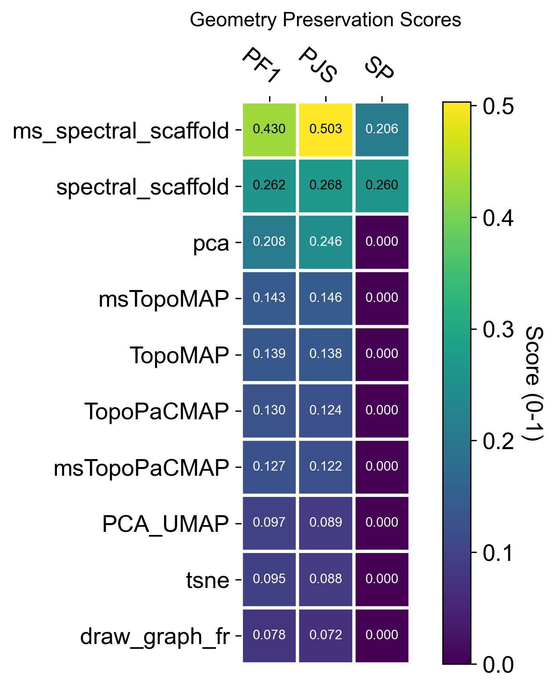
    


---
## Spectral selectivity (axes ↔ labels)

The spectral scaffold is a set of eigenmodes; **spectral selectivity** asks which axes carry structured biological signal (clusters, gradients, trajectories) rather than noise. We score alignment at the cell and neighborhood level to identify informative axes, guide annotations, and prioritize components for downstream use.

- **EAS (Entropy-based Axis Selectivity)** — in \[0, 1\]; measures how concentrated each cell’s energy is on a single spectral axis after standardization and eigenvalue weighting (λ / (1 − λ)). Higher values indicate a single dominant axis per cell (local 1D structure).

- **RayScore** — detects coherent radial progressions along a dominant axis; defined as `sigmoid(neighborhood radial z-score) × EAS`. Large values mark ray-like, outward trajectories (axis sign stored separately).

- **LAC (Local Axial Coherence)** — fraction of local variance explained by the first principal component within the k-NN neighborhood. Values near 1.0 imply locally 1-D structure aligned with a single axis.

- **Radius (spectral radius)** — ‖Z‖₂ of standardized scaffold coordinates; a proxy for distance from the origin in spectral space that often correlates with diffusion-time progression.

Use these together to explore the geometrical structure of your data


```python
tp.sc.spectral_selectivity(adata, tg, groupby_candidates=['topo_clusters'])

spectral_selectivity_keys = ['spectral_EAS', 'spectral_RayScore', 'spectral_LAC', 'spectral_radius']

sc.pl.embedding(adata, basis="TopoMAP", color=spectral_selectivity_keys, ncols=4, cmap='inferno')
```

    /home/davi/topometry/topo/topograph.py:2703: RuntimeWarning: invalid value encountered in log
      H = -_np.sum(P * _np.log(P + eps), axis=1)


    
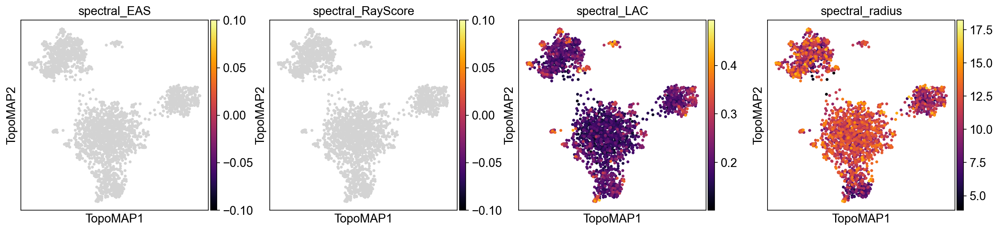
    


High values of EAS, RayScore, and LAC co-localized on the map indicate regions where a single scaffold axis dominates (EAS), progression is radially coherent from the spectral origin (RayScore), and local geometry is effectively 1-D (LAC). These areas are prime candidates for axis-aware annotation (e.g., a differentiation ray) and for using that axis as an ordering variable (akin to pseudotime). In contrast, patches with low EAS/LAC suggest multi-axis mixing or locally 2-D/branching structure, where a single latent coordinate will not summarize biology. The spectral radius adds context: larger radius (brighter) often tracks later “diffusion time” or more advanced states along a trajectory, whereas smaller radius marks proximal/early regions near the scaffold origin. In practice, prioritize axes and neighborhoods where EAS/RayScore/LAC jointly peak, and treat low-selectivity, low-radius areas as candidate hubs, mixing zones, or early states requiring multi-axis interpretation.

---
## Explore scaffold feature modes

Every eigenvector of the diffusion/Laplacian operator encodes a distinct geometric
mode of variation across the cell manifold. Linking each mode back to individual
genes—**feature modes**—lets you ask: *which genes drive each axis of the scaffold?*
This is TopoMetry's interpretability layer.

### Mathematical foundation

Let $P$ be the Markov operator (row-stochastic transition matrix) learned during
`tg.fit()`. Its stationary distribution $\pi$ (the unique probability vector satisfying
$\pi = P^\top \pi$) describes the long-run visitation frequency of each cell and
acts as a natural, **data-driven measure** over the manifold.

For gene $g$ (expression vector $x_g \in \mathbb{R}^n$) and scaffold eigenvector
$\psi_k \in \mathbb{R}^n$, the **$\pi$-weighted correlation** is:

$$\mathrm{corr}_{g,k} = \frac{\langle x_g,\,\psi_k\rangle_\pi}{\|x_g\|_\pi\,\|\psi_k\|_\pi}, \qquad \langle u,v\rangle_\pi = \sum_i \pi_i\, u_i v_i$$

Because $\pi$ up-weights cells in dense, well-sampled regions and down-weights
rare sub-populations, this correlation is more robust than an ordinary Pearson
correlation on unweighted data.

### Standardization modes: `'corr'` vs `'corr_atanh'`

**`standardize='corr'`** — returns the raw $\pi$-weighted correlation $r \in [-1, 1]$.
This is the **principled, interpretable choice**: values are on a universal scale,
directly comparable across genes and components, and suitable for downstream tasks
such as regression, gene-set scoring, or integration with factor-analysis results.
Use this when you want loadings you can explain and quantify.

**`standardize='corr_atanh'`** — applies the Fisher $z$-transform
$z = \tanh^{-1}(r)$, then normalises each column by its maximum absolute value.
Because $\tanh^{-1}$ diverges near $\pm 1$, it **amplifies strong associations**
and compresses weak ones, making faint but consistent signals stand out.
Use this for **pattern discovery**: revealing secondary gene programmes that are
real but modest in raw correlation, e.g. cycling genes layered on top of a
lineage axis. Note that the absolute magnitude is no longer directly interpretable
after normalisation; rank and sign remain meaningful.


#### Principled loadings — `standardize='corr'`

We run `calculate_feature_modes` with the default `operator='X'` (the base Markov
operator $P_X$ built from raw gene space) and `multiscale=True` so that the
multiscale diffusion map eigenvectors are used as the scaffold. Results are stored
in `adata.varm` under the key `feature_modes_ms_x_corr` and metadata in
`adata.uns['feature_modes_ms_x_corr_meta']`.


```python
tp.sc.calculate_feature_modes(
    adata, tg,
    multiscale=True,
    operator="X",
    weight=True,
    standardize='corr',
    return_results=False,
)
tp.sc.plot_feature_modes(
    adata,
    store_key='feature_modes_ms_x_corr',
    components_to_plot=range(0, 31),
    n_top_features=3,
    cmap='bwr',
    show_colorbar=True,
    fontsize=14,
)
```


    
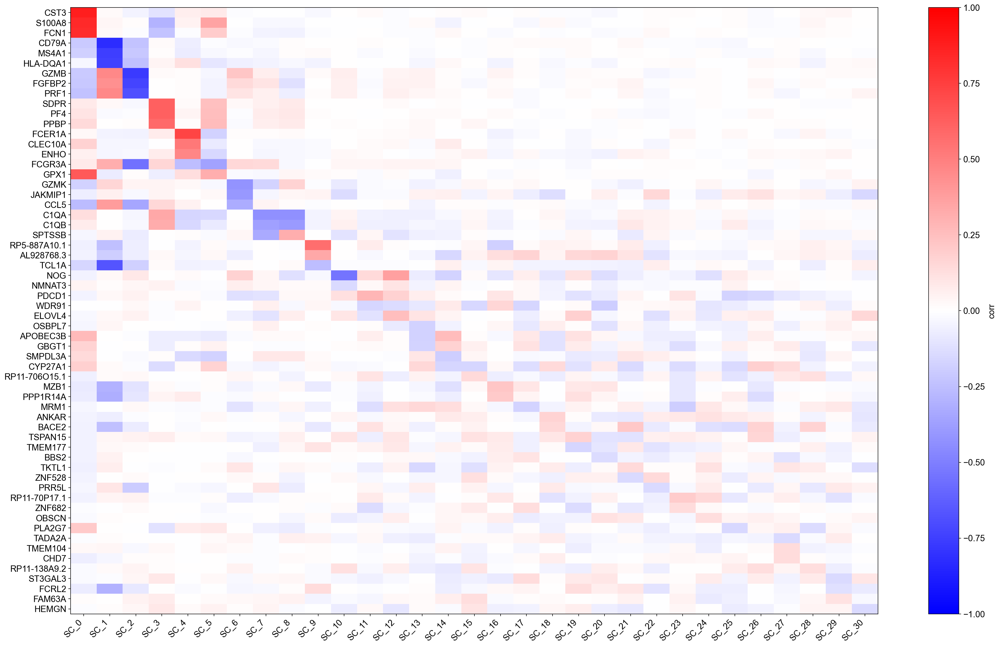
    


Each row of the heatmap is a gene; each column is a scaffold eigenvector (ranked by
eigenvalue). Colours encode $\pi$-weighted correlation: red means the gene is
positively associated with that geometric mode, blue means negatively associated.
The top-$k$ gene names annotated on the right are the genes with the strongest
absolute correlation per component.

Because values are genuine correlations, you can immediately interpret them:
a value of $0.6$ means that gene explains ~36 % of the variance of that scaffold
axis (in the $\pi$-weighted sense). Components with a handful of very high
correlations correspond to sharp, gene-dominated axes (e.g., a lineage marker);
components with many moderate correlations correspond to broad, combinatorial
programmes (e.g., cell-cycle or metabolic state).


#### Pattern-discovery loadings — `standardize='corr_atanh'`

The Fisher $z$-transform amplifies associations near $\pm 1$ and compresses those
near $0$. After per-column normalisation, the heatmap reveals the **relative
importance** of genes within each component rather than their absolute correlation.
This makes it easier to spot secondary gene programmes that are real but subtle.


```python
tp.sc.calculate_feature_modes(
    adata, tg,
    multiscale=True,
    operator="X",
    weight=True,
    standardize='corr_atanh',
    return_results=False,
)
tp.sc.plot_feature_modes(
    adata,
    store_key='feature_modes_ms_x_corr_atanh',
    components_to_plot=range(0, 31),
    n_top_features=3,
    cmap='bwr',
    show_colorbar=True,
    fontsize=14,
)
```


    
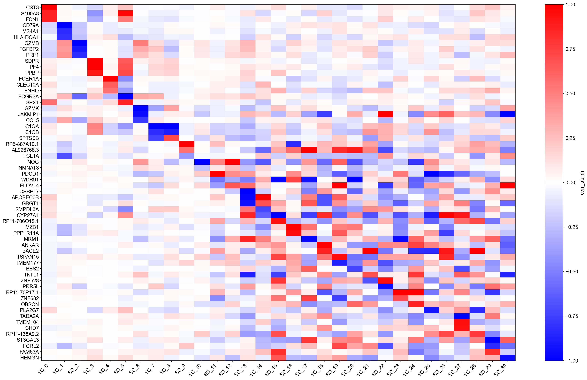
    


Compare this heatmap with the `'corr'` version above:

- Genes that had raw $|r| \approx 0.9$–$1.0$ now saturate near $\pm 1$ and
  appear as the dominant markers — their biological signal is very clean.
- Genes with $|r| \approx 0.3$–$0.5$ that were faint in the `'corr'` plot may
  now rise into the top-$k$ annotation list, revealing co-regulated secondary
  programmes.

A useful workflow is to use `'corr'` for **reporting and integration** (e.g., feeding
loadings into GSEA or a regression model) and `'corr_atanh'` for **exploration**
(spotting unexpected gene programmes worth following up).

You can also inspect the top genes for any component programmatically:


```python
import pandas as pd

# Load the corr loadings and show the top 10 genes for component 0
key = 'feature_modes_ms_x_corr'
meta = adata.uns[key + '_meta']
loadings = pd.DataFrame(
    adata.varm[key],
    index=adata.var_names,
    columns=[f"SC_{i}" for i in range(adata.varm[key].shape[1])],
)
print('Top 10 genes for SC_0 (by |corr|):')
print(loadings['SC_0'].abs().nlargest(10).to_frame().join(loadings['SC_0'].rename('corr')))
```

    Top 10 genes for SC_0 (by |corr|):
                SC_0      corr
    index                     
    CST3    0.877551  0.877551
    S100A8  0.828552  0.828552
    FCN1    0.827702  0.827702
    AIF1    0.825896  0.825896
    LST1    0.823422  0.823422
    TYROBP  0.803341  0.803341
    LGALS2  0.780447  0.780447
    TYMP    0.767044  0.767044
    LGALS1  0.728653  0.728653
    FCER1G  0.714550  0.714550


---
## Imputation

TopoMetry supports **geometry-aware imputation** by diffusing expression values over the learned diffusion operator, in close analogy to methods such as MAGIC. Rather than smoothing directly in gene-expression space, imputation is performed on the refined diffusion geometry learned by TopoMetry, so information is propagated preferentially along manifold-consistent directions and across biologically meaningful neighborhoods. This approach reduces technical sparsity while minimizing spurious mixing between unrelated cell states, a common failure mode when imputation is driven by distorted low-dimensional embeddings.

Concretely, gene expression is propagated using powers of the diffusion operator, effectively averaging expression across multi-step random walks on the graph. Early diffusion steps emphasize local denoising, while later steps incorporate broader contextual information along trajectories and branches. Because the operator itself is geometry-preserving by construction, imputed values tend to sharpen continuous programs such as differentiation or cell-cycle progression without collapsing discrete populations. As with MAGIC, diffusion time controls the strength of smoothing, but in TopoMetry this parameter is grounded in the learned manifold and can be interpreted in terms of diffusion scale rather than arbitrary neighborhood size.


```python
tp.sc.impute_adata(
    adata,
    tg=tg,
    impute_t_grid=(2, 4, 8), # diffusion times for imputation; adjust as needed - using multiple times can provide more robust imputation but increases runtime
    null_K=1000, # default, number of K permutations for null distribution to score against 
    raw=False, # whether to impute  adata.X (if False, default) or adata.raw.X (if True - massively increases runtime). 
)
```


```python
sc.pl.embedding(adata, basis='TopoMAP', color=['IL32', 'GZMB', 'NKG7', 'FCER1A'], cmap='inferno', layer='scaled', vmin=0)
```


    
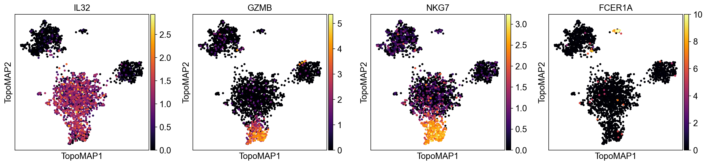
    


```python
sc.pl.embedding(adata, basis='TopoMAP', color=['IL32', 'GZMB', 'NKG7', 'FCER1A'], cmap='inferno', layer='topo_imputation', vmin=0)
```


    
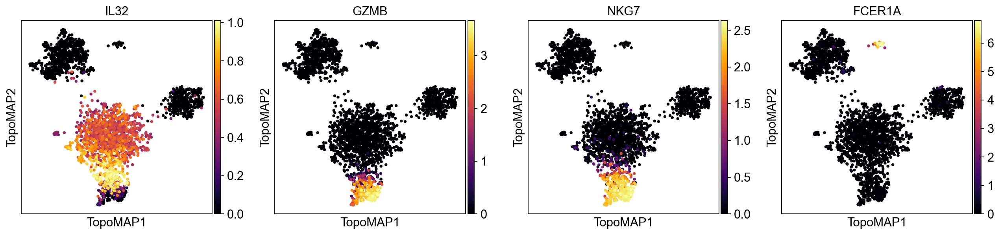
    


As we can see, the imputation eliminates noisy non-specific signal across different marker genes. 

---
## Graph‑signal filtering 

Graph signal filtering treats measurements defined on cells—such as gene expression, categorical annotations, or experimental readouts—as **signals living on a graph**, rather than as independent observations. In single-cell data, the graph encodes the manifold structure of the population through neighborhood relationships, so filtering corresponds to propagating information along biologically meaningful paths while respecting the underlying geometry. By applying diffusion operators to these signals, high-frequency noise that is inconsistent with the graph structure is attenuated, whereas coherent patterns that align with trajectories, branches, or neighborhoods are reinforced. This perspective provides a principled way to denoise, smooth, and interpret cell-level signals in a geometry-aware manner, closely analogous to low-pass filtering in classical signal processing but defined over a data-driven manifold instead of a regular grid.


Because the example dataset (pbmc3k) consists of cells from a single healthy donor, it does not contain a naturally varying signal suitable for demonstrating graph-signal filtering. Instead, we simulate a binary disease-state label by randomly assigning half of the cells to a "disease" state:


```python
rng = np.random.default_rng(7)

# pick a cluster key (prefer highest-resolution topo_clusters_res*)
cluster_key = "topo_clusters_res0.8"
labels = adata.obs[cluster_key].astype("category")
cats = labels.cat.categories.to_numpy()

# choose 3 hotspot clusters (or fewer if not available)
hotspot = rng.choice(cats, size=min(3, len(cats)), replace=False)
hotspot_set = set(hotspot.tolist())

# simulate disease state: 70% diseased in hotspot clusters, 10% elsewhere
diseased = np.zeros(adata.n_obs, dtype=bool)
for c in cats:
    idx = np.flatnonzero(labels.values == c)
    if idx.size == 0:
        continue
    frac = 0.7 if c in hotspot_set else 0.1
    ksel = int(round(frac * idx.size))
    chosen = rng.choice(idx, size=max(1, min(ksel, idx.size)), replace=False)
    diseased[chosen] = True

sim_key = "simulated_state"
adata.obs[sim_key] = pd.Categorical(np.where(diseased, "diseased", "healthy"), categories=["healthy", "diseased"])
```

Now that we simulated a disease state, we can filter the signal and visualize the results:


```python
# Filter the signal with diffusion on the multiscale scaffold
tp.sc.filter_signal(
    adata,
    tg,
    signal_key='simulated_state',
    signal="diseased",
    which="msZ", # multiscale scaffold (default) - also supports "Z" for fixed-scale scaffold
    diffusion_t=1, # diffusion time - controls the extent of smoothing; higher values lead to more smoothing
    normalize="auto",
)

# Visualize raw vs filtered
sc.pl.embedding(
    adata,
    basis="TopoMAP",
    color=["simulated_state", "simulated_state__gf__filtered_t1_msz"],
    frameon=False,
    legend_loc="right",
    cmap='Reds'
)
```


    
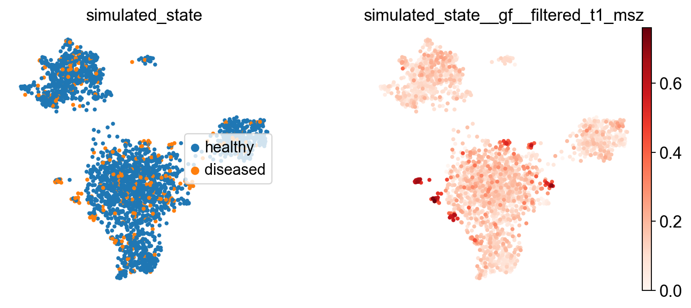
    


## Saving

Finally, we save a clean, portable `.h5ad` and write the fitted `TopOGraph` as a pickle. 


```python
adata.write_h5ad("pbmc3k_topometry.h5ad")
tp.save_topograph(tg, "pbmc3k_topograph.pkl")
```

    TopOGraph saved at pbmc3k_topograph.pkl


```python
# Optional: re‑load to verify
tg = tp.load_topograph("pbmc3k_topograph.pkl")
tg
```


<style>#sk-container-id-1 {
  /* Definition of color scheme common for light and dark mode */
  --sklearn-color-text: #000;
  --sklearn-color-text-muted: #666;
  --sklearn-color-line: gray;
  /* Definition of color scheme for unfitted estimators */
  --sklearn-color-unfitted-level-0: #fff5e6;
  --sklearn-color-unfitted-level-1: #f6e4d2;
  --sklearn-color-unfitted-level-2: #ffe0b3;
  --sklearn-color-unfitted-level-3: chocolate;
  /* Definition of color scheme for fitted estimators */
  --sklearn-color-fitted-level-0: #f0f8ff;
  --sklearn-color-fitted-level-1: #d4ebff;
  --sklearn-color-fitted-level-2: #b3dbfd;
  --sklearn-color-fitted-level-3: cornflowerblue;

  /* Specific color for light theme */
  --sklearn-color-text-on-default-background: var(--sg-text-color, var(--theme-code-foreground, var(--jp-content-font-color1, black)));
  --sklearn-color-background: var(--sg-background-color, var(--theme-background, var(--jp-layout-color0, white)));
  --sklearn-color-border-box: var(--sg-text-color, var(--theme-code-foreground, var(--jp-content-font-color1, black)));
  --sklearn-color-icon: #696969;

  @media (prefers-color-scheme: dark) {
    /* Redefinition of color scheme for dark theme */
    --sklearn-color-text-on-default-background: var(--sg-text-color, var(--theme-code-foreground, var(--jp-content-font-color1, white)));
    --sklearn-color-background: var(--sg-background-color, var(--theme-background, var(--jp-layout-color0, #111)));
    --sklearn-color-border-box: var(--sg-text-color, var(--theme-code-foreground, var(--jp-content-font-color1, white)));
    --sklearn-color-icon: #878787;
  }
}

#sk-container-id-1 {
  color: var(--sklearn-color-text);
}

#sk-container-id-1 pre {
  padding: 0;
}

#sk-container-id-1 input.sk-hidden--visually {
  border: 0;
  clip: rect(1px 1px 1px 1px);
  clip: rect(1px, 1px, 1px, 1px);
  height: 1px;
  margin: -1px;
  overflow: hidden;
  padding: 0;
  position: absolute;
  width: 1px;
}

#sk-container-id-1 div.sk-dashed-wrapped {
  border: 1px dashed var(--sklearn-color-line);
  margin: 0 0.4em 0.5em 0.4em;
  box-sizing: border-box;
  padding-bottom: 0.4em;
  background-color: var(--sklearn-color-background);
}

#sk-container-id-1 div.sk-container {
  /* jupyter's `normalize.less` sets `[hidden] { display: none; }`
     but bootstrap.min.css set `[hidden] { display: none !important; }`
     so we also need the `!important` here to be able to override the
     default hidden behavior on the sphinx rendered scikit-learn.org.
     See: https://github.com/scikit-learn/scikit-learn/issues/21755 */
  display: inline-block !important;
  position: relative;
}

#sk-container-id-1 div.sk-text-repr-fallback {
  display: none;
}

div.sk-parallel-item,
div.sk-serial,
div.sk-item {
  /* draw centered vertical line to link estimators */
  background-image: linear-gradient(var(--sklearn-color-text-on-default-background), var(--sklearn-color-text-on-default-background));
  background-size: 2px 100%;
  background-repeat: no-repeat;
  background-position: center center;
}

/* Parallel-specific style estimator block */

#sk-container-id-1 div.sk-parallel-item::after {
  content: "";
  width: 100%;
  border-bottom: 2px solid var(--sklearn-color-text-on-default-background);
  flex-grow: 1;
}

#sk-container-id-1 div.sk-parallel {
  display: flex;
  align-items: stretch;
  justify-content: center;
  background-color: var(--sklearn-color-background);
  position: relative;
}

#sk-container-id-1 div.sk-parallel-item {
  display: flex;
  flex-direction: column;
}

#sk-container-id-1 div.sk-parallel-item:first-child::after {
  align-self: flex-end;
  width: 50%;
}

#sk-container-id-1 div.sk-parallel-item:last-child::after {
  align-self: flex-start;
  width: 50%;
}

#sk-container-id-1 div.sk-parallel-item:only-child::after {
  width: 0;
}

/* Serial-specific style estimator block */

#sk-container-id-1 div.sk-serial {
  display: flex;
  flex-direction: column;
  align-items: center;
  background-color: var(--sklearn-color-background);
  padding-right: 1em;
  padding-left: 1em;
}


/* Toggleable style: style used for estimator/Pipeline/ColumnTransformer box that is
clickable and can be expanded/collapsed.
- Pipeline and ColumnTransformer use this feature and define the default style
- Estimators will overwrite some part of the style using the `sk-estimator` class
*/

/* Pipeline and ColumnTransformer style (default) */

#sk-container-id-1 div.sk-toggleable {
  /* Default theme specific background. It is overwritten whether we have a
  specific estimator or a Pipeline/ColumnTransformer */
  background-color: var(--sklearn-color-background);
}

/* Toggleable label */
#sk-container-id-1 label.sk-toggleable__label {
  cursor: pointer;
  display: flex;
  width: 100%;
  margin-bottom: 0;
  padding: 0.5em;
  box-sizing: border-box;
  text-align: center;
  align-items: start;
  justify-content: space-between;
  gap: 0.5em;
}

#sk-container-id-1 label.sk-toggleable__label .caption {
  font-size: 0.6rem;
  font-weight: lighter;
  color: var(--sklearn-color-text-muted);
}

#sk-container-id-1 label.sk-toggleable__label-arrow:before {
  /* Arrow on the left of the label */
  content: "▸";
  float: left;
  margin-right: 0.25em;
  color: var(--sklearn-color-icon);
}

#sk-container-id-1 label.sk-toggleable__label-arrow:hover:before {
  color: var(--sklearn-color-text);
}

/* Toggleable content - dropdown */

#sk-container-id-1 div.sk-toggleable__content {
  max-height: 0;
  max-width: 0;
  overflow: hidden;
  text-align: left;
  /* unfitted */
  background-color: var(--sklearn-color-unfitted-level-0);
}

#sk-container-id-1 div.sk-toggleable__content.fitted {
  /* fitted */
  background-color: var(--sklearn-color-fitted-level-0);
}

#sk-container-id-1 div.sk-toggleable__content pre {
  margin: 0.2em;
  border-radius: 0.25em;
  color: var(--sklearn-color-text);
  /* unfitted */
  background-color: var(--sklearn-color-unfitted-level-0);
}

#sk-container-id-1 div.sk-toggleable__content.fitted pre {
  /* unfitted */
  background-color: var(--sklearn-color-fitted-level-0);
}

#sk-container-id-1 input.sk-toggleable__control:checked~div.sk-toggleable__content {
  /* Expand drop-down */
  max-height: 200px;
  max-width: 100%;
  overflow: auto;
}

#sk-container-id-1 input.sk-toggleable__control:checked~label.sk-toggleable__label-arrow:before {
  content: "▾";
}

/* Pipeline/ColumnTransformer-specific style */

#sk-container-id-1 div.sk-label input.sk-toggleable__control:checked~label.sk-toggleable__label {
  color: var(--sklearn-color-text);
  background-color: var(--sklearn-color-unfitted-level-2);
}

#sk-container-id-1 div.sk-label.fitted input.sk-toggleable__control:checked~label.sk-toggleable__label {
  background-color: var(--sklearn-color-fitted-level-2);
}

/* Estimator-specific style */

/* Colorize estimator box */
#sk-container-id-1 div.sk-estimator input.sk-toggleable__control:checked~label.sk-toggleable__label {
  /* unfitted */
  background-color: var(--sklearn-color-unfitted-level-2);
}

#sk-container-id-1 div.sk-estimator.fitted input.sk-toggleable__control:checked~label.sk-toggleable__label {
  /* fitted */
  background-color: var(--sklearn-color-fitted-level-2);
}

#sk-container-id-1 div.sk-label label.sk-toggleable__label,
#sk-container-id-1 div.sk-label label {
  /* The background is the default theme color */
  color: var(--sklearn-color-text-on-default-background);
}

/* On hover, darken the color of the background */
#sk-container-id-1 div.sk-label:hover label.sk-toggleable__label {
  color: var(--sklearn-color-text);
  background-color: var(--sklearn-color-unfitted-level-2);
}

/* Label box, darken color on hover, fitted */
#sk-container-id-1 div.sk-label.fitted:hover label.sk-toggleable__label.fitted {
  color: var(--sklearn-color-text);
  background-color: var(--sklearn-color-fitted-level-2);
}

/* Estimator label */

#sk-container-id-1 div.sk-label label {
  font-family: monospace;
  font-weight: bold;
  display: inline-block;
  line-height: 1.2em;
}

#sk-container-id-1 div.sk-label-container {
  text-align: center;
}

/* Estimator-specific */
#sk-container-id-1 div.sk-estimator {
  font-family: monospace;
  border: 1px dotted var(--sklearn-color-border-box);
  border-radius: 0.25em;
  box-sizing: border-box;
  margin-bottom: 0.5em;
  /* unfitted */
  background-color: var(--sklearn-color-unfitted-level-0);
}

#sk-container-id-1 div.sk-estimator.fitted {
  /* fitted */
  background-color: var(--sklearn-color-fitted-level-0);
}

/* on hover */
#sk-container-id-1 div.sk-estimator:hover {
  /* unfitted */
  background-color: var(--sklearn-color-unfitted-level-2);
}

#sk-container-id-1 div.sk-estimator.fitted:hover {
  /* fitted */
  background-color: var(--sklearn-color-fitted-level-2);
}

/* Specification for estimator info (e.g. "i" and "?") */

/* Common style for "i" and "?" */

.sk-estimator-doc-link,
a:link.sk-estimator-doc-link,
a:visited.sk-estimator-doc-link {
  float: right;
  font-size: smaller;
  line-height: 1em;
  font-family: monospace;
  background-color: var(--sklearn-color-background);
  border-radius: 1em;
  height: 1em;
  width: 1em;
  text-decoration: none !important;
  margin-left: 0.5em;
  text-align: center;
  /* unfitted */
  border: var(--sklearn-color-unfitted-level-1) 1pt solid;
  color: var(--sklearn-color-unfitted-level-1);
}

.sk-estimator-doc-link.fitted,
a:link.sk-estimator-doc-link.fitted,
a:visited.sk-estimator-doc-link.fitted {
  /* fitted */
  border: var(--sklearn-color-fitted-level-1) 1pt solid;
  color: var(--sklearn-color-fitted-level-1);
}

/* On hover */
div.sk-estimator:hover .sk-estimator-doc-link:hover,
.sk-estimator-doc-link:hover,
div.sk-label-container:hover .sk-estimator-doc-link:hover,
.sk-estimator-doc-link:hover {
  /* unfitted */
  background-color: var(--sklearn-color-unfitted-level-3);
  color: var(--sklearn-color-background);
  text-decoration: none;
}

div.sk-estimator.fitted:hover .sk-estimator-doc-link.fitted:hover,
.sk-estimator-doc-link.fitted:hover,
div.sk-label-container:hover .sk-estimator-doc-link.fitted:hover,
.sk-estimator-doc-link.fitted:hover {
  /* fitted */
  background-color: var(--sklearn-color-fitted-level-3);
  color: var(--sklearn-color-background);
  text-decoration: none;
}

/* Span, style for the box shown on hovering the info icon */
.sk-estimator-doc-link span {
  display: none;
  z-index: 9999;
  position: relative;
  font-weight: normal;
  right: .2ex;
  padding: .5ex;
  margin: .5ex;
  width: min-content;
  min-width: 20ex;
  max-width: 50ex;
  color: var(--sklearn-color-text);
  box-shadow: 2pt 2pt 4pt #999;
  /* unfitted */
  background: var(--sklearn-color-unfitted-level-0);
  border: .5pt solid var(--sklearn-color-unfitted-level-3);
}

.sk-estimator-doc-link.fitted span {
  /* fitted */
  background: var(--sklearn-color-fitted-level-0);
  border: var(--sklearn-color-fitted-level-3);
}

.sk-estimator-doc-link:hover span {
  display: block;
}

/* "?"-specific style due to the `<a>` HTML tag */

#sk-container-id-1 a.estimator_doc_link {
  float: right;
  font-size: 1rem;
  line-height: 1em;
  font-family: monospace;
  background-color: var(--sklearn-color-background);
  border-radius: 1rem;
  height: 1rem;
  width: 1rem;
  text-decoration: none;
  /* unfitted */
  color: var(--sklearn-color-unfitted-level-1);
  border: var(--sklearn-color-unfitted-level-1) 1pt solid;
}

#sk-container-id-1 a.estimator_doc_link.fitted {
  /* fitted */
  border: var(--sklearn-color-fitted-level-1) 1pt solid;
  color: var(--sklearn-color-fitted-level-1);
}

/* On hover */
#sk-container-id-1 a.estimator_doc_link:hover {
  /* unfitted */
  background-color: var(--sklearn-color-unfitted-level-3);
  color: var(--sklearn-color-background);
  text-decoration: none;
}

#sk-container-id-1 a.estimator_doc_link.fitted:hover {
  /* fitted */
  background-color: var(--sklearn-color-fitted-level-3);
}
</style><div id="sk-container-id-1" class="sk-top-container"><div class="sk-text-repr-fallback"><pre>TopOGraph object with 2638 samples and 1838 observations and:
 . Base Kernels: 
    bw_adaptive - .BaseKernelDict[&#x27;bw_adaptive&#x27;]
 . Eigenbases: 
    DM with bw_adaptive - .EigenbasisDict[&#x27;DM with bw_adaptive&#x27;] 
    msDM with bw_adaptive - .EigenbasisDict[&#x27;msDM with bw_adaptive&#x27;]
 . Graph Kernels: 
    bw_adaptive from msDM with bw_adaptive - .GraphKernelDict[&#x27;bw_adaptive from msDM with bw_adaptive&#x27;] 
    bw_adaptive from DM with bw_adaptive - .GraphKernelDict[&#x27;bw_adaptive from DM with bw_adaptive&#x27;]
 . Projections: 
    MAP of bw_adaptive from msDM with bw_adaptive - .ProjectionDict[&#x27;MAP of bw_adaptive from msDM with bw_adaptive&#x27;] 
    MAP of bw_adaptive from DM with bw_adaptive - .ProjectionDict[&#x27;MAP of bw_adaptive from DM with bw_adaptive&#x27;] 
    PaCMAP of msDM with bw_adaptive - .ProjectionDict[&#x27;PaCMAP of msDM with bw_adaptive&#x27;] 
    PaCMAP of DM with bw_adaptive - .ProjectionDict[&#x27;PaCMAP of DM with bw_adaptive&#x27;] 
 Active base kernel  -  .base_kernel 
 Active eigenbasis  -  .eigenbasis 
 Active graph kernel  -  .graph_kernel</pre><b>In a Jupyter environment, please rerun this cell to show the HTML representation or trust the notebook. <br />On GitHub, the HTML representation is unable to render, please try loading this page with nbviewer.org.</b></div><div class="sk-container" hidden><div class="sk-item sk-dashed-wrapped"><div class="sk-label-container"><div class="sk-label fitted sk-toggleable"><input class="sk-toggleable__control sk-hidden--visually" id="sk-estimator-id-1" type="checkbox" ><label for="sk-estimator-id-1" class="sk-toggleable__label fitted sk-toggleable__label-arrow"><div><div>TopOGraph</div></div><div><span class="sk-estimator-doc-link fitted">i<span>Fitted</span></span></div></label><div class="sk-toggleable__content fitted"><pre>TopOGraph object with 2638 samples and 1838 observations and:
 . Base Kernels: 
    bw_adaptive - .BaseKernelDict[&#x27;bw_adaptive&#x27;]
 . Eigenbases: 
    DM with bw_adaptive - .EigenbasisDict[&#x27;DM with bw_adaptive&#x27;] 
    msDM with bw_adaptive - .EigenbasisDict[&#x27;msDM with bw_adaptive&#x27;]
 . Graph Kernels: 
    bw_adaptive from msDM with bw_adaptive - .GraphKernelDict[&#x27;bw_adaptive from msDM with bw_adaptive&#x27;] 
    bw_adaptive from DM with bw_adaptive - .GraphKernelDict[&#x27;bw_adaptive from DM with bw_adaptive&#x27;]
 . Projections: 
    MAP of bw_adaptive from msDM with bw_adaptive - .ProjectionDict[&#x27;MAP of bw_adaptive from msDM with bw_adaptive&#x27;] 
    MAP of bw_adaptive from DM with bw_adaptive - .ProjectionDict[&#x27;MAP of bw_adaptive from DM with bw_adaptive&#x27;] 
    PaCMAP of msDM with bw_adaptive - .ProjectionDict[&#x27;PaCMAP of msDM with bw_adaptive&#x27;] 
    PaCMAP of DM with bw_adaptive - .ProjectionDict[&#x27;PaCMAP of DM with bw_adaptive&#x27;] 
 Active base kernel  -  .base_kernel 
 Active eigenbasis  -  .eigenbasis 
 Active graph kernel  -  .graph_kernel</pre></div> </div></div><div class="sk-parallel"><div class="sk-parallel-item"><div class="sk-item"><div class="sk-label-container"><div class="sk-label fitted sk-toggleable"><input class="sk-toggleable__control sk-hidden--visually" id="sk-estimator-id-2" type="checkbox" ><label for="sk-estimator-id-2" class="sk-toggleable__label fitted sk-toggleable__label-arrow"><div><div>base_kernel: Kernel</div></div></label><div class="sk-toggleable__content fitted"><pre>Kernel() estimator fitted with precomputed distance matrix using a kernel with adaptive bandwidth </pre></div> </div></div><div class="sk-serial"><div class="sk-item"><div class="sk-estimator fitted sk-toggleable"><input class="sk-toggleable__control sk-hidden--visually" id="sk-estimator-id-3" type="checkbox" ><label for="sk-estimator-id-3" class="sk-toggleable__label fitted sk-toggleable__label-arrow"><div><div>Kernel</div></div></label><div class="sk-toggleable__content fitted"><pre>Kernel() estimator fitted with precomputed distance matrix using a kernel with adaptive bandwidth </pre></div> </div></div></div></div></div></div></div></div></div>


That's it for this tutorial! I hope TopoMetry is useful for your research.
