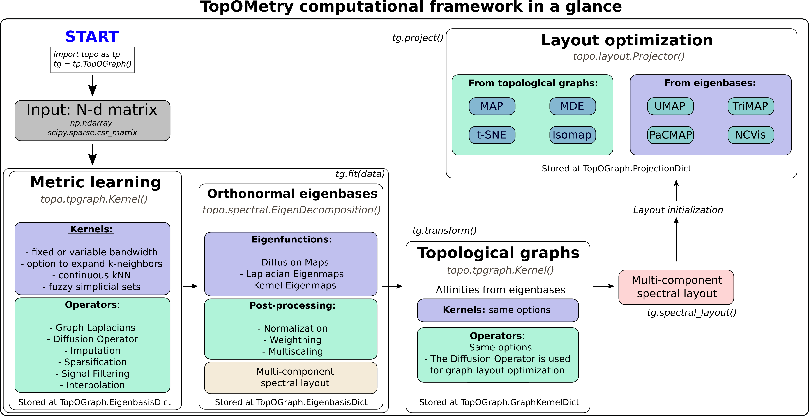

# About TopOMetry

TopOMetry (Topologically Optimized geoMetry) is a high-level python library to explore data topology.
It allows learning topological metrics, dimensionality reduced basis and graphs from data, as well
to visualize them with different layout optimization algorithms. The main objective is to achieve approximations of
the [Laplace-Beltrami Operator](https://en.wikipedia.org/wiki/Laplace%E2%80%93Beltrami_operator), a natural way to describe
data geometry and its high-dimensional topology.

TopOMetry main class is the [TopOGraph](https://topometry.readthedocs.io/en/latest/topograph/) object. In a ``TopOGraph``, topological metrics are recovered with diffusion
harmonics, fuzzy simplicial sets or Continuous-k-Nearest-Neighbors, and used to obtain topological basis (multiscale Diffusion Maps and/or
fuzzy or continuous versions of Laplacian Eigenmaps). On top of these basis, new graphs can be learned using k-nearest-neighbors
graphs or with new topological metrics. The learned metrics, basis and graphs are stored as different attributes of the
``TopOGraph`` object. Finally, built-in adaptations of graph layout methods such as t-SNE and UMAP are used to obtain
visualizations to obtain further insight from data. You can also use TopOMetry to add topological information to your favorite workflow
by using its dimensionality reduced bases to compute k-nearest-neighbors instead of PCA, or its topological graphs as
affinity matrices for other algorithms.

The following diagram represent the different possible combinations of topological models and layouts options:

If you haven't already, [install TopOMetry](installation.md) and [start using it](quickstart.md)!

For users not familiar with single-cell analysis, check the tutorials with [MNIST](MNIST_TopOMetry_Tutorial.md) 
and [document embedding](20Newsgroups_Tutorial.md). 

For single-cell data
analysis, check the tutorials on [evaluating different workflows](pbmc3k.md), 
[learning T CD4 diversity (PBMC 68k)](pbmc68k.md)  and 
[embedding single-cell data to non-Euclidean spaces](Non_euclidean_tutorial.md).