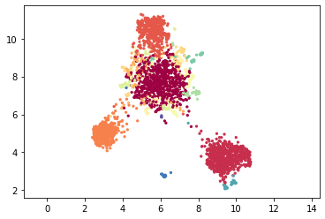
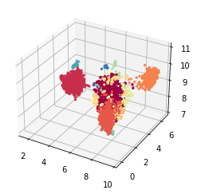
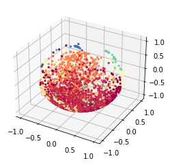
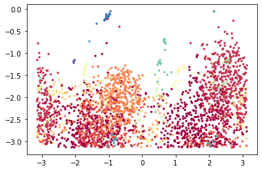
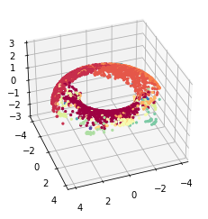
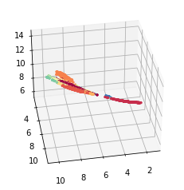
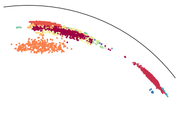
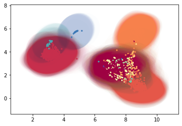

# Embedding to non-euclidean spaces with MAP

MAP (Manifold Approximation and Projection) is a lighter version of [UMAP](https://umap-learn.readthedocs.io/en/latest/index.html) with fewer assumptions. It simply performs the graph layout by optimizing the cross-entropy between a similarity graph and an initialized lower-dimensional embedding. The graph construction is conveniently done by TopOMetry with a loose manifold hypothesis only, and a spectral initialization is used.

For the purpose of data visualization, data is usually embedded to a 2D euclidean plane. However, new studies involving single-cell data analysis have pointed to the utility of performing non-euclidean embeddings [[1](https://doi.org/10.1038/s41467-020-16822-4),[2](https://doi.org/10.1038/s41467-021-22851-4)]. Here, we show how to perform these embeddings within TopOMetry. Please note this heavily relies [on previous work on UMAP](https://umap-learn.readthedocs.io/en/latest/embedding_space.html).

The key idea is we can embed data to any given space, such as spheres, hyperboloids and so on.

To start we’ll load the usual selection of libraries.


```python
import scanpy as sc
import topo as tp
%matplotlib inline
```

As a test dataset we’ll use 3k PBMCs from a Healthy Donor from 10X Genomics available in Scanpy and [here.](https://support.10xgenomics.com/single-cell-gene-expression/datasets/1.1.0/pbmc3k)


```python
adata = sc.datasets.pbmc3k_processed()
```

After loading the data and QC, instead using PCA for linear dimensional reduction, we can use the TopOGraph to make a diffusion-based dimensional reduction to get the topological metrics that we gonna use on the graphs. 


```python
# Start up the TopOGraph
tg = tp.TopOGraph(n_jobs=-1)

# Run a couple of models
tg.run_models(adata.X, kernels=['cknn', 'bw_adaptive'],
                   eigenmap_methods=['DM'],
                   projections=['MAP'])
```

    Computing neighborhood graph...
     Base kNN graph computed in 1.105346 (sec)
     Fitted the cknn kernel in 0.077692 (sec)
    Computing eigenbasis...
     Fitted eigenbasis with Diffusion Maps from the cknn kernel in 2.553819 (sec)
        Building topological graph from eigenbasis...
            Computing neighborhood graph...
     Computed in 0.212759 (sec)
     Fitted the cknn graph kernel in 0.087557 (sec)
     Computed MAP in 4.904644 (sec)
        Building topological graph from eigenbasis...
            Computing neighborhood graph...
     Computed in 0.167265 (sec)
     Fitted the bw_adaptive graph kernel in 0.056129 (sec)
     Computed MAP in 15.412920 (sec)
     Fitted the bw_adaptive kernel in 0.057018 (sec)
    Computing eigenbasis...
     Fitted eigenbasis with Diffusion Maps from the bw_adaptive kernel in 4.019360 (sec)
        Building topological graph from eigenbasis...
            Computing neighborhood graph...
     Computed in 0.275255 (sec)
     Fitted the cknn graph kernel in 0.090399 (sec)
     Computed MAP in 19.579064 (sec)
        Building topological graph from eigenbasis...
            Computing neighborhood graph...
     Computed in 0.237484 (sec)
     Fitted the bw_adaptive graph kernel in 0.070045 (sec)
     Computed MAP in 6.799948 (sec)


<style>#sk-container-id-1 {color: black;background-color: white;}#sk-container-id-1 pre{padding: 0;}#sk-container-id-1 div.sk-toggleable {background-color: white;}#sk-container-id-1 label.sk-toggleable__label {cursor: pointer;display: block;width: 100%;margin-bottom: 0;padding: 0.3em;box-sizing: border-box;text-align: center;}#sk-container-id-1 label.sk-toggleable__label-arrow:before {content: "▸";float: left;margin-right: 0.25em;color: #696969;}#sk-container-id-1 label.sk-toggleable__label-arrow:hover:before {color: black;}#sk-container-id-1 div.sk-estimator:hover label.sk-toggleable__label-arrow:before {color: black;}#sk-container-id-1 div.sk-toggleable__content {max-height: 0;max-width: 0;overflow: hidden;text-align: left;background-color: #f0f8ff;}#sk-container-id-1 div.sk-toggleable__content pre {margin: 0.2em;color: black;border-radius: 0.25em;background-color: #f0f8ff;}#sk-container-id-1 input.sk-toggleable__control:checked~div.sk-toggleable__content {max-height: 200px;max-width: 100%;overflow: auto;}#sk-container-id-1 input.sk-toggleable__control:checked~label.sk-toggleable__label-arrow:before {content: "▾";}#sk-container-id-1 div.sk-estimator input.sk-toggleable__control:checked~label.sk-toggleable__label {background-color: #d4ebff;}#sk-container-id-1 div.sk-label input.sk-toggleable__control:checked~label.sk-toggleable__label {background-color: #d4ebff;}#sk-container-id-1 input.sk-hidden--visually {border: 0;clip: rect(1px 1px 1px 1px);clip: rect(1px, 1px, 1px, 1px);height: 1px;margin: -1px;overflow: hidden;padding: 0;position: absolute;width: 1px;}#sk-container-id-1 div.sk-estimator {font-family: monospace;background-color: #f0f8ff;border: 1px dotted black;border-radius: 0.25em;box-sizing: border-box;margin-bottom: 0.5em;}#sk-container-id-1 div.sk-estimator:hover {background-color: #d4ebff;}#sk-container-id-1 div.sk-parallel-item::after {content: "";width: 100%;border-bottom: 1px solid gray;flex-grow: 1;}#sk-container-id-1 div.sk-label:hover label.sk-toggleable__label {background-color: #d4ebff;}#sk-container-id-1 div.sk-serial::before {content: "";position: absolute;border-left: 1px solid gray;box-sizing: border-box;top: 0;bottom: 0;left: 50%;z-index: 0;}#sk-container-id-1 div.sk-serial {display: flex;flex-direction: column;align-items: center;background-color: white;padding-right: 0.2em;padding-left: 0.2em;position: relative;}#sk-container-id-1 div.sk-item {position: relative;z-index: 1;}#sk-container-id-1 div.sk-parallel {display: flex;align-items: stretch;justify-content: center;background-color: white;position: relative;}#sk-container-id-1 div.sk-item::before, #sk-container-id-1 div.sk-parallel-item::before {content: "";position: absolute;border-left: 1px solid gray;box-sizing: border-box;top: 0;bottom: 0;left: 50%;z-index: -1;}#sk-container-id-1 div.sk-parallel-item {display: flex;flex-direction: column;z-index: 1;position: relative;background-color: white;}#sk-container-id-1 div.sk-parallel-item:first-child::after {align-self: flex-end;width: 50%;}#sk-container-id-1 div.sk-parallel-item:last-child::after {align-self: flex-start;width: 50%;}#sk-container-id-1 div.sk-parallel-item:only-child::after {width: 0;}#sk-container-id-1 div.sk-dashed-wrapped {border: 1px dashed gray;margin: 0 0.4em 0.5em 0.4em;box-sizing: border-box;padding-bottom: 0.4em;background-color: white;}#sk-container-id-1 div.sk-label label {font-family: monospace;font-weight: bold;display: inline-block;line-height: 1.2em;}#sk-container-id-1 div.sk-label-container {text-align: center;}#sk-container-id-1 div.sk-container {/* jupyter's `normalize.less` sets `[hidden] { display: none; }` but bootstrap.min.css set `[hidden] { display: none !important; }` so we also need the `!important` here to be able to override the default hidden behavior on the sphinx rendered scikit-learn.org. See: https://github.com/scikit-learn/scikit-learn/issues/21755 */display: inline-block !important;position: relative;}#sk-container-id-1 div.sk-text-repr-fallback {display: none;}</style><div id="sk-container-id-1" class="sk-top-container"><div class="sk-text-repr-fallback"><pre>TopOGraph object with 2638 samples and 1838 observations and:
 . Base Kernels: 
    cknn - .BaseKernelDict[&#x27;cknn&#x27;] 
    bw_adaptive - .BaseKernelDict[&#x27;bw_adaptive&#x27;]
 . Eigenbases: 
    DM with cknn - .EigenbasisDict[&#x27;DM with cknn&#x27;] 
    DM with bw_adaptive - .EigenbasisDict[&#x27;DM with bw_adaptive&#x27;]
 . Graph Kernels: 
    cknn from DM with cknn - .GraphKernelDict[&#x27;cknn from DM with cknn&#x27;] 
    bw_adaptive from DM with cknn - .GraphKernelDict[&#x27;bw_adaptive from DM with cknn&#x27;] 
    cknn from DM with bw_adaptive - .GraphKernelDict[&#x27;cknn from DM with bw_adaptive&#x27;] 
    bw_adaptive from DM with bw_adaptive - .GraphKernelDict[&#x27;bw_adaptive from DM with bw_adaptive&#x27;]
 . Projections: 
    MAP of cknn from DM with cknn - .ProjectionDict[&#x27;MAP of cknn from DM with cknn&#x27;] 
    MAP of bw_adaptive from DM with cknn - .ProjectionDict[&#x27;MAP of bw_adaptive from DM with cknn&#x27;] 
    MAP of cknn from DM with bw_adaptive - .ProjectionDict[&#x27;MAP of cknn from DM with bw_adaptive&#x27;] 
    MAP of bw_adaptive from DM with bw_adaptive - .ProjectionDict[&#x27;MAP of bw_adaptive from DM with bw_adaptive&#x27;] 
 Active base kernel  -  .base_kernel 
 Active eigenbasis  -  .eigenbasis 
 Active graph kernel  -  .graph_kernel</pre><b>In a Jupyter environment, please rerun this cell to show the HTML representation or trust the notebook. <br />On GitHub, the HTML representation is unable to render, please try loading this page with nbviewer.org.</b></div><div class="sk-container" hidden><div class="sk-item sk-dashed-wrapped"><div class="sk-label-container"><div class="sk-label sk-toggleable"><input class="sk-toggleable__control sk-hidden--visually" id="sk-estimator-id-1" type="checkbox" ><label for="sk-estimator-id-1" class="sk-toggleable__label sk-toggleable__label-arrow">TopOGraph</label><div class="sk-toggleable__content"><pre>TopOGraph object with 2638 samples and 1838 observations and:
 . Base Kernels: 
    cknn - .BaseKernelDict[&#x27;cknn&#x27;] 
    bw_adaptive - .BaseKernelDict[&#x27;bw_adaptive&#x27;]
 . Eigenbases: 
    DM with cknn - .EigenbasisDict[&#x27;DM with cknn&#x27;] 
    DM with bw_adaptive - .EigenbasisDict[&#x27;DM with bw_adaptive&#x27;]
 . Graph Kernels: 
    cknn from DM with cknn - .GraphKernelDict[&#x27;cknn from DM with cknn&#x27;] 
    bw_adaptive from DM with cknn - .GraphKernelDict[&#x27;bw_adaptive from DM with cknn&#x27;] 
    cknn from DM with bw_adaptive - .GraphKernelDict[&#x27;cknn from DM with bw_adaptive&#x27;] 
    bw_adaptive from DM with bw_adaptive - .GraphKernelDict[&#x27;bw_adaptive from DM with bw_adaptive&#x27;]
 . Projections: 
    MAP of cknn from DM with cknn - .ProjectionDict[&#x27;MAP of cknn from DM with cknn&#x27;] 
    MAP of bw_adaptive from DM with cknn - .ProjectionDict[&#x27;MAP of bw_adaptive from DM with cknn&#x27;] 
    MAP of cknn from DM with bw_adaptive - .ProjectionDict[&#x27;MAP of cknn from DM with bw_adaptive&#x27;] 
    MAP of bw_adaptive from DM with bw_adaptive - .ProjectionDict[&#x27;MAP of bw_adaptive from DM with bw_adaptive&#x27;] 
 Active base kernel  -  .base_kernel 
 Active eigenbasis  -  .eigenbasis 
 Active graph kernel  -  .graph_kernel</pre></div></div></div><div class="sk-parallel"><div class="sk-parallel-item"><div class="sk-item"><div class="sk-label-container"><div class="sk-label sk-toggleable"><input class="sk-toggleable__control sk-hidden--visually" id="sk-estimator-id-2" type="checkbox" ><label for="sk-estimator-id-2" class="sk-toggleable__label sk-toggleable__label-arrow">base_kernel: Kernel</label><div class="sk-toggleable__content"><pre>Kernel() estimator fitted with precomputed distance matrix using a kernel with adaptive bandwidth </pre></div></div></div><div class="sk-serial"><div class="sk-item"><div class="sk-estimator sk-toggleable"><input class="sk-toggleable__control sk-hidden--visually" id="sk-estimator-id-3" type="checkbox" ><label for="sk-estimator-id-3" class="sk-toggleable__label sk-toggleable__label-arrow">Kernel</label><div class="sk-toggleable__content"><pre>Kernel() estimator fitted with precomputed distance matrix using a kernel with adaptive bandwidth </pre></div></div></div></div></div></div></div></div></div></div>


Now we need to find the clusters. Here we clustering with leiden


```python
sc.tl.leiden(adata, adjacency=tg.graph_kernel.P)
```


```python
labels = adata.obs['leiden'].astype('int')
```

## Default 2D euclidean plane 

This is the standard ploting option for printed material such as manuscripts and research articles. TopOMetry has a plotting module that can be used to visualize this data:


```python
tp.pl.scatter(tg.ProjectionDict['MAP of bw_adaptive from DM with bw_adaptive'], labels=labels)
```


    

    


TopOMetry can also plot data onto 3 dimensions. When using the 'TkAgg' matplotlib backend users can interactively explore them. For this, we'll need to compute a new initialisation, with 3 dimensions.


```python
tridim_emb = tg.project(projection_method='MAP', n_components=3)

tp.pl.scatter3d(tridim_emb, labels=labels)
```

     Computed MAP in 17.880470 (sec)


    

    


Naturally, we can also use plotly to visualize the results:


```python
import plotly.express as px 

fig = px.scatter_3d(tridim_emb, x=0, y=1, z=2, size_max=5, 
symbol=labels.astype('str'), color=labels.astype('str'))
fig.update_layout(margin=dict(l=0, r=0, b=0, t=0))
fig.show()
```


## Spherical embeddings


Here we project the lower dimensional embedding into a spheric space. 


```python
sphere_emb = tg.project(projection_method='MAP', n_components=2, output_metric='haversine')

tp.pl.sphere(sphere_emb, labels=labels)
```

     Computed MAP in 15.321689 (sec)


    

    


Or its planar projection:


```python
tp.pl.sphere_projection(sphere_emb, labels=labels)
```


    

    


We can also try to plot this with plotly:


```python
import numpy as np
import pandas as pd

x = np.sin(sphere_emb[:, 0]) * np.cos(sphere_emb[:, 1])
y = np.sin(sphere_emb[:, 0]) * np.sin(sphere_emb[:, 1])
z = np.cos(sphere_emb[:, 0])

df = pd.DataFrame({'x': x, 'y': y, 'z': z, 'labels': labels.astype('str')})

fig = px.scatter_3d(df, x=x, y=y, z=z, size_max=5, 
symbol=labels.astype('str'), color=labels.astype('str'))
fig.update_layout(margin=dict(l=0, r=0, b=0, t=0))
fig.show()
```


## Torus embedding

TopOMetry allows you to vizualize your data as a donut, using for this the torus embedding. Torus is a surface of revolution generated by revolving a circle in three-dimensional space about an axis. See more details [here](https://en.wikipedia.org/wiki/Torus)


```python
torus_emb = tg.project(projection_method='MAP', n_components=2, output_metric='torus')

tp.pl.toroid(torus_emb, labels=labels)
```

     Computed MAP in 5.236554 (sec)


    

    


## Hyperboloid embedding


On data science, it is common to use hyperbolic representations for hierarchical data (see more context [here](https://www.ncbi.nlm.nih.gov/pmc/articles/PMC6534139/)). We can use the [hyperboloid model](https://en.wikipedia.org/wiki/Hyperboloid_model) on TopOMetry to see our data in this space:


```python
hyper_emb = tg.project(projection_method='MAP', n_components=2, output_metric='hyperboloid')

tp.pl.hyperboloid(hyper_emb, labels=labels)
```

     Computed MAP in 6.014628 (sec)


    

    


We can also try to visualize this data with plotly:


```python
x,y,z = tp.pl.two_to_3d_hyperboloid(hyper_emb)

df = pd.DataFrame({'x': x, 'y': y, 'z': z, 'labels': labels.astype('str')})

fig = px.scatter_3d(df, x=x, y=y, z=z, size_max=5,
symbol=labels.astype('str'), color=labels.astype('str'))
fig.update_layout(margin=dict(l=0, r=0, b=0, t=0))
fig.show()
```


Usually, we use [Poincare’s disk model](https://en.wikipedia.org/wiki/Poincar%C3%A9_disk_model) for this visualization of a hyperbolic space.


```python
poincare_emb = tg.project(projection_method='MAP', n_components=2, output_metric='poincare')

tp.pl.poincare(poincare_emb, labels=labels)
```

     Computed MAP in 5.075709 (sec)


    

    


## Gaussian-Energy Embedding

Unlike most approaches that represent nodes as point vectors in a low-dimensional continuous space, each one with exact values for every parameter, we can embed each node as a Gaussian distribution and infers a probability distribution over all possible values, allowing us to capture uncertainty about the representation. See more context [here](https://doi.org/10.1371/journal.pcbi.1008186) and [here](https://arxiv.org/abs/1707.03815v4)


```python
gauss_emb = tg.project(projection_method='MAP', n_components=5, output_metric='gaussian_energy')

tp.pl.gaussian_potential(gauss_emb, labels=labels)
```

     Computed MAP in 8.252542 (sec)


    

    


### That was it for this tutorial!

So now you know how to use the various possible output metrics of MAP (because of UMAP) to visualize your single-cell data!
