# Evaluating single-cell analysis workflows: ~3,000 PBMC

In this tutorial, we are going to analyze some [single-cell RNA-seq](https://en.wikipedia.org/wiki/Single_cell_sequencing) data with TopOMetry. TopOMetry has a companion package , [CellTOMetry](https://github.com/davisidarta/celltometry), which is focused on computational workflows for single-cell data using [scanpy](https://scanpy.readthedocs.io/) and the [AnnData](https://anndata.readthedocs.io/en/latest/index.html) family of objects. These objects contain gene expression matrices, metadata, dimensional reductions and neighborhood information. 

CellTOMetry can run all TopOMetry models at once given an AnnotatedData object in a single command. 
The topological analysis is centered around the TopOGraph object, as  CellTOMetry will automatically add results to  _AnnData_  and perform clustering with the Leiden clustering algorithm. CellTOMetry also contains simple wrappers aroud scanpy's workflow for preprocessing and standard single-cell analysis. 


```python
# Import libraries

import scanpy as sc
import topo as tp
import celltometry as ct
```

    /home/davi/.local/lib/python3.9/site-packages/torchvision/io/image.py:11: UserWarning: Failed to load image Python extension: /home/davi/.local/lib/python3.9/site-packages/torchvision/image.so: undefined symbol: _ZNK3c106IValue23reportToTensorTypeErrorEv
      warn(f"Failed to load image Python extension: {e}")


```python
sc.settings.verbosity = 0  
sc.settings.set_figure_params(dpi=200,  dpi_save=800, facecolor='white', format='tif') 
%matplotlib inline
```

Let's use the _pbmc3k_ dataset from 10X genomics. It comes with Scanpy, so it's super easy to get.


```python
adata = sc.datasets.pbmc3k()
adata
```


    AnnData object with n_obs × n_vars = 2700 × 32738
        var: 'gene_ids'


## Default Scanpy workflow

Next, we'll perform the default scanpy preprocessing:
- Normalize libraries by size and log-transform expression values
- Select highly variable genes

And the default scanpy workflow:
- Double center ('scale')
- Run PCA
- Get a neighborhood graph from PCA results (with fuzzy simplicial sets by default)
- Embed the neighborhood graph with UMAP
- Cluster the neighborhood graph with the Leiden community detection algorithm


```python
adata = ct.preprocess(adata)
adata = ct.default_workflow(adata, scale=True)
sc.pl.umap(adata, color=['leiden'])
```

    /home/davi/.local/lib/python3.9/site-packages/scanpy/preprocessing/_simple.py:843: UserWarning: Revieved a view of an AnnData. Making a copy.
      view_to_actual(adata)


    
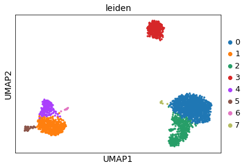
    


Here, we'll also plot some marker genes:
- CD4 for T CD4 cells (also expressed in LYZ+ monocytes)
- CD8A for T CD8 cells
- LYZ for monocytes
- MS4A1 for B cells
- PPBP for megakaryocytes


```python
sc.pl.umap(adata, color=['leiden', 'CD4', 'CD8A', 'LYZ', 'MS4A1', 'PPBP'], ncols=3)
```


    
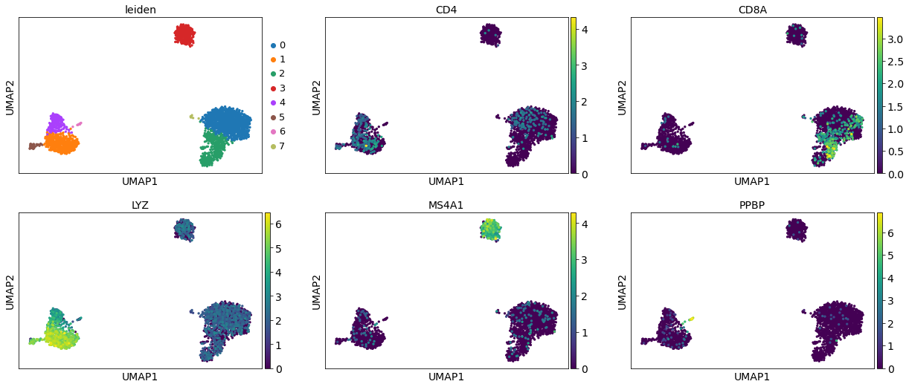
    


## Topological workflow:

### Setting a TopOGraph

Now, we'll perform the topological workflow with TopOMetry, using CellTOMetry to help us manage the _AnnData_ object storing our analysis. We'll start an empty _TopOGraph_ object, and populate it and _AnnData_ with CellTOMetry.

The main function in CellTOMetry is the `topological_workflow()`. It will use the expression matrix in the `adata.X` slot to extract orthogonal bases, new topological graphs and layouts for visualizations. It will also employ the Leiden community detection algorithm to cluster cells accordingly with the topological graphs.

Current options are:
- Bases: `'diffusion'`, `'continuous'` and `'fuzzy'`;
- Graphs: `'diff'`, '`cknn`' and `'fuzzy'`;
- Layouts: `'MAP'`, `'PaCMAP'`, `'MDE'`, `'TriMAP'`, `'NCVis'` and `'tSNE'`.

The `'continuous'` and `'cknn`' options are _quite_ computationally expensive and demand a lot of memory. Keep this in mind if you're dealing with a large dataset (>30,000 cells) or using a modest computational environment.

Any combination of these can theoretically generate meaningful results, which deserve to be visually inspected and scored for assessing global and local structure preservation. As of now, TopOMetry allows 30 possible layouts to be generated with these combinations from a single dataset.


```python
tg = ct.TopOGraph(n_jobs=12, n_eigs=50)

# These are all the available models within TopOMetry (30 possible layouts)
adata = ct.topological_workflow(adata, tg, bases=['diffusion', 'continuous', 'fuzzy'], 
                                graphs=['diff', 'cknn', 'fuzzy'],                      
                                layouts=['MAP', 'PaCMAP', 'MDE', 'TriMAP', 'NCVis', 'tSNE'])
```

    Computing neighborhood graph...
     Base kNN graph computed in 4.676944 (sec)
    Building topological basis...using diffusion model.
     Topological basis fitted with multiscale self-adaptive diffusion maps in 0.357751 (sec)
             Computing spectral layout...


    /home/davi/.local/lib/python3.9/site-packages/pacmap/pacmap.py:383: FutureWarning: elementwise comparison failed; returning scalar instead, but in the future will perform elementwise comparison
      if Yinit is None or Yinit == "pca":
    /home/davi/.local/lib/python3.9/site-packages/pacmap/pacmap.py:389: FutureWarning: elementwise comparison failed; returning scalar instead, but in the future will perform elementwise comparison
      elif Yinit == "random":


             Obtained PaCMAP embedding in = 8.855343 (sec)
             Obtained TriMAP embedding in = 10.274162 (sec)
             Obtained tSNE embedding in = 4.691163 (sec)
             Obtained NCVis embedding in = 1.982002 (sec)
        Building topological graph...
         Topological `diff` graph extracted in = 0.119075 (sec)
             Optimized MAP embedding in = 4.592063 (sec)
             Obtained MDE embedding in = 2.917383 (sec)
        Building topological graph...
         Topological `cknn` graph extracted in = 0.334578 (sec)
             Optimized MAP embedding in = 1751.397080 (sec)
             Obtained MDE embedding in = 10.748615 (sec)
             Optimized MAP embedding in = 6.217152 (sec)
             Obtained MDE embedding in = 2.916786 (sec)
    Building topological basis...using continuous model.
     Topological basis fitted with Laplacian Eigenmaps from Continuous-k-Nearest-Neighbors in 5.593451 (sec)


    /home/davi/.local/lib/python3.9/site-packages/pacmap/pacmap.py:383: FutureWarning: elementwise comparison failed; returning scalar instead, but in the future will perform elementwise comparison
      if Yinit is None or Yinit == "pca":
    /home/davi/.local/lib/python3.9/site-packages/pacmap/pacmap.py:389: FutureWarning: elementwise comparison failed; returning scalar instead, but in the future will perform elementwise comparison
      elif Yinit == "random":


             Obtained PaCMAP embedding in = 1.943901 (sec)
             Obtained TriMAP embedding in = 3.304230 (sec)
             Obtained tSNE embedding in = 5.716446 (sec)
             Obtained NCVis embedding in = 1.962625 (sec)
        Building topological graph...
         Topological `diff` graph extracted in = 0.144766 (sec)
             Optimized MAP embedding in = 4.858031 (sec)
             Obtained MDE embedding in = 3.856189 (sec)
        Building topological graph...
         Topological `cknn` graph extracted in = 0.360193 (sec)
             Optimized MAP embedding in = 1801.425467 (sec)
             Obtained MDE embedding in = 9.896433 (sec)
        Building topological graph...
         Topological `fuzzy` graph extracted in = 2.481213 (sec)
             Optimized MAP embedding in = 6.195711 (sec)
             Obtained MDE embedding in = 2.842338 (sec)
    Building topological basis...using fuzzy model.
     Topological basis fitted with Laplacian Eigenmaps from fuzzy simplicial sets in 7.010832 (sec)


    /home/davi/.local/lib/python3.9/site-packages/pacmap/pacmap.py:383: FutureWarning: elementwise comparison failed; returning scalar instead, but in the future will perform elementwise comparison
      if Yinit is None or Yinit == "pca":
    /home/davi/.local/lib/python3.9/site-packages/pacmap/pacmap.py:389: FutureWarning: elementwise comparison failed; returning scalar instead, but in the future will perform elementwise comparison
      elif Yinit == "random":


             Obtained PaCMAP embedding in = 4.514045 (sec)
             Obtained TriMAP embedding in = 2.524693 (sec)
             Obtained tSNE embedding in = 5.248896 (sec)
             Obtained NCVis embedding in = 0.687866 (sec)
        Building topological graph...
         Topological `diff` graph extracted in = 0.122813 (sec)
             Optimized MAP embedding in = 3.275765 (sec)
             Obtained MDE embedding in = 2.870505 (sec)
        Building topological graph...
         Topological `cknn` graph extracted in = 0.325902 (sec)
             Optimized MAP embedding in = 1893.901896 (sec)
             Obtained MDE embedding in = 18.409658 (sec)
        Building topological graph...
         Topological `fuzzy` graph extracted in = 2.884828 (sec)
             Optimized MAP embedding in = 9.713447 (sec)
             Obtained MDE embedding in = 3.977812 (sec)


### Dimensionality estimation

One of the core features of the topological workflow is automatic dimensionality estimation. This happens as a side-effect of the bit limit during matrix decomposition: when the 64-bit precision limit is reached, the sign of the resulting eigenvalues flip from positive to negative or become null. Thus, we will not need to arbitrarily select a number of components to use in downstream analysis - an initial guess large enough to find an spectral gap is enough. 

Please note that this is an indirect inference that happens partly as a consequence of the bit-limit. The true dimensionality of the data could be different, and accurately estimating it is a field of research on its own. Nonetheless, this is useful to decide how many components to keep and arises naturally from data. I recommend computing a large enough number of eigencomponents (`n_eigs` parameter of TopOGraph) so that you find such a limit.


```python
tg.scree_plot(basis='diffusion')
tg.scree_plot(basis='fuzzy')
tg.scree_plot(basis='continuous')
```


    
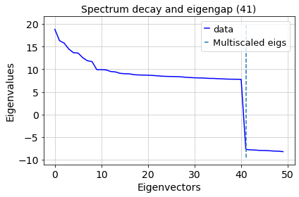
    


    /home/davi/.local/lib/python3.9/site-packages/kneed/knee_locator.py:304: UserWarning: No knee/elbow found
      warnings.warn("No knee/elbow found")


    
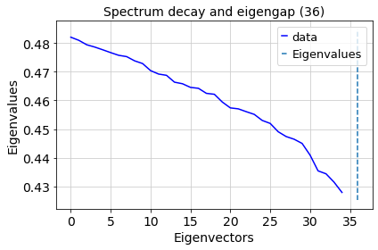
    


    /home/davi/.local/lib/python3.9/site-packages/kneed/knee_locator.py:304: UserWarning: No knee/elbow found
      warnings.warn("No knee/elbow found")


    
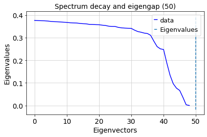
    


Next, let's inspect how some of these layouts and clustering results look like!

### Visualize results

Results are seamlessly added to the `adata` object and be plotted with scanpy:


```python
sc.pl.embedding(adata, basis='db_PaCMAP', color=['pca_leiden', 'db_diff_leiden'])
sc.pl.embedding(adata, basis='fb_PaCMAP', color=['pca_leiden', 'fb_fuzzy_leiden'])
sc.pl.embedding(adata, basis='cb_PaCMAP', color=['pca_leiden', 'cb_fuzzy_leiden'])
```


    
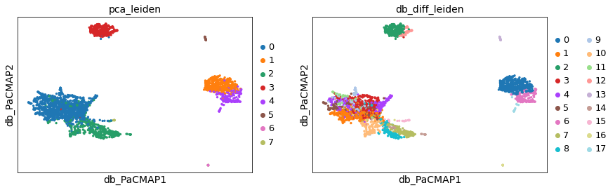
    


    
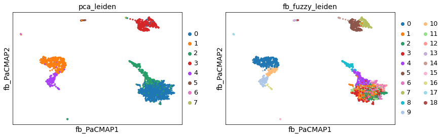
    


    
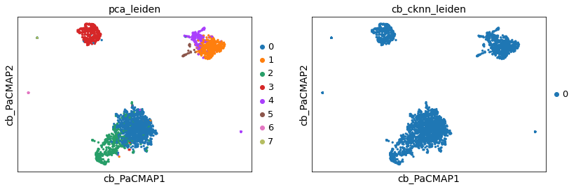
    


```python
sc.pl.embedding(adata, basis='db_diff_MAP', color=['pca_leiden', 'db_diff_leiden'])
sc.pl.embedding(adata, basis='fb_fuzzy_MAP', color=['pca_leiden', 'fb_fuzzy_leiden'])
sc.pl.embedding(adata, basis='cb_fuzzy_MAP', color=['pca_leiden', 'cb_fuzzy_leiden'])
```


    
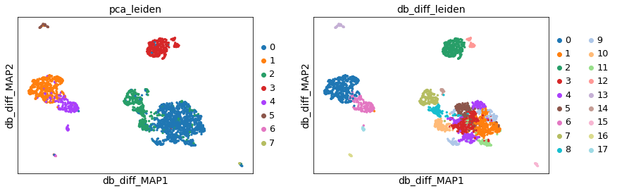
    


    
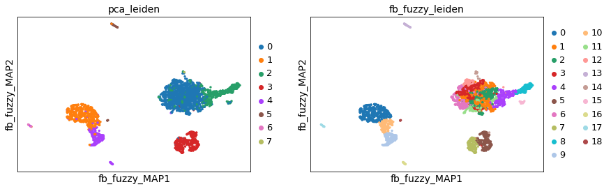
    


    
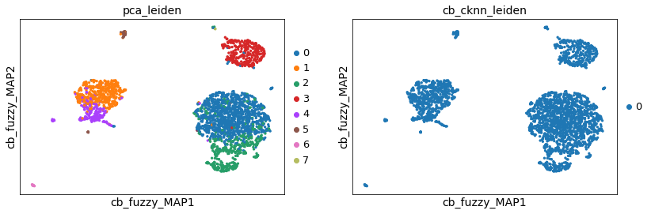
    


Alright! There are some differences between embeddings, but all show more of less the same distribution of cell types. Topological embeddings do generate an additional number of clusters, particularly of T CD4 cells.

Next, we'll evaluate how much each of these orthogonal bases, topological graphs and layouts preserve the original global and local structure of the dataset.

## Scoring models

We can obtain two scores for each representation we learned: a global score and a local score. The global score relates to how well the representation resemblances PCA in preserving the global structure, and was introduced in the TriMAP manuscript (see [here]() for details). The local score assesses how much connectivity changes during the embedding; formally, it is the Spearman correlation between the geodesic distances of the input data and of the lower-dimensional embedding. For both scores, higher is better, and 1.0 is the maximum score. 

Note that the local score of visualization layouts (i.e. UMAP, db_diff_MAP) is computed using the input used **for each layout method** - that is, for UMAP we use PCA, and for db_diff_MAP we use the diffusion basis, for example. This means that each layout local score tells us how well the _layout_ method performs on preserving the underlying orthogonal basis, and not how well it preserves the actual data structure (that's what the bases scores are for!).


To score our models, we'll use a TopOMetry function in the `pipes` module: `topo.pipes.eval_models_layouts()`.
Similarly to CellTOMetry's `topological_workflow()`, it takes as input which bases, graphs and layouts to score. If you do not want to score any graph or layout, simply pass an empty list (i.e. `graphs=[]`).

This function outputs a list of lists, in which the first element contains the bases scores, the second contains the graphs scores, and the third the layouts scores. Later we'll see how we can compute a separate embedding not included in TopOMetry and score it for comparison.


```python
from scipy.sparse import csr_matrix
data = csr_matrix(adata.X)

scores = tp.pipes.eval_models_layouts(tg, data, bases=['diffusion', 'continuous', 'fuzzy'], 
                                graphs=['diff', 'cknn', 'fuzzy'],                      
                                layouts=['MAP', 'PaCMAP', 'MDE', 'TriMAP', 'NCVis', 'tSNE'])
```

    Computing scores...
    Computing diffusion-related scores...
    Computing continuous-related scores...
    Computing fuzzy-related scores...
    Computing PCA for comparison...


    /home/davi/.local/lib/python3.9/site-packages/sklearn/utils/validation.py:593: FutureWarning: np.matrix usage is deprecated in 1.0 and will raise a TypeError in 1.2. Please convert to a numpy array with np.asarray. For more information see: https://numpy.org/doc/stable/reference/generated/numpy.matrix.html
      warnings.warn(


    Computing default UMAP...


    /home/davi/.local/lib/python3.9/site-packages/sklearn/utils/validation.py:593: FutureWarning: np.matrix usage is deprecated in 1.0 and will raise a TypeError in 1.2. Please convert to a numpy array with np.asarray. For more information see: https://numpy.org/doc/stable/reference/generated/numpy.matrix.html
      warnings.warn(


    Computing default tSNE...
    Computing default PaCMAP...


    /home/davi/.local/lib/python3.9/site-packages/pacmap/pacmap.py:383: FutureWarning: elementwise comparison failed; returning scalar instead, but in the future will perform elementwise comparison
      if Yinit is None or Yinit == "pca":
    /home/davi/.local/lib/python3.9/site-packages/pacmap/pacmap.py:389: FutureWarning: elementwise comparison failed; returning scalar instead, but in the future will perform elementwise comparison
      elif Yinit == "random":


    Computing default TriMAP...
    Computing default MDE...


```python
tp.pl.plot_bases_scores(scores[0])
```

    /home/davi/.local/lib/python3.9/site-packages/topo/plot.py:236: UserWarning: FixedFormatter should only be used together with FixedLocator
      ax1.set_xticklabels(keys, fontsize=fontsize)
    /home/davi/.local/lib/python3.9/site-packages/topo/plot.py:239: UserWarning: FixedFormatter should only be used together with FixedLocator
      ax2.set_xticklabels(keys, fontsize=fontsize)


    
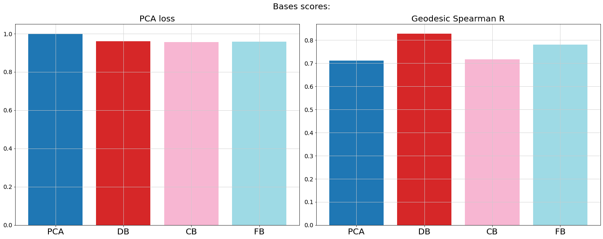
    


As we can see, all methods perform rather similarly in preserving global structure. However, when it comes to local structure, the diffusion and the fuzzy basis outperform PCA and the continuous basis. This means the latent orthogonal space that we build with these models will be more trustworthy when it comes to local neighborhoods.

Next, we can plot the topological graphs scores:


```python
tp.pl.plot_graphs_scores(scores[1])
```

    /home/davi/.local/lib/python3.9/site-packages/topo/plot.py:259: UserWarning: FixedFormatter should only be used together with FixedLocator
      ax1.set_xticklabels(keys, fontsize=fontsize//2, rotation=45)


    
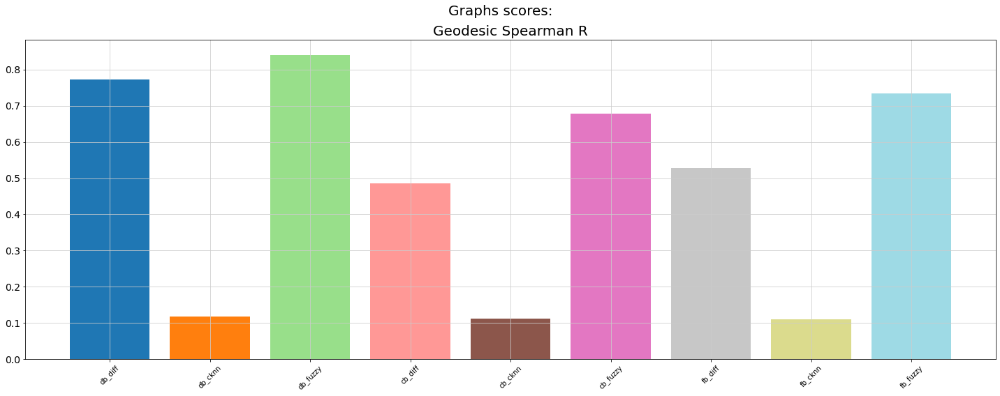
    


Unsurprisingly, combinations of the diffusion and the fuzzy models seem to perform better than those containing the continuous model. This was expected, since the fuzzy and diffusion bases performed better than the continuous basis. These scores are useful because these graphs can be used for clustering, such as by being passed as the `adjacency` argument of scanpy clustering functions (i.e. `scanpy.tl.leiden(adata, adjacency=tg.db_diff_graph)`). By knowing which graphs better preserve local structure, we can predict which will be better inputs for clustering.

Lastly, let's visualize the layout scores:


```python
tp.pl.plot_layouts_scores(scores[2], figsize=(30,8))
```

    /home/davi/.local/lib/python3.9/site-packages/topo/plot.py:285: UserWarning: FixedFormatter should only be used together with FixedLocator
      ax1.set_xticklabels(keys, fontsize=fontsize//2, rotation=90)
    /home/davi/.local/lib/python3.9/site-packages/topo/plot.py:288: UserWarning: FixedFormatter should only be used together with FixedLocator
      ax2.set_xticklabels(keys, fontsize=fontsize//2, rotation=90)


    
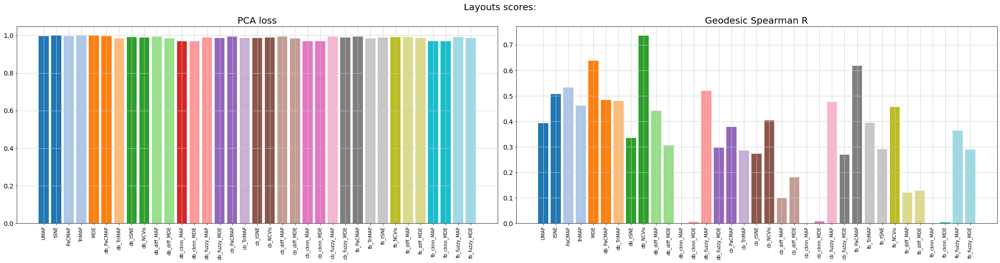
    


Once again, all layout options seem to perform rather similarly when it comes to preserving global structure. This is a consequence of the initialization used for the embeddings (Laplacian Eigenmaps in TopOMetry and UMAP, PCA for other methods), as it has been shown by [Kobak & Linderman](https://doi.org/10.1038/s41587-020-00809-z). 

When it comes to preserving local structure, MDE performs best when using PCA as an input. When using topological models as inputs, NCVis, PaCMAP and MAP perform better. Once more, models using the continuous basis perform poorly compared to those using the diffusion and the fuzzy bases.

__NOTE__: The current evaluation models are **very** computationally intensive. Use as much threads as possible and be prepared to wait. Unfortunatelly, evaluating dimensional reduction results is a complex task, associated with its own biases and assumptions, and assuming only distance distribution relantionships are monotonic (Spearman's R) and that data is a topological manifold requires scaling up computational cost. However, we do note that these perform slightly faster and use less memory than [current approaches](https://github.com/KenLauLab/DR-structure-preservation).

### Score a third-party model

TopOMetry was designed to be flexible and open to a number of different algorithms. Thus, you may want to compare how a particular algorithm performs compared to your TopOMetry results. To learn how to that, we'll use [PHATE](), a popular dimensional reduction method used for obtaining layouts to visualize single-cell data.

First, we'll run the PHATE algorithm. Next, we'll score it with TopOMetry scoring functions, and then add it to the original scoring results so that we can visualize them.


```python
from phate import PHATE

phate_Y = PHATE(n_components=2).fit_transform(adata.X)

adata.obsm['X_phate'] = phate_Y
sc.pl.embedding(adata, basis='phate', color='pca_leiden')
```

    Calculating PHATE...
      Running PHATE on 2700 observations and 2727 variables.
      Calculating graph and diffusion operator...
        Calculating PCA...
        Calculated PCA in 4.98 seconds.
        Calculating KNN search...
        Calculated KNN search in 0.80 seconds.
        Calculating affinities...
        Calculated affinities in 0.29 seconds.
      Calculated graph and diffusion operator in 6.09 seconds.
      Calculating landmark operator...
        Calculating SVD...
        Calculated SVD in 1.94 seconds.
        Calculating KMeans...
        Calculated KMeans in 31.02 seconds.
      Calculated landmark operator in 33.76 seconds.
      Calculating optimal t...
        Automatically selected t = 9
      Calculated optimal t in 9.90 seconds.
      Calculating diffusion potential...
      Calculated diffusion potential in 0.78 seconds.
      Calculating metric MDS...
      Calculated metric MDS in 4.34 seconds.
    Calculated PHATE in 54.91 seconds.


    
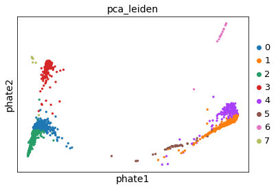
    


```python
# Import scoring functions
from topo.pipes import local_score, global_score

# Run scores; PHATE is computed from PCA
phate_local_score = local_score(adata.obsm['X_pca'], phate_Y)
phate_global_score = global_score(adata.obsm['X_pca'], phate_Y)

# Add to scoring results
scores[2]['PHATE'] = (phate_global_score, phate_local_score)
```

    /home/davi/.local/lib/python3.9/site-packages/topo/eval/local_scores.py:7: UserWarning: Graph has negative weights: dijkstra will give inaccurate results if the graph contains negative cycles. Consider johnson or bellman_ford.
      G = shortest_path(data, method=method, unweighted=unweighted, directed=directed)


```python
# Plot results with PHATE added
tp.pl.plot_layouts_scores(scores[2], figsize=(30,8))
```

    /home/davi/.local/lib/python3.9/site-packages/topo/plot.py:285: UserWarning: FixedFormatter should only be used together with FixedLocator
      ax1.set_xticklabels(keys, fontsize=fontsize//2, rotation=90)
    /home/davi/.local/lib/python3.9/site-packages/topo/plot.py:288: UserWarning: FixedFormatter should only be used together with FixedLocator
      ax2.set_xticklabels(keys, fontsize=fontsize//2, rotation=90)


    
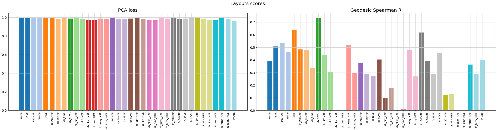
    


That's it for this tutorial! I hope CellTOMetry and TopOMetry can be useful for you!
