# Learning T CD4 cell heterogeneity: 68k PBMCs

 In this notebook, I showcase how TopOMetry can be useful in discovering new biological insights even when
 analyzing single-cell data that has been extensively analyzed before by several groups.  We will use a dataset containing around 68,000 individually RNA sequenced cells, consisting of peripherical blood mononuclear cells extracted from a healthy donor. This corresponds to the analysis performed for Figure 2 of the manuscript.

To assist us throghout this analysis, we'll be using [scanpy](https://scanpy.readthedocs.io/en/latest/index.html), a scalable toolkit for analyzing single-cell RNA sequencing data. In particular, we'll use the _AnnData_ framework for storing single-cell data and its plotting API for some plotting. _AnnData_ and _scanpy_ are key elements of the python environment for single-cell analysis, and I designed [CellTOMetry](https://github.com/davisidarta/celltometry) to wrap TopOMetry with it in a (hopefully) user-friendly way. Let's start! 

## Install and load libraries


```python
# Install pre-requisites and scanpy (pre-requisites for scanpy are python-igraph and leidenalg)
#!pip install nmslib annoy scipy scanpy numba kneed pymde multicoretsne pacmap trimap ncvis python-igraph leidenalg scanpy 
```


```python
# Install TopOMetry
#!pip install topometry
```


```python
import scanpy as sc
import topo as tp
import celltometry as ct
```

    /home/davi/.local/lib/python3.9/site-packages/torchvision/io/image.py:11: UserWarning: Failed to load image Python extension: /home/davi/.local/lib/python3.9/site-packages/torchvision/image.so: undefined symbol: _ZNK3c106IValue23reportToTensorTypeErrorEv
      warn(f"Failed to load image Python extension: {e}")


```python
import matplotlib
matplotlib.use('TkAgg')
```

These are some scanpy helper functions:


```python
sc.settings.verbosity = 0  
sc.settings.set_figure_params(dpi=150, facecolor='white')
sc.settings.n_jobs = 10
%matplotlib inline
```


```python
wd = '/home/davi/Bioinfo/TopOMetry_Paper/pheno_tutorials/pbmc68k/'
```

## Load data and QC

Download data from 10X genomics [website](https://cf.10xgenomics.com/samples/cell-exp/1.1.0/fresh_68k_pbmc_donor_a/fresh_68k_pbmc_donor_a_filtered_gene_bc_matrices.tar.gz):


```python
!mkdir data
!wget https://cf.10xgenomics.com/samples/cell-exp/1.1.0/fresh_68k_pbmc_donor_a/fresh_68k_pbmc_donor_a_filtered_gene_bc_matrices.tar.gz -O data/fresh_68k_pbmc_donor_a_filtered_gene_bc_matrices.tar.gz
!cd data; tar -xzf fresh_68k_pbmc_donor_a_filtered_gene_bc_matrices.tar.gz
```

    mkdir: cannot create directory ‘data’: File exists
    --2022-03-11 00:53:59--  https://cf.10xgenomics.com/samples/cell-exp/1.1.0/fresh_68k_pbmc_donor_a/fresh_68k_pbmc_donor_a_filtered_gene_bc_matrices.tar.gz
    Resolving cf.10xgenomics.com (cf.10xgenomics.com)... 2606:4700::6812:ad, 2606:4700::6812:1ad, 104.18.1.173, ...
    Connecting to cf.10xgenomics.com (cf.10xgenomics.com)|2606:4700::6812:ad|:443... connected.
    HTTP request sent, awaiting response... 200 OK
    Length: 124442812 (119M) [application/x-tar]
    Saving to: ‘data/fresh_68k_pbmc_donor_a_filtered_gene_bc_matrices.tar.gz’
    
    data/fresh_68k_pbmc 100%[===================>] 118.68M  30.8MB/s    in 3.9s    
    
    2022-03-11 00:54:03 (30.1 MB/s) - ‘data/fresh_68k_pbmc_donor_a_filtered_gene_bc_matrices.tar.gz’ saved [124442812/124442812]
    


```python
adata = sc.read_10x_mtx(
    'data/filtered_matrices_mex/hg19/',  
    var_names='gene_symbols',               
    cache=True)          
adata.var_names_make_unique()
adata                    
```


    AnnData object with n_obs × n_vars = 68579 × 32738
        var: 'gene_ids'


```python
# Default QC
sc.pp.filter_cells(adata, min_genes=200)
sc.pp.filter_genes(adata, min_cells=3)
adata.var['mt'] = adata.var_names.str.startswith('MT-')  # annotate the group of mitochondrial genes as 'mt'
sc.pp.calculate_qc_metrics(adata, qc_vars=['mt'], percent_top=None, log1p=False, inplace=True)
sc.pl.violin(adata, ['n_genes', 'total_counts', 'pct_counts_mt'],
             jitter=0.4, multi_panel=True)
```


    
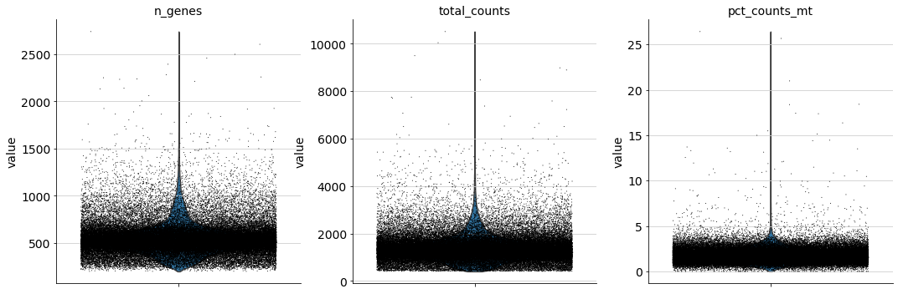
    


This data contains 68,579 cells with 32,738 sequenced genes. A great deal of this is just experimental noise, so we need to perform some quality control. Here, we'll do the default quality-control analysis:


```python
adata = adata[adata.obs.n_genes < 1000, :]
adata = adata[adata.obs.total_counts < 4000, :]
adata = adata[adata.obs.pct_counts_mt < 5, :]
adata
```


    View of AnnData object with n_obs × n_vars = 66834 × 17788
        obs: 'n_genes', 'n_genes_by_counts', 'total_counts', 'total_counts_mt', 'pct_counts_mt'
        var: 'gene_ids', 'n_cells', 'mt', 'n_cells_by_counts', 'mean_counts', 'pct_dropout_by_counts', 'total_counts'


## Default Scanpy workflow (PCA-based)

Here, for brevity sake, we'll perform the default scanpy workflow. For more information about the analysis of single-cell data and proposed workflows, we direct the interested user to [Scanpy tutorials](https://scanpy-tutorials.readthedocs.io/en/latest/index.html) and this [excellent best-practices review](https://www.embopress.org/doi/full/10.15252/msb.20188746). 

In short, this involves normalizing the library size of each sequenced cell by the total number of detected mRNA molecules, then logarithmizing it. Next, genes with high expression mean and high dispersion are selected as highly-variable genes, and stored for downstream analysis. Data is then scaled and mean-centered. 

The default workflow further involves computing PCA, and then using top principal components to compute a neighborhood graph. From this graph, it is possible to cluster cells with the leiden algorithm, and to obtain lower-dimensional embeddings with UMAP.


```python
adata = ct.preprocess(adata)
adata = ct.default_workflow(adata)
```

    /home/davi/.local/lib/python3.9/site-packages/scanpy/preprocessing/_normalization.py:138: UserWarning: Revieved a view of an AnnData. Making a copy.
      view_to_actual(adata)
    /home/davi/.local/lib/python3.9/site-packages/scanpy/preprocessing/_simple.py:810: UserWarning: Revieved a view of an AnnData. Making a copy.
      view_to_actual(adata)


```python
sc.pl.pca(adata, color=['leiden'], size=5)
```


    
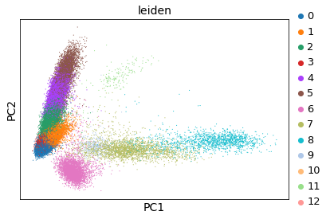
    


```python
sc.pl.embedding(adata, basis='umap', color=['leiden'], size=5)
```


    
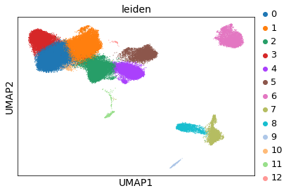
    


This looks quite familiar. Let's see how it compares to the TopOMetry workflow.

## Topological analysis with TopOMetry

Now that we have concluded the default Scanpy analysis, let's perform some topological analyses with TopOMetry. For this, we will start up a TopOGraph object with some data, and populate its slots as we proceed with the analysis. These 4 steps will be followed:

* (1) Learn topological metrics - this can be done with diffusion harmonics, fuzzy simplicial sets or continuous k-nearest-neighbors (ckNN);


* (2) Build a topological basis - this can be done with multiscale diffusion maps or Laplacian Eigenmaps on the fuzzy and continuous metrics;


* (3) Extract a topological graph - again, this can be done with diffusion harmonics, fuzzy simplicial sets or ckNN;


* (4) Optimize a topological layout - this can be done with any layout algorithm. TopOMetry built-ins are MAP (a lighter UMAP with looser assumptions), t-SNE, PaCMAP, TriMAP, MDE and NCVis. MAP, PaCMAP and NCVis are faster, while t-SNE, TriMAP and MDE computations can take a while.

For now, let's start with the default TopOMetry analysis - for this tutorial, we'll stick with diffusion models, as they are TopOMetry's top performer in both structure preservation and computational efficiency.

### Setting up a TopOGraph instance

The TopOGraph class orchestrates all computations in TopOMetry and CellTOMetry. It combines all dimensional reduction steps in a comprehensive, modular fashion. The `fit()` and `transform()` methods learn the orthogonal basis and an associated topological graph with the currently active options (default diffusion). However, we will not have to worry about that when using CellTOMetry. 

Let's take a look at TopOGraph main parameters:

* `base_knn` - the number of k nearest neighbors to use when learning models (default 10).


* `graph_knn` - same as `base_knn`, but for learning the topological graphs (default 10).


* `n_eigs` - the number of total eigencomponents to compute when learning an orthogonal basis (default 100). The actual learned basis can have fewer eigencomponents if the eigendecomposition reaches the bit precision limit, and I recommend increasing this parameter enough so that this condition is satisfied. In practice, this is an empirical estimate of the data dimensionality under a certain precision threshold (i.e. 32, 64 or 128 bits). 


* `base_metric` and `graph_metric` - which metric to compute distances with (default 'cosine').

* `n_jobs` - how many threads to use during computations (default 1). I highly recommend using as many threads as possible.


Let's create our TopOGraph object:


```python
# Assign the TopOGraph class to an object

tg = ct.TopOGraph(n_jobs=12, n_eigs=150)
```

Now check what this empty TopOGraph looks like:


```python
tg
```


    TopOGraph object without any fitted data.
     . Orthogonal bases: none fitted. 
      
     Active basis: diffusion basis. 
     Active graph: diff graph.


### Use the TopOGraph with AnnData

CellTOMetry has the convenience pipeline function `topological_workflow` to run TopOMetry. You only need to pass which models you want to use for learning orthogonal bases, topological graphs and 2- or 3-D layouts from the AnnData object. Additionally, you can also set kwargs to the `sc.tl.leiden()` clustering function used in the pipeline.

Here, we're running only the diffusion models, and use MAP and PaCMAP for layout. This takes 5 minutes on my laptop, but may differ on your settings. The algorithm is highly scalable with the number of assigned threads (`n_jobs` parameter on `TopOGraph`) - the more, the faster.


```python
adata = ct.topological_workflow(adata, tg, bases=['diffusion'], 
                                graphs=['diff', 'fuzzy'],                      
                                layouts=['MAP', 'PaCMAP'])
```

    Computing neighborhood graph...
     Base kNN graph computed in 262.431533 (sec)
    Building topological basis...using diffusion model.
     Topological basis fitted with multiscale self-adaptive diffusion maps in 87.857485 (sec)
             Computing spectral layout...


    /home/davi/.local/lib/python3.9/site-packages/pacmap/pacmap.py:383: FutureWarning: elementwise comparison failed; returning scalar instead, but in the future will perform elementwise comparison
      if Yinit is None or Yinit == "pca":
    /home/davi/.local/lib/python3.9/site-packages/pacmap/pacmap.py:389: FutureWarning: elementwise comparison failed; returning scalar instead, but in the future will perform elementwise comparison
      elif Yinit == "random":


             Obtained PaCMAP embedding in = 72.655797 (sec)
        Building topological graph...
         Topological `diff` graph extracted in = 8.426888 (sec)
             Optimized MAP embedding in = 32.783875 (sec)
             Optimized MAP embedding in = 102.361873 (sec)


Next, we check what our populated TopOGraph looks like:


```python
tg
```


    TopOGraph object with 66834 samples and 2318 observations and:
     . Orthogonal bases: 
     .. Multiscale Diffusion Maps fitted - .MSDiffMap 
        With similarity metrics stored at - .DiffBasis.K and .DiffBasis.T 
        With layouts: 
             PaCMAP - .db_PaCMAP
         And the downstream topological graphs: 
           Diffusion graph - .db_diff_graph
              Graph layouts: 
             MAP - .db_diff_MAP 
           Fuzzy graph - .db_fuzzy_graph 
             Graph layouts: 
             MAP - .db_fuzzy_MAP
     
      
     Active basis: diffusion basis. 
     Active graph: fuzzy graph.


We can check if the matrix decomposition process found an 'eigengap', i.e. a point of numerical instability where the precision of eigenvalues reach the bit limit. Generally, it is useful to expand the number of computed eigenvectors (`n_eigs`) until such an eigengap is found. This can be used as an indirect estimation of data intrinsic dimensionality.

When using the diffusion basis, the eigengap is represented either as the a null or a negative value. The fuzzy and continuous bases represent eigengaps as null values (i.e. the number of ploted eigenvalues will be smaller than that of computed eigenvectors).


```python
import matplotlib
matplotlib.use('TkAgg')
```


```python
tg.eigenspectrum()
```


    <module 'matplotlib.pyplot' from '/home/davi/.local/lib/python3.9/site-packages/matplotlib/pyplot.py'>


    
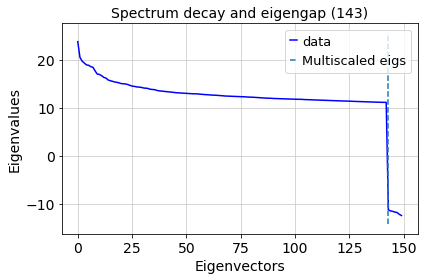
    


In this case

### Visualize results

Now, we can use scanpy for plotting, as all the relevant topological information was added to the AnnData object.

First, the default PCA-primed UMAP embedding.


```python
sc.pl.embedding(adata, basis='umap',
                color=['pca_leiden', 'db_diff_leiden', 'db_fuzzy_leiden'],
                palette='tab20', legend_loc=None, ncols=3)
```


    

    


Next, the two MAP layouts using different graphs learned from the diffusion basis:


```python
sc.pl.embedding(adata, basis='db_diff_MAP',
                color=['pca_leiden', 'db_diff_leiden', 'db_fuzzy_leiden'],
                palette='tab20', legend_loc=None, ncols=3)
```


    
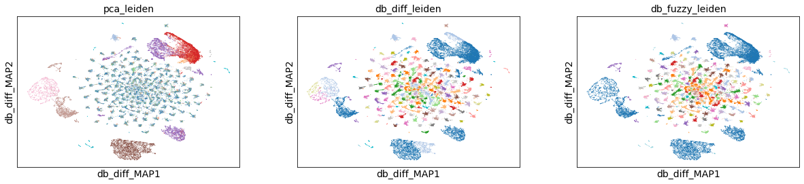
    


```python
sc.pl.embedding(adata, basis='db_fuzzy_MAP',
                color=['pca_leiden', 'db_diff_leiden', 'db_fuzzy_leiden'],
                palette='tab20', legend_loc=None, ncols=3)
```


    
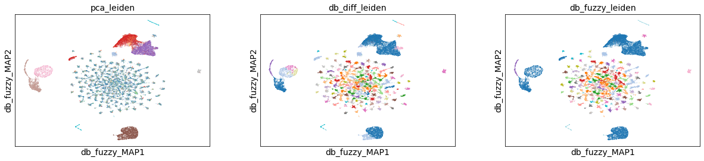
    


As we can see, the maps are quite similar! How about visualizing some canonical marker genes?

* CD3E: T cells
    - CD4: T CD cells
    - CD8A: T CD8 cells

* MS4A1: B cells
* LYZ: Monocytes and dendritic cells
* PPBP: Megakaryocytes

We can visualize these genes in the default UMAP layout:


```python
sc.pl.embedding(adata, basis='umap',
                color=['CD3E', 'CD4', 'CD8A', 'MS4A1', 'LYZ', 'PPBP'],
                legend_loc=None, ncols=3)
```


    
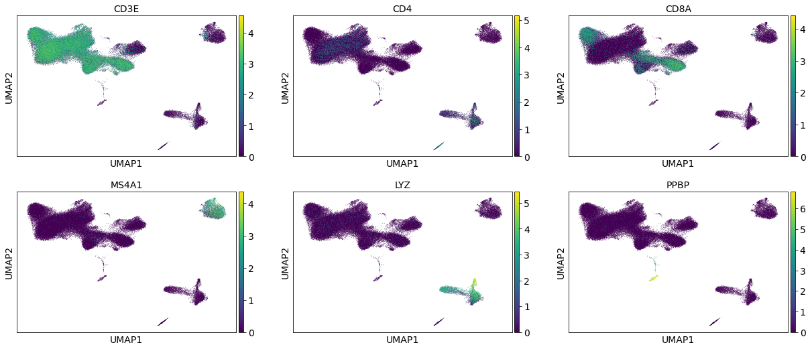
    


And in the MAP layout of the diffusion graph learned on the diffusion basis (db_diff_MAP, for short).


```python
sc.pl.embedding(adata, basis='db_diff_MAP',
                color=['CD3E', 'CD4', 'CD8A', 'MS4A1', 'LYZ', 'PPBP'],
                legend_loc=None, ncols=3)
```


    
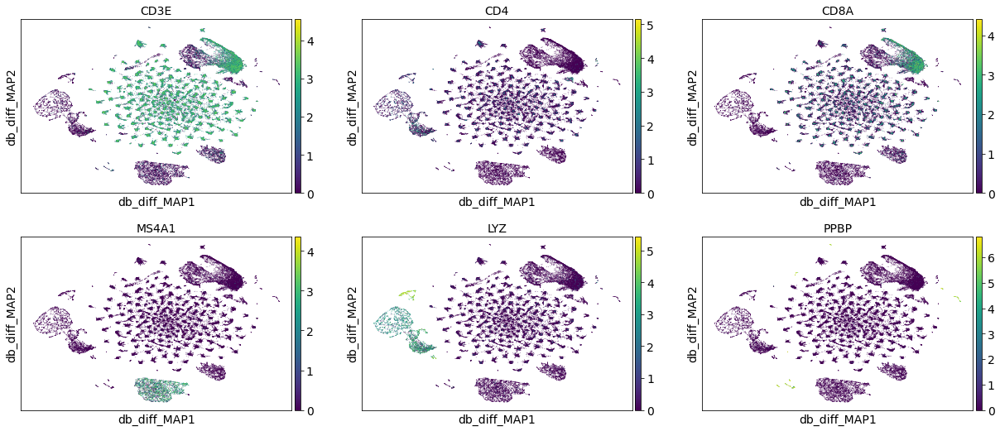
    


And in the MAP layout of the fuzzy simplicial set graph learned on the diffusion basis (db_fuzzy_MAP, for short).


```python
sc.pl.embedding(adata, basis='db_fuzzy_MAP',
                color=['CD3E', 'CD4', 'CD8A', 'MS4A1', 'LYZ', 'PPBP'],
                legend_loc=None, ncols=3)
```


    
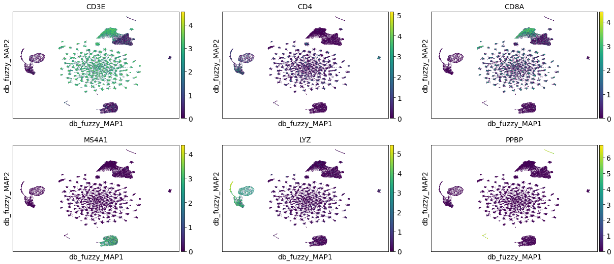
    


### Compute additional layouts

The `topological_workflow` function in CellTOMetry was designed to work similar to the `run_layouts` function in TopOMetry, which will check the computed layouts and compute any required combinations of models that is not already present.

For example, we can compute PaCMAP layouts for this data.


```python
adata = ct.topological_workflow(adata, tg, bases=['diffusion'], 
                                graphs=['diff', 'fuzzy'],                      
                                layouts=['MAP', 'PaCMAP'])
```

We can see the db_PaCMAP results have been added to the TopOGraph `tg`:


```python
tg
```


    TopOGraph object with 66834 samples and 2318 observations and:
     . Orthogonal bases: 
     .. Multiscale Diffusion Maps fitted - .MSDiffMap 
        With similarity metrics stored at - .DiffBasis.K and .DiffBasis.T 
        With layouts: 
             PaCMAP - .db_PaCMAP
         And the downstream topological graphs: 
           Diffusion graph - .db_diff_graph
              Graph layouts: 
             MAP - .db_diff_MAP 
           Fuzzy graph - .db_fuzzy_graph 
             Graph layouts: 
             MAP - .db_fuzzy_MAP
     
      
     Active basis: diffusion basis. 
     Active graph: fuzzy graph.


And to the AnnData `adata.obsm` field: 


```python
adata
```


    AnnData object with n_obs × n_vars = 66834 × 2318
        obs: 'n_genes', 'n_genes_by_counts', 'total_counts', 'total_counts_mt', 'pct_counts_mt', 'leiden', 'pca_leiden', 'db_diff_leiden', 'db_fuzzy_leiden'
        var: 'gene_ids', 'n_cells', 'mt', 'n_cells_by_counts', 'mean_counts', 'pct_dropout_by_counts', 'total_counts', 'highly_variable', 'means', 'dispersions', 'dispersions_norm', 'mean', 'std'
        uns: 'log1p', 'hvg', 'pca', 'neighbors', 'leiden', 'umap', 'leiden_colors', 'pca_leiden_colors', 'db_diff_leiden_colors', 'db_fuzzy_leiden_colors'
        obsm: 'X_pca', 'X_umap', 'X_pca_umap', 'X_db', 'X_db_PaCMAP', 'X_db_diff_MAP', 'X_db_fuzzy_MAP'
        varm: 'PCs'
        obsp: 'distances', 'connectivities'


Then we can visualize it:


```python
sc.pl.embedding(adata, basis='db_PaCMAP',
                color=['pca_leiden', 'db_diff_leiden', 'db_fuzzy_leiden'],
                palette='tab20', legend_loc=None, ncols=3)
```


    
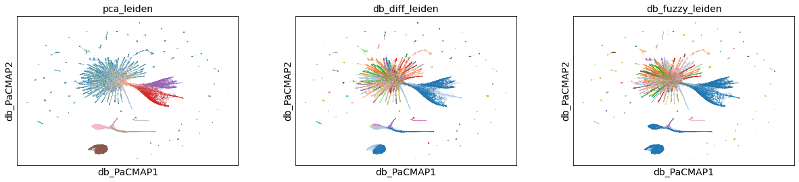
    


For best reproducibility, you can obtain the TopOGraph pickle file (pbmc68k_topograph.pkl) from the TopOMetry's Zenodo repository and use it to add information to the AnnData Object. You can easily write to and read from a [pickle]() to save your TopOGraph for further analysis.


```python
# Define a filename
filename = 'topograph_save_test.pkl'

# Write to file
tg.write_pkl(wd=wd, filename=filename)

# Read from file
tg = tp.read_pkl(wd=wd, filename=filename)
    
tg
```

    TopOGraph saved at /home/davi/Bioinfo/TopOMetry_Paper/pheno_tutorials/pbmc68k/topograph_save_test.pkl


    TopOGraph object with 66834 samples and 2318 observations and:
     . Orthogonal bases: 
     .. Multiscale Diffusion Maps fitted - .MSDiffMap 
        With similarity metrics stored at - .DiffBasis.K and .DiffBasis.T 
        With layouts: 
             PaCMAP - .db_PaCMAP
         And the downstream topological graphs: 
           Diffusion graph - .db_diff_graph
              Graph layouts: 
             MAP - .db_diff_MAP 
           Fuzzy graph - .db_fuzzy_graph 
             Graph layouts: 
             MAP - .db_fuzzy_MAP
     
      
     Active basis: diffusion basis. 
     Active graph: fuzzy graph.


The processed and populated AnnData is also available and will be used for the rest of this tutorial for visualizing results:


```python
#adata.write_h5ad('pbmc68k_tutorial.h5ad')
adata = sc.read_h5ad('pbmc68k_tutorial.h5ad')
adata
```


    AnnData object with n_obs × n_vars = 66834 × 2318
        obs: 'n_genes', 'n_genes_by_counts', 'total_counts', 'total_counts_mt', 'pct_counts_mt', 'leiden', 'pca_leiden', 'db_diff_leiden', 'db_fuzzy_leiden'
        var: 'gene_ids', 'n_cells', 'mt', 'n_cells_by_counts', 'mean_counts', 'pct_dropout_by_counts', 'total_counts', 'highly_variable', 'means', 'dispersions', 'dispersions_norm', 'mean', 'std'
        uns: 'db_diff_leiden_colors', 'db_fuzzy_leiden_colors', 'hvg', 'leiden', 'leiden_colors', 'neighbors', 'pca', 'pca_leiden_colors', 'umap'
        obsm: 'X_db', 'X_db_NCVis', 'X_db_PaCMAP', 'X_db_TriMAP', 'X_db_diff_MAP', 'X_db_fuzzy_MAP', 'X_db_tSNE', 'X_pca', 'X_pca_umap', 'X_umap'
        varm: 'PCs'
        obsp: 'connectivities', 'distances'


### Computing many layouts at once

We can also compute all remaining layouts at once by not passing any argument to the `layouts` parameter. Please note that some layout methods may require a reasonable amount of memory to compute.


```python
adata = ct.topological_workflow(adata, tg, bases=['diffusion'], 
                                graphs=['diff', 'fuzzy'],
                               layouts=['TriMAP', 'tSNE', 'NCVis'])
```

             Obtained TriMAP embedding in = 70.679887 (sec)
             Obtained tSNE embedding in = 301.613685 (sec)
             Obtained NCVis embedding in = 25.248965 (sec)


The fuzzy basis would also be computed if no argument was passed to the `bases` parameter, and `graphs` is set to `['diff', 'fuzzy']' if no argument is given. This is because the Continuous k-Nearest Neighbor algorithm currently implemented in TopOMetry is very inefficient when dealing with more than ~10,000 cells.

Once more, let's check our TopOGraph object:


```python
tg
```


    TopOGraph object with 66834 samples and 2318 observations and:
     . Orthogonal bases: 
     .. Multiscale Diffusion Maps fitted - .MSDiffMap 
        With similarity metrics stored at - .DiffBasis.K and .DiffBasis.T 
        With layouts: 
             PaCMAP - .db_PaCMAP 
             TriMAP - .db_TriMAP 
             tSNE - .db_tSNE 
             NCVis - .db_NCVis
         And the downstream topological graphs: 
           Diffusion graph - .db_diff_graph
              Graph layouts: 
             MAP - .db_diff_MAP 
           Fuzzy graph - .db_fuzzy_graph 
             Graph layouts: 
             MAP - .db_fuzzy_MAP
     
      
     Active basis: diffusion basis. 
     Active graph: fuzzy graph.


And we can just plot all resulting layouts at once:


```python
sc.pl.embedding(adata, basis='db_tSNE',
                color=['pca_leiden', 'db_diff_leiden', 'db_fuzzy_leiden'],
                palette='tab20', legend_loc=None, ncols=3)

sc.pl.embedding(adata, basis='db_TriMAP',
                color=['pca_leiden', 'db_diff_leiden', 'db_fuzzy_leiden'],
                palette='tab20', legend_loc=None, ncols=3)

sc.pl.embedding(adata, basis='db_NCVis',
                color=['pca_leiden', 'db_diff_leiden', 'db_fuzzy_leiden'],
                palette='tab20', legend_loc=None, ncols=3)
```


    
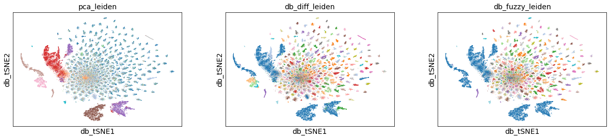
    


    
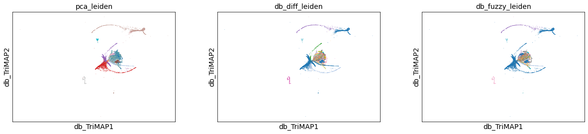
    


    
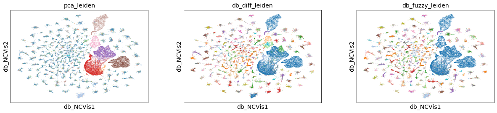
    
## Dynamical MDE visualization

We can also optimize an MDE embedding and visualize the resulting GIF:

__TIP__: you can estimate the duration of the video: (n_epochs (default 500) / snapshot_every(default 30)) / fps

We'll use `snapshot_every=5` and `fps=25` to get a 4s video: 500 / 5 = 100;  100 / 25 = 4 (s)


```python
db_diff_MDE = tg.MDE(basis='diffusion', graph=tg.db_diff_graph, snapshot_every=5)
```


```python
# Make the gif with the new clusters
tg.MDE_problem.play(savepath= wd + 'pbmc68k_db_diff_MDE_db_leiden.gif', fps=25,
                    marker_size=0.5, color_by=adata.obs['db_diff_leiden'],
                    figsize_inches=(12, 12), axis_limits=[-12, 12])
```
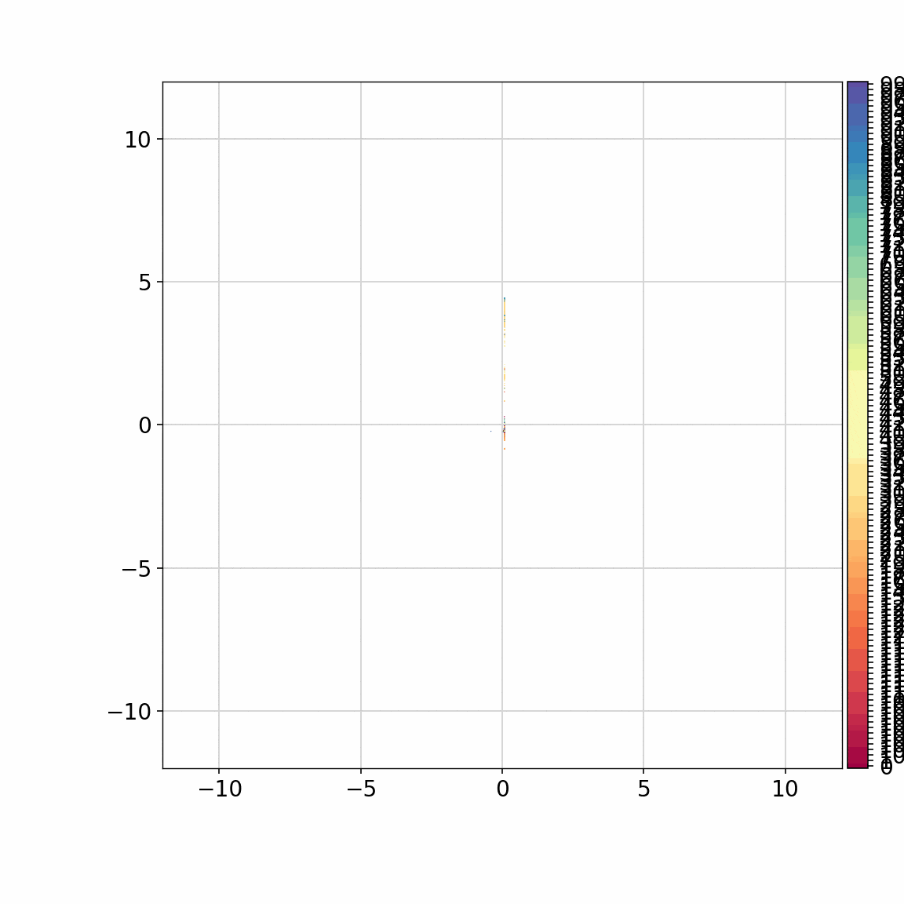


And once again save results:


```python
tg.write_pkl(wd=wd, filename=filename)
```

That's it for this tutorial! I hope you enjoyed and that TopOMetry might be useful for you!

