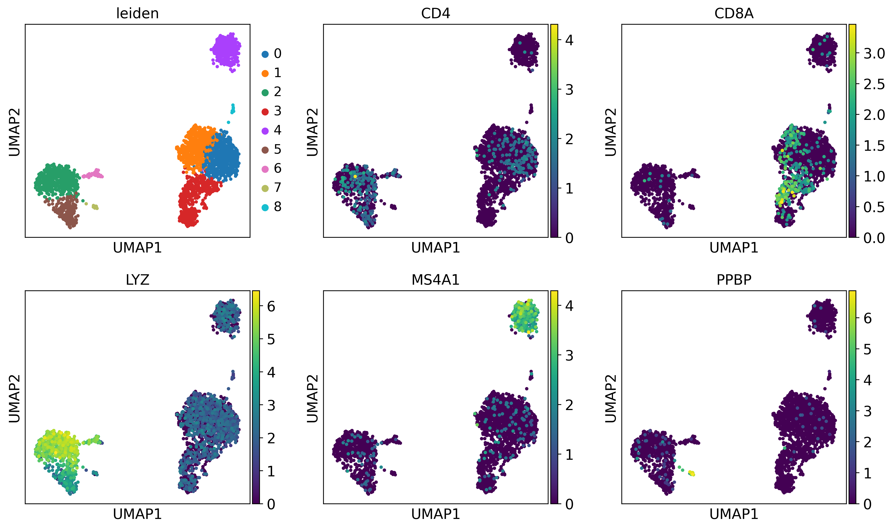
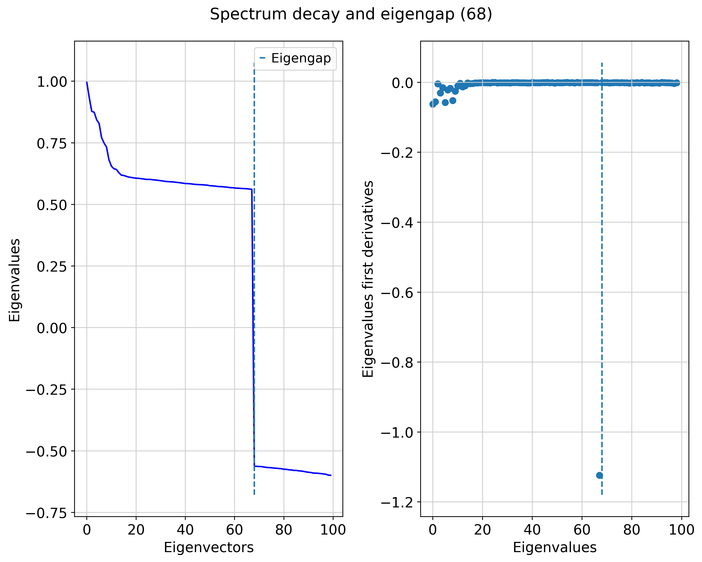
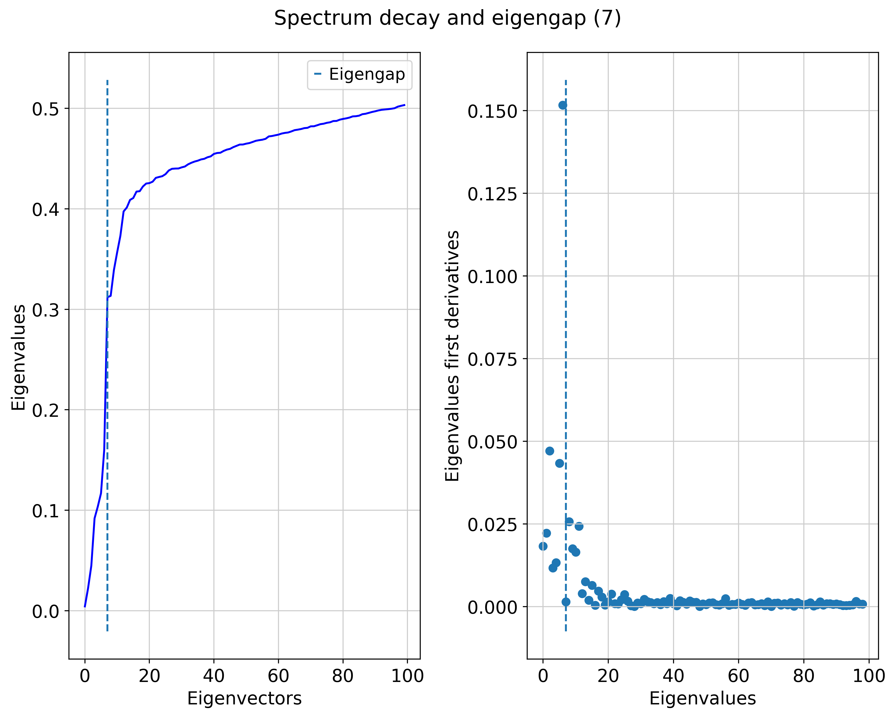
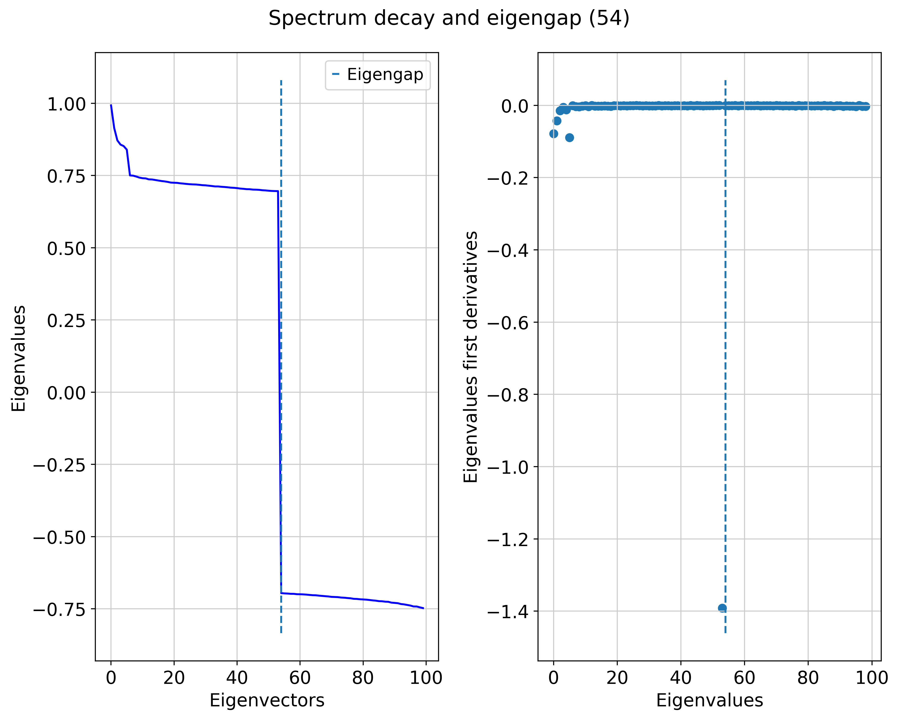
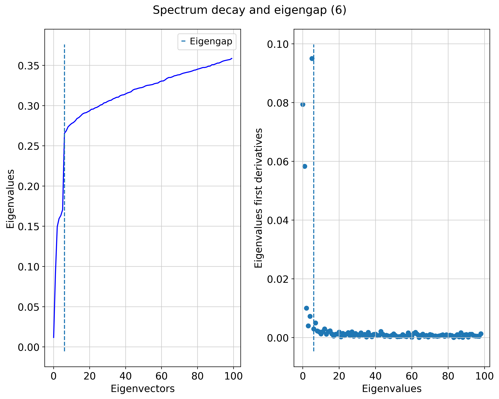
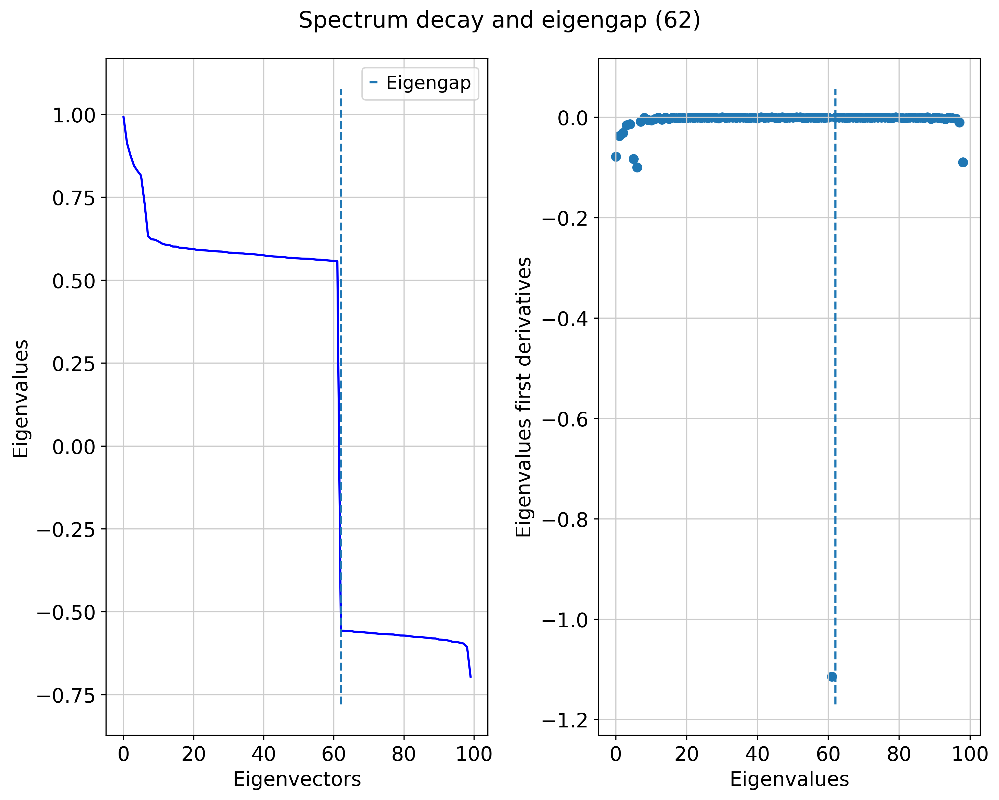
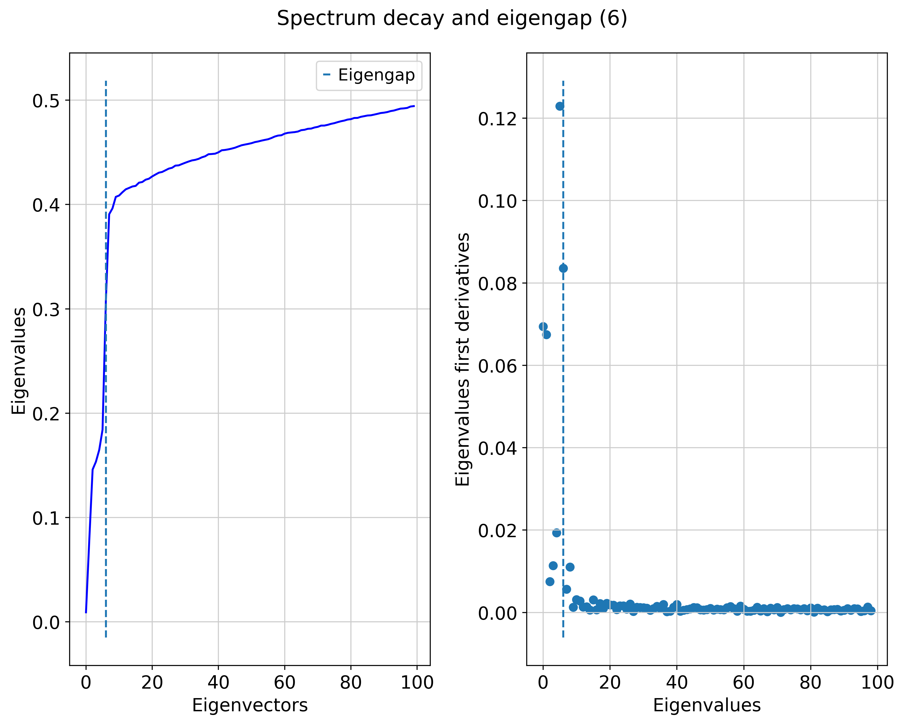

# Using TopOMetry for single-cell analysis: a quickstart with 3,000 PBMC

In this tutorial, we are going to analyze some [single-cell RNA-seq](https://en.wikipedia.org/wiki/Single_cell_sequencing) data with TopOMetry. 

To deal with the basic processing of single-cell data we will use [scanpy](https://scanpy.readthedocs.io/), which stores data in an [AnnData](https://anndata.readthedocs.io/en/latest/index.html) object. The _AnnData_ object stores gene expression matrices, metadata, dimensional reductions and neighborhood information. 

TopOMetry contains wrapper functions to deal with _AnnData_ objects and interact with _scanpy_ functions, which work out of the box if you have _scanpy_ installed.


```python
# Import libraries
import scanpy as sc
import topo as tp
```


```python
sc.settings.verbosity = 0  
sc.settings.set_figure_params(dpi=200, facecolor='white') 
%matplotlib inline
```

Let's use the _pbmc3k_ dataset from 10X genomics. It comes with Scanpy, so it's super easy to get.


```python
adata = sc.datasets.pbmc3k()
adata
```


    AnnData object with n_obs × n_vars = 2700 × 32738
        var: 'gene_ids'


## Default Scanpy workflow

Next, we'll perform the default scanpy preprocessing:
- Normalize libraries by size and log-transform expression values
- Select highly variable genes
- 'Scale' the data - mean center and scale by standard deviation of each feature

And the default scanpy workflow:
- Run Principal Component Analysis (PCA)
- Get a neighborhood graph from PCA results (with fuzzy simplicial sets by default)
- Embed that neighborhood graph with UMAP
- Cluster that neighborhood graph with the Leiden community detection algorithm

All these steps can be performed by the `topo.sc.preprocess()` and `topo.sc.default_workflow()` functions in TopOMetry:


```python
adata = tp.sc.preprocess(adata)
adata = tp.sc.default_workflow(adata)
sc.pl.umap(adata, color=['leiden'])
```

    /home/davi/.local/lib/python3.10/site-packages/scanpy/preprocessing/_simple.py:843: UserWarning: Received a view of an AnnData. Making a copy.
      view_to_actual(adata)
    2023-03-23 01:42:11.037121: I tensorflow/core/platform/cpu_feature_guard.cc:193] This TensorFlow binary is optimized with oneAPI Deep Neural Network Library (oneDNN) to use the following CPU instructions in performance-critical operations:  AVX2 FMA
    To enable them in other operations, rebuild TensorFlow with the appropriate compiler flags.
    2023-03-23 01:42:11.148431: W tensorflow/compiler/xla/stream_executor/platform/default/dso_loader.cc:64] Could not load dynamic library 'libcudart.so.11.0'; dlerror: libcudart.so.11.0: cannot open shared object file: No such file or directory
    2023-03-23 01:42:11.148446: I tensorflow/compiler/xla/stream_executor/cuda/cudart_stub.cc:29] Ignore above cudart dlerror if you do not have a GPU set up on your machine.
    2023-03-23 01:42:11.730020: W tensorflow/compiler/xla/stream_executor/platform/default/dso_loader.cc:64] Could not load dynamic library 'libnvinfer.so.7'; dlerror: libnvinfer.so.7: cannot open shared object file: No such file or directory
    2023-03-23 01:42:11.730103: W tensorflow/compiler/xla/stream_executor/platform/default/dso_loader.cc:64] Could not load dynamic library 'libnvinfer_plugin.so.7'; dlerror: libnvinfer_plugin.so.7: cannot open shared object file: No such file or directory
    2023-03-23 01:42:11.730110: W tensorflow/compiler/tf2tensorrt/utils/py_utils.cc:38] TF-TRT Warning: Cannot dlopen some TensorRT libraries. If you would like to use Nvidia GPU with TensorRT, please make sure the missing libraries mentioned above are installed properly.


    

    


NOTE: these two steps correspond to the following _scanpy_ commands:

```
sc.pp.normalize_total(adata)
sc.pp.highly_variable_genes(adata)
sc.pp.scale(adata)
```

and

```
sc.tl.pca(adata)
sc.pp.neighbors(adata)
sc.tl.leiden(adata)
sc.tl.umap(adata)
```

Here, we'll also plot some marker genes:
- _CD4_ for T CD4 cells (also expressed in LYZ+ monocytes)
- _CD8A_ for T CD8 cells
- _LYZ_ for monocytes
- _MS4A1_ for B cells
- _PPBP_ for megakaryocytes


```python
sc.pl.umap(adata, color=['leiden', 'CD4', 'CD8A', 'LYZ', 'MS4A1', 'PPBP'], ncols=3)
```


    

    


If you're familiar with single-cell analysis, there's nothing new here. We obtain embeddings and clustering results that reasonably separate known classes.

Let's try the topological workflow with TopOMetry now:

## Topological workflow:

### Setting a TopOGraph

Now, we'll perform the topological workflow with TopOMetry.We'll start an empty _TopOGraph_ object, and populate it and the _AnnData_ object with our results.

The main wrapper function in TopOMetry is `topo.sc.topological_workflow(adata)`.

It will use the expression matrix stored at `adata.X` to compute neighborhood graphs, topological operators, eigenbases and new operators and projections for downstream clustering and visualization. For simplicity, it also employs the Leiden algorithm for clustering, in order to allow for a more direct comparison between estabilished dimensional reduction methods.


```python
adata.X
```


    array([[-0.83299935, -0.05255092, -0.18329315, ..., -0.22630502,
             0.58875185,  0.21599771],
           [-0.83299935, -0.05255092,  4.9283743 , ...,  0.28566244,
             0.08810925,  0.20357192],
           [ 0.3942427 , -0.05255092, -0.18329315, ..., -0.84630585,
             0.93271184, -0.04291435],
           ...,
           [-0.83299935, -0.05255092, -0.18329315, ...,  0.68965864,
            -0.9750807 ,  0.5797783 ],
           [-0.83299935, -0.05255092, -0.18329315, ..., -0.29836395,
            -0.9750807 , -0.29690614],
           [-0.83299935, -0.05255092, -0.18329315, ..., -1.9568096 ,
            -0.9750807 ,  0.12774365]], dtype=float32)


```python

```


```python
# This will be a bit verbose but that's OK for this tutorial
# (it's all silent when verbosity is set to 0)
tg = tp.TopOGraph(n_jobs=-1, n_eigs=100, base_knn=10, verbosity=1)


# These are some of the available models within TopOMetry (dozens of possible layouts)
adata = tp.sc.topological_workflow(
    adata,                                     # the anndata object
    tg,                                       # the TopOGraph object
    kernels=['cknn', 'fuzzy','bw_adaptive'],# the kernels to use
    eigenmap_methods=['DM', 'LE'],   # the eigenmap methods to use
    projections=['MAP', 'PaCMAP'],         # the projections to use
    resolution=0.8                        # the Leiden clustering resolution
)
```

    Computing neighborhood graph...
     Base kNN graph computed in 2.620246 (sec)
     Fitted the cknn kernel in 0.157297 (sec)
    Computing eigenbasis...
     Fitted eigenbasis with Diffusion Maps from the cknn kernel in 18.787167 (sec)
        Building topological graph from eigenbasis...
            Computing neighborhood graph...
     Computed in 0.177521 (sec)
     Fitted the cknn graph kernel in 0.108054 (sec)
     Computed MAP in 32.294303 (sec)
     Computed PaCMAP in 87.933258 (sec)
        Building topological graph from eigenbasis...
            Computing neighborhood graph...
     Computed in 0.263913 (sec)
     Fitted the fuzzy graph kernel in 15.308028 (sec)
     Computed MAP in 20.412133 (sec)
     Computed PaCMAP in 69.923910 (sec)
        Building topological graph from eigenbasis...
            Computing neighborhood graph...
     Computed in 0.126137 (sec)
     Fitted the bw_adaptive graph kernel in 0.061733 (sec)
     Computed MAP in 23.984527 (sec)
     Computed PaCMAP in 65.837271 (sec)
    Computing eigenbasis...
     Fitted eigenbasis with Laplacian Eigenmaps from the cknn in 5.676591 (sec)
        Building topological graph from eigenbasis...
            Computing neighborhood graph...
     Computed in 0.179856 (sec)
     Fitted the cknn graph kernel in 0.090420 (sec)
     Computed MAP in 23.422579 (sec)
     Computed PaCMAP in 80.409932 (sec)
        Building topological graph from eigenbasis...
            Computing neighborhood graph...
     Computed in 0.239054 (sec)
     Fitted the fuzzy graph kernel in 15.902175 (sec)
     Computed MAP in 28.655143 (sec)
     Computed PaCMAP in 98.685540 (sec)
        Building topological graph from eigenbasis...
            Computing neighborhood graph...
     Computed in 0.304790 (sec)
     Fitted the bw_adaptive graph kernel in 0.129509 (sec)
     Computed MAP in 7.876579 (sec)
     Computed PaCMAP in 9.573797 (sec)
     Fitted the fuzzy kernel in 2.826534 (sec)
    Computing eigenbasis...
     Fitted eigenbasis with Diffusion Maps from the fuzzy kernel in 0.510267 (sec)
        Building topological graph from eigenbasis...
            Computing neighborhood graph...
     Computed in 0.157822 (sec)
     Fitted the cknn graph kernel in 0.067758 (sec)
     Computed MAP in 7.235101 (sec)
     Computed PaCMAP in 8.942719 (sec)
        Building topological graph from eigenbasis...
            Computing neighborhood graph...
     Computed in 0.101671 (sec)
     Fitted the fuzzy graph kernel in 8.543859 (sec)
     Computed MAP in 4.286674 (sec)
     Computed PaCMAP in 8.544540 (sec)
        Building topological graph from eigenbasis...
            Computing neighborhood graph...
     Computed in 0.112320 (sec)
     Fitted the bw_adaptive graph kernel in 0.055335 (sec)
     Computed MAP in 6.352291 (sec)
     Computed PaCMAP in 7.747541 (sec)
    Computing eigenbasis...
     Fitted eigenbasis with Laplacian Eigenmaps from the fuzzy in 0.693278 (sec)
        Building topological graph from eigenbasis...
            Computing neighborhood graph...
     Computed in 0.160372 (sec)
     Fitted the cknn graph kernel in 0.068758 (sec)
     Computed MAP in 7.244460 (sec)
     Computed PaCMAP in 8.445334 (sec)
        Building topological graph from eigenbasis...
            Computing neighborhood graph...
     Computed in 0.109382 (sec)
     Fitted the fuzzy graph kernel in 9.521996 (sec)
     Computed MAP in 4.537626 (sec)
     Computed PaCMAP in 8.609476 (sec)
        Building topological graph from eigenbasis...
            Computing neighborhood graph...
     Computed in 0.113668 (sec)
     Fitted the bw_adaptive graph kernel in 0.054275 (sec)
     Computed MAP in 7.202426 (sec)
     Computed PaCMAP in 8.715852 (sec)
     Fitted the bw_adaptive kernel in 0.045887 (sec)
    Computing eigenbasis...
     Fitted eigenbasis with Diffusion Maps from the bw_adaptive kernel in 0.665022 (sec)
        Building topological graph from eigenbasis...
            Computing neighborhood graph...
     Computed in 0.153723 (sec)
     Fitted the cknn graph kernel in 0.076179 (sec)
     Computed MAP in 7.475572 (sec)
     Computed PaCMAP in 8.919021 (sec)
        Building topological graph from eigenbasis...
            Computing neighborhood graph...
     Computed in 0.104954 (sec)
     Fitted the fuzzy graph kernel in 9.608940 (sec)
     Computed MAP in 4.475576 (sec)
     Computed PaCMAP in 8.736011 (sec)
        Building topological graph from eigenbasis...
            Computing neighborhood graph...
     Computed in 0.132061 (sec)
     Fitted the bw_adaptive graph kernel in 0.045438 (sec)
     Computed MAP in 5.975654 (sec)
     Computed PaCMAP in 8.852193 (sec)
    Computing eigenbasis...
     Fitted eigenbasis with Laplacian Eigenmaps from the bw_adaptive in 0.540488 (sec)
        Building topological graph from eigenbasis...
            Computing neighborhood graph...
     Computed in 0.165301 (sec)
     Fitted the cknn graph kernel in 0.067692 (sec)
     Computed MAP in 6.765506 (sec)
     Computed PaCMAP in 9.070715 (sec)
        Building topological graph from eigenbasis...
            Computing neighborhood graph...
     Computed in 0.114099 (sec)
     Fitted the fuzzy graph kernel in 11.694868 (sec)
     Computed MAP in 19.502013 (sec)
     Computed PaCMAP in 122.547035 (sec)
        Building topological graph from eigenbasis...
            Computing neighborhood graph...
     Computed in 0.279199 (sec)
     Fitted the bw_adaptive graph kernel in 0.088829 (sec)
     Computed MAP in 25.565523 (sec)
     Computed PaCMAP in 81.144982 (sec)


We can see that all this information was added to the TopOGraph object...


```python
tg
```


    TopOGraph object with 2700 samples and 2727 observations and:
     . Base Kernels: 
        cknn - .BaseKernelDict['cknn'] 
        fuzzy - .BaseKernelDict['fuzzy'] 
        bw_adaptive - .BaseKernelDict['bw_adaptive']
     . Eigenbases: 
        DM with cknn - .EigenbasisDict['DM with cknn'] 
        LE with cknn - .EigenbasisDict['LE with cknn'] 
        DM with fuzzy - .EigenbasisDict['DM with fuzzy'] 
        LE with fuzzy - .EigenbasisDict['LE with fuzzy'] 
        DM with bw_adaptive - .EigenbasisDict['DM with bw_adaptive'] 
        LE with bw_adaptive - .EigenbasisDict['LE with bw_adaptive']
     . Graph Kernels: 
        cknn from DM with cknn - .GraphKernelDict['cknn from DM with cknn'] 
        fuzzy from DM with cknn - .GraphKernelDict['fuzzy from DM with cknn'] 
        bw_adaptive from DM with cknn - .GraphKernelDict['bw_adaptive from DM with cknn'] 
        cknn from LE with cknn - .GraphKernelDict['cknn from LE with cknn'] 
        fuzzy from LE with cknn - .GraphKernelDict['fuzzy from LE with cknn'] 
        bw_adaptive from LE with cknn - .GraphKernelDict['bw_adaptive from LE with cknn'] 
        cknn from DM with fuzzy - .GraphKernelDict['cknn from DM with fuzzy'] 
        fuzzy from DM with fuzzy - .GraphKernelDict['fuzzy from DM with fuzzy'] 
        bw_adaptive from DM with fuzzy - .GraphKernelDict['bw_adaptive from DM with fuzzy'] 
        cknn from LE with fuzzy - .GraphKernelDict['cknn from LE with fuzzy'] 
        fuzzy from LE with fuzzy - .GraphKernelDict['fuzzy from LE with fuzzy'] 
        bw_adaptive from LE with fuzzy - .GraphKernelDict['bw_adaptive from LE with fuzzy'] 
        cknn from DM with bw_adaptive - .GraphKernelDict['cknn from DM with bw_adaptive'] 
        fuzzy from DM with bw_adaptive - .GraphKernelDict['fuzzy from DM with bw_adaptive'] 
        bw_adaptive from DM with bw_adaptive - .GraphKernelDict['bw_adaptive from DM with bw_adaptive'] 
        cknn from LE with bw_adaptive - .GraphKernelDict['cknn from LE with bw_adaptive'] 
        fuzzy from LE with bw_adaptive - .GraphKernelDict['fuzzy from LE with bw_adaptive'] 
        bw_adaptive from LE with bw_adaptive - .GraphKernelDict['bw_adaptive from LE with bw_adaptive']
     . Projections: 
        MAP of cknn from DM with cknn - .ProjectionDict['MAP of cknn from DM with cknn'] 
        PaCMAP of DM with cknn - .ProjectionDict['PaCMAP of DM with cknn'] 
        MAP of fuzzy from DM with cknn - .ProjectionDict['MAP of fuzzy from DM with cknn'] 
        MAP of bw_adaptive from DM with cknn - .ProjectionDict['MAP of bw_adaptive from DM with cknn'] 
        MAP of cknn from LE with cknn - .ProjectionDict['MAP of cknn from LE with cknn'] 
        PaCMAP of LE with cknn - .ProjectionDict['PaCMAP of LE with cknn'] 
        MAP of fuzzy from LE with cknn - .ProjectionDict['MAP of fuzzy from LE with cknn'] 
        MAP of bw_adaptive from LE with cknn - .ProjectionDict['MAP of bw_adaptive from LE with cknn'] 
        MAP of cknn from DM with fuzzy - .ProjectionDict['MAP of cknn from DM with fuzzy'] 
        PaCMAP of DM with fuzzy - .ProjectionDict['PaCMAP of DM with fuzzy'] 
        MAP of fuzzy from DM with fuzzy - .ProjectionDict['MAP of fuzzy from DM with fuzzy'] 
        MAP of bw_adaptive from DM with fuzzy - .ProjectionDict['MAP of bw_adaptive from DM with fuzzy'] 
        MAP of cknn from LE with fuzzy - .ProjectionDict['MAP of cknn from LE with fuzzy'] 
        PaCMAP of LE with fuzzy - .ProjectionDict['PaCMAP of LE with fuzzy'] 
        MAP of fuzzy from LE with fuzzy - .ProjectionDict['MAP of fuzzy from LE with fuzzy'] 
        MAP of bw_adaptive from LE with fuzzy - .ProjectionDict['MAP of bw_adaptive from LE with fuzzy'] 
        MAP of cknn from DM with bw_adaptive - .ProjectionDict['MAP of cknn from DM with bw_adaptive'] 
        PaCMAP of DM with bw_adaptive - .ProjectionDict['PaCMAP of DM with bw_adaptive'] 
        MAP of fuzzy from DM with bw_adaptive - .ProjectionDict['MAP of fuzzy from DM with bw_adaptive'] 
        MAP of bw_adaptive from DM with bw_adaptive - .ProjectionDict['MAP of bw_adaptive from DM with bw_adaptive'] 
        MAP of cknn from LE with bw_adaptive - .ProjectionDict['MAP of cknn from LE with bw_adaptive'] 
        PaCMAP of LE with bw_adaptive - .ProjectionDict['PaCMAP of LE with bw_adaptive'] 
        MAP of fuzzy from LE with bw_adaptive - .ProjectionDict['MAP of fuzzy from LE with bw_adaptive'] 
        MAP of bw_adaptive from LE with bw_adaptive - .ProjectionDict['MAP of bw_adaptive from LE with bw_adaptive'] 
     Active base kernel  -  .base_kernel 
     Active eigenbasis  -  .eigenbasis 
     Active graph kernel  -  .graph_kernel


...and also to the _AnnData_ object:


```python
adata
```


    AnnData object with n_obs × n_vars = 2700 × 2727
        obs: 'leiden', 'pca_leiden', 'cknn from DM with cknn_leiden', 'fuzzy from DM with cknn_leiden', 'bw_adaptive from DM with cknn_leiden', 'cknn from LE with bw_adaptive_leiden', 'fuzzy from LE with bw_adaptive_leiden', 'bw_adaptive from LE with bw_adaptive_leiden', 'cknn from DM with fuzzy_leiden', 'fuzzy from DM with fuzzy_leiden', 'bw_adaptive from DM with fuzzy_leiden', 'cknn from DM with bw_adaptive_leiden', 'fuzzy from DM with bw_adaptive_leiden', 'bw_adaptive from DM with bw_adaptive_leiden'
        var: 'gene_ids', 'highly_variable', 'means', 'dispersions', 'dispersions_norm', 'mean', 'std'
        uns: 'log1p', 'hvg', 'pca', 'neighbors', 'leiden', 'umap', 'leiden_colors'
        obsm: 'X_pca', 'X_umap', 'X_pca_umap', 'X_DM with cknn', 'X_MAP of bw_adaptive from DM with cknn', 'X_PaCMAP of DM with cknn', 'X_LE with bw_adaptive', 'X_MAP of bw_adaptive from LE with bw_adaptive', 'X_PaCMAP of LE with bw_adaptive', 'X_DM with fuzzy', 'X_MAP of bw_adaptive from DM with fuzzy', 'X_PaCMAP of DM with fuzzy', 'X_DM with bw_adaptive', 'X_MAP of bw_adaptive from DM with bw_adaptive', 'X_PaCMAP of DM with bw_adaptive'
        varm: 'PCs'
        obsp: 'distances', 'connectivities', 'DM with cknn_distances', 'cknn from DM with cknn_connectivities', 'fuzzy from DM with cknn_connectivities', 'bw_adaptive from DM with cknn_connectivities', 'LE with bw_adaptive_distances', 'cknn from LE with bw_adaptive_connectivities', 'fuzzy from LE with bw_adaptive_connectivities', 'bw_adaptive from LE with bw_adaptive_connectivities', 'DM with fuzzy_distances', 'cknn from DM with fuzzy_connectivities', 'fuzzy from DM with fuzzy_connectivities', 'bw_adaptive from DM with fuzzy_connectivities', 'DM with bw_adaptive_distances', 'cknn from DM with bw_adaptive_connectivities', 'fuzzy from DM with bw_adaptive_connectivities', 'bw_adaptive from DM with bw_adaptive_connectivities'


To keep it clear, the representations and clustering results are added as descriptively as possible (e.g. DM with bw_adaptive means diffusion maps using the bandwidth adaptive kernel). 

### Dimensionality estimation

One of the core features of the topological workflow is automatic dimensionality estimation. This happens as a side-effect of the bit limit during matrix decomposition: when the 64-bit precision limit is reached, the sign of the resulting eigenvalues may flip from positive to negative or become null. Thus, we will not need to arbitrarily select a number of components to use in downstream analysis - an initial guess large enough to find an spectral gap is enough. If such a gap is not found, TopOMetry will guess the optimal number of components using the first derivatives of the eigenspectrum.

The true dimensionality of the data could be different, and accurately estimating it is a field of research on its own. Nonetheless, this is useful to decide how many components to keep and arises naturally from data. I recommend computing a large enough number of eigencomponents (`n_eigs` parameter of TopOGraph) so that you find such a limit.


```python
for key in tg.EigenbasisDict.keys():
    print(key)
    tg.eigenspectrum(eigenbasis_key=key)
```

    DM with cknn


    

    


    LE with cknn


    

    


    DM with fuzzy


    

    


    LE with fuzzy


    

    


    DM with bw_adaptive


    

    


    LE with bw_adaptive


    

    


Now let's see if our dimensionality estimates are in accordance with global dimensionality estimates using Fisher Separability Analysis (FSA):


```python
tg.verbosity=0
tg.estimate_global_dimensionality(adata.X)
```


    ---------------------------------------------------------------------------

    AttributeError                            Traceback (most recent call last)

    Cell In[11], line 2
          1 tg.verbosity=0
    ----> 2 tg.estimate_global_dimensionality(adata.X)


    File ~/.local/lib/python3.10/site-packages/topo/topograph.py:984, in TopOGraph.estimate_global_dimensionality(self, X, scaled)
        977     if self.dimensionality_estimator is None:
        978         self.dimensionality_estimator = FisherS(scaled=scaled,
        979                                                 verbose=self.bases_graph_verbose).fit_pw(X,
        980                                                                                         n_jobs=self.n_jobs,
        981                                                                                         metric=self.base_metric,
        982                                                                                         n_neighbors=self.base_knn,
        983                                                                                         backend=self.backend)
    --> 984     self.global_dimensionality = self.dimensionality_estimator.transform()
        985 if self.verbosity >= 1:
        986     print('   Global dimensionality is %f' %
        987           self.global_dimensionality)


    File ~/.local/lib/python3.10/site-packages/topo/tpgraph/fisher.py:146, in FisherS.transform(self, X)
        142 def transform(self, X=None):
        143     """
        144     Returns the estimated global intrinsic dimensionality. Here for scikit-learn API consistency.
        145     """
    --> 146     return self.dimension_


    AttributeError: 'FisherS' object has no attribute 'dimension_'


As we can see, indeed our dimensionality estimates of around 50-60 dimensions using the diffusion eigenspectra are consistent with the FSA estimate! 

Unless specified, TopOMetry will use the guessed dimensionality for downstream analysis of Diffusion Maps, and all eigenvectors of Laplacian Eigenmaps. This is to avoid losing too much information when using LE due to tigher eigengaps.

Let's inspect some of the layouts generated by them:

### Visualize results

Results are seamlessly added to the `adata` object and be plotted with scanpy:


```python
# Remove representations that we will not need for plotting
del adata.obsm['X_umap']
del adata.obsm['X_pca']
del adata.obsm['X_DM with fuzzy']
del adata.obsm['X_DM with cknn']
del adata.obsm['X_DM with bw_adaptive']
del adata.obsm['X_LE with bw_adaptive']
```


```python
colors = ['pca_leiden', 'cknn from DM with cknn_leiden', 'fuzzy from DM with cknn_leiden', 'bw_adaptive from DM with cknn_leiden', 'cknn from LE with bw_adaptive_leiden', 'fuzzy from LE with bw_adaptive_leiden', 'bw_adaptive from LE with bw_adaptive_leiden', 'cknn from DM with fuzzy_leiden', 'fuzzy from DM with fuzzy_leiden', 'bw_adaptive from DM with fuzzy_leiden', 'cknn from DM with bw_adaptive_leiden', 'fuzzy from DM with bw_adaptive_leiden', 'bw_adaptive from DM with bw_adaptive_leiden']

representations = adata.obsm_keys()
for rep in representations:
    sc.pl.embedding(adata, basis=rep, color=colors, ncols=5)
```

Alright! There are some differences between embeddings (mostly between PCA-derived and TopOMetry-derived), but all of them show more of less the same distribution of cell types. Topological embeddings do seem to generate an additional number of clusters, particularly of T CD4 cells.

Next, we'll evaluate how much each of these orthogonal bases, topological graphs and layouts preserve the original global and local structure of the dataset, similarly to the evaluations tutorial. 

This way, we can numerically quantify which embedding and clustering result we should trust the most!


```python
# Remove verbosity
tg.verbosity=0

evaluation_dict = tp.pipes.eval_models_layouts(tg, adata.X,
                        subsample=None, # indices to subsample
                        kernels=['cknn', 'fuzzy', 'bw_adaptive'], # kernels to use
                        eigenmap_methods=['DM', 'LE'], # eigenmap methods to use
                        projections=['MAP', 'PaCMAP'], # projections to use
                        additional_eigenbases=None, # additional eigenbases to use (e.g. VAEs)
                        additional_projections={'UMAP on PCA':adata.obsm['X_pca_umap']}, # additional projections to use (e.g. VAEs)
                        n_neighbors=5, n_jobs=-1)
```


```python
evaluation_dict
```


```python
tp.pl.plot_all_scores(evaluation_dict, figsize=(30,15), fontsize=30, log=True)
```


```python

```
